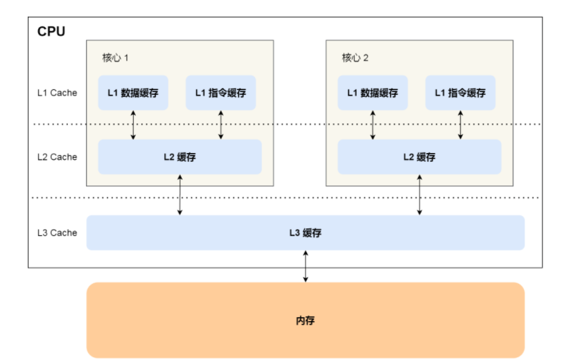

# Table of Contents

* [CPU Cache 的数据写入](#cpu-cache-的数据写入)
* [缓存一致性问题](#缓存一致性问题)
* [总线嗅探](#总线嗅探)
* [MESI](#mesi)
  * [一致性存在的问题](#一致性存在的问题)
  * [Store Buffer 和  Invalidate Queue](#store-buffer-和--invalidate-queue)
* [总结](#总结)
* [参考资料](#参考资料)

# CPU Cache 的数据写入

随着时间的推移，CPU 和内存的访问性能相差越来越大，于是就在 CPU 内部嵌入了 CPU Cache（高速缓存），CPU Cache 离 CPU 核心相当近，因此它的访问速度是很快的，于是它充当了 CPU 与内存之间的缓存角色。

CPU Cache 通常分为三级缓存：L1 Cache、L2 Cache、L3 Cache，级别越低的离 CPU 核心越近，访问速度也快，但是存储容量相对就会越小。其中，在多核心的 CPU 里，每个核心都有各自的 L1/L2 Cache，而 L3 Cache 是所有核心共享使用的。

# 缓存一致性问题

现在 CPU 都是多核的，由于 L1/L2 Cache 是多个核心各自独有的，那么会带来多核心的**缓存一致性（\*Cache Coherence\*）** 的问题，如果不能保证缓存一致性的问题，就可能造成结果错误。

那缓存一致性的问题具体是怎么发生的呢？我们以一个含有两个核心的 CPU  作为例子看一看。

假设 A 号核心和 B 号核心同时运行两个线程，都操作共同的变量 i（初始值为 0 ）。

+ 这时如果 A 号核心执行了 `i++` 语句的时候，为了考虑性能，使用了我们前面所说的写回策略，先把值为 `1` 的执行结果写入到 L1/L2 Cache 中，然后把 L1/L2 Cache 中对应的 Block 标记为脏的，这个时候数据其实没有被同步到内存中的，因为写回策略，只有在 A 号核心中的这个 Cache Block 要被替换的时候，数据才会写入到内存里。

+ 如果这时旁边的 B 号核心尝试从内存读取 i 变量的值，则读到的将会是错误的值，因为刚才 A 号核心更新 i 值还没写入到内存中，内存中的值还依然是 0。**这个就是所谓的缓存一致性问题，A 号核心和 B 号核心的缓存，在这个时候是不一致，从而会导致执行结果的错误。**

那么，要解决这一问题，就需要一种机制，来同步两个不同核心里面的缓存数据。要实现的这个机制的话，要保证做到下面这 2 点：

- 第一点，某个 CPU 核心里的 Cache 数据更新时，必须要传播到其他核心的 Cache，这个称为**写传播（\*Wreite Propagation\*）**；

  > 第一点写传播很容易就理解，当某个核心在 Cache 更新了数据，就需要同步到其他核心的 Cache 里。

- 第二点，某个 CPU 核心里对数据的操作顺序，必须在其他核心看起来顺序是一样的，这个称为**事务的串形化（\*Transaction Serialization\*）**。

  > 具体来说就是cpu缓存的操作，是一个原子性操作。

# 总线嗅探

写传播的原则就是当某个 CPU 核心更新了 Cache 中的数据，要把该事件广播通知到其他核心。最常见实现的方式是**总线嗅探（\*Bus Snooping\*）**。

我还是以前面的 i 变量例子来说明总线嗅探的工作机制，当 A 号 CPU 核心修改了 L1 Cache 中 i 变量的值，通过总线把这个事件广播通知给其他所有的核心，然后每个 CPU 核心都会监听总线上的广播事件，并检查是否有相同的数据在自己的 L1 Cache 里面，如果 B 号 CPU 核心的 L1 Cache 中有该数据，那么也需要把该数据更新到自己的 L1 Cache。

可以发现，总线嗅探方法很简单， CPU 需要每时每刻监听总线上的一切活动，但是不管别的核心的 Cache 是否缓存相同的数据，都需要发出一个广播事件，这无疑会加重总线的负载。

另外，总线嗅探只是保证了某个 CPU 核心的 Cache 更新数据这个事件能被其他 CPU 核心知道，但是并不能保证事务串形化。

于是，有一个协议基于总线嗅探机制实现了事务串形化，也用状态机机制降低了总线带宽压力，这个协议就是 MESI 协议，这个协议就做到了 CPU 缓存一致性。

# MESI

MESI 协议其实是 4 个状态单词的开头字母缩写，分别是：

- *Modified*，已修改
- *Exclusive*，独占
- *Shared*，共享
- *Invalidated*，已失效

这四个状态来标记 Cache Line 四个不同的状态。

+ 「已修改」状态就是我们前面提到的脏标记，代表该 Cache Block 上的数据已经被更新过，但是还没有写到内存里。
+ 而「已失效」状态，表示的是这个 Cache Block 里的数据已经失效了，不可以读取该状态的数据。

+ 「独占」和「共享」状态都代表 Cache Block 里的数据是干净的，也就是说，这个时候 Cache Block 里的数据和内存里面的数据是一致性的。

  「独占」和「共享」的差别在于，独占状态的时候，数据只存储在一个 CPU 核心的 Cache 里，而其他 CPU 核心的 Cache 没有该数据。这个时候，如果要向独占的 Cache 写数据，就可以直接自由地写入，而不需要通知其他 CPU 核心，因为只有你这有这个数据，就不存在缓存一致性的问题了，于是就可以随便操作该数据。

另外，在「独占」状态下的数据，如果有其他核心从内存读取了相同的数据到各自的 Cache ，那么这个时候，独占状态下的数据就会变成共享状态。

那么，「共享」状态代表着相同的数据在多个 CPU 核心的 Cache 里都有，所以当我们要更新 Cache 里面的数据的时候，不能直接修改，而是要先向所有的其他 CPU 核心广播一个请求，要求先把其他核心的 Cache 中对应的 Cache Line 标记为「无效」状态，然后再更新当前 Cache 里面的数据。

我们举个具体的例子来看看这四个状态的转换：

1. 当 A 号 CPU 核心从内存读取变量 i 的值，数据被缓存在 A 号 CPU 核心自己的 Cache 里面，此时其他 CPU 核心的 Cache 没有缓存该数据，于是标记 Cache Line 状态为「独占」，此时其 Cache 中的数据与内存是一致的；
2. 然后 B 号 CPU 核心也从内存读取了变量 i 的值，此时会发送消息给其他 CPU 核心，由于 A 号 CPU 核心已经缓存了该数据，所以会把数据返回给 B 号 CPU 核心。在这个时候， A 和 B 核心缓存了相同的数据，Cache Line 的状态就会变成「共享」，并且其 Cache 中的数据与内存也是一致的；
3. 当 A 号 CPU 核心要修改 Cache 中 i 变量的值，发现数据对应的 Cache Line 的状态是共享状态，**则要向所有的其他 CPU 核心广播一个请求，要求先把其他核心的 Cache 中对应的 Cache Line 标记为「无效」状态，然后 A 号 CPU 核心才更新 Cache 里面的数据，同时标记 Cache Line 为「已修改」状态，此时 Cache 中的数据就与内存不一致了**。
4. 如果 A 号 CPU 核心「继续」修改 Cache 中 i 变量的值，由于此时的 Cache Line 是「已修改」状态，因此不需要给其他 CPU 核心发送消息，直接更新数据即可。
5. 如果 A 号 CPU 核心的 Cache 里的 i 变量对应的  Cache Line 要被「替换」，发现  Cache Line 状态是「已修改」状态，就会在替换前先把数据同步到内存。

所以，可以发现当 Cache Line 状态是「已修改」或者「独占」状态时，修改更新其数据不需要发送广播给其他 CPU 核心，这在一定程度上减少了总线带宽压力。

事实上，整个 MESI 的状态可以用一个有限状态机来表示它的状态流转。还有一点，对于不同状态触发的事件操作，可能是来自本地 CPU 核心发出的广播事件，也可以是来自其他 CPU 核心通过总线发出的广播事件。下图即是 MESI 协议的状态图：

## 一致性存在的问题

我们可以发现，影响MESI协议的时间瓶颈主要有两块：

1. 无效化指令：Kernel0需要通知所有的核心，该变量对应的缓存在其他核心中是无效的。在通知完之前，该核心不能做任何关于这个变量的操作。
2. 确认响应：Kernel0需要收到其他核心的确认响应。在收到确认消息之前，该核心不能做任何关于这个变量的操作，需要持续等待其他核心的响应，直到所有核心响应完成，将其对应的缓存行标志位设为Invalid，才能继续其它操作。

## Store Buffer 和  Invalidate Queue 

+  针对无效化指令的加速：在缓存的基础上，引入Store Buffer这个结构。Store Buffer是一个特殊的硬件存储结构。通俗的来讲，**核心可以先将变量写入Store Buffer，然后再处理其他事情。**如果后面的操作需要用到这个变量，就可以从Store Buffer中读取变量的值，核心读数据的順序变成Store Buffer → 缓存 → 内存。这样在任何时候核心都不用卡住，做不了关于这个变量的操作了。 

+  针对确认响应的加速：在缓存的基础上，引入Invalidate Queue这个结构。其他核心收到Kernel0的Invalidate的命令后，**立即给Kernel0回Acknowledge**，并把Invalidate这个操作，先记录到Invalidate Queue里，当其他操作结束时，再从Invalidate Queue中取命令，进行Invalidate操作。**所以当Kernel0收到确认响应时，其他核心对应的缓存行可能还没完全置为Invalid状态** 

> 可以看到变成异步操作了。

# 总结

CPU 在读写数据的时候，都是在 CPU Cache 读写数据的，原因是 Cache 离 CPU 很近，读写性能相比内存高出很多。对于 Cache 里没有缓存 CPU 所需要读取的数据的这种情况，CPU 则会从内存读取数据，并将数据缓存到 Cache 里面，最后 CPU 再从 Cache 读取数据。

而对于数据的写入，CPU 都会先写入到 Cache 里面，然后再在找个合适的时机写入到内存，那就有「写直达」和「写回」这两种策略来保证 Cache 与内存的数据一致性：

- 写直达，只要有数据写入，都会直接把数据写入到内存里面，这种方式简单直观，但是性能就会受限于内存的访问速度；
- 写回，对于已经缓存在 Cache 的数据的写入，只需要更新其数据就可以，不用写入到内存，只有在需要把缓存里面的脏数据交换出去的时候，才把数据同步到内存里，这种方式在缓存命中率高的情况，性能会更好；

当今 CPU 都是多核的，每个核心都有各自独立的 L1/L2 Cache，只有 L3 Cache 是多个核心之间共享的。所以，我们要确保多核缓存是一致性的，否则会出现错误的结果。

要想实现缓存一致性，关键是要满足 2 点：

- 第一点是写传播，也就是当某个 CPU 核心发生写入操作时，需要把该事件广播通知给其他核心；
- 第二点是事物的串行化，这个很重要，只有保证了这个，次啊能保障我们的数据是真正一致的，我们的程序在各个不同的核心上运行的结果也是一致的；

基于总线嗅探机制的 MESI 协议，就满足上面了这两点，因此它是保障缓存一致性的协议。

MESI 协议，是已修改、独占、共享、已实现这四个状态的英文缩写的组合。整个 MSI 状态的变更，则是根据来自本地 CPU 核心的请求，或者来自其他 CPU 核心通过总线传输过来的请求，从而构成一个流动的状态机。另外，对于在「已修改」或者「独占」状态的 Cache Line，修改更新其数据不需要发送广播给其他 CPU 核心。

# 参考资料

https://mp.weixin.qq.com/s?__biz=MzUxODAzNDg4NQ==&mid=2247486479&idx=1&sn=433a551c37a445d068ffbf8ac85f0346&scene=21#wechat_redirect)%E3%80%8D%E3%80%82
