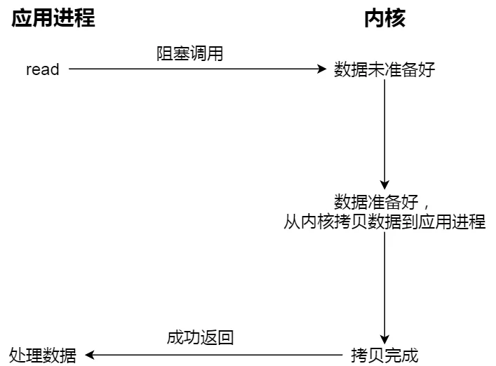
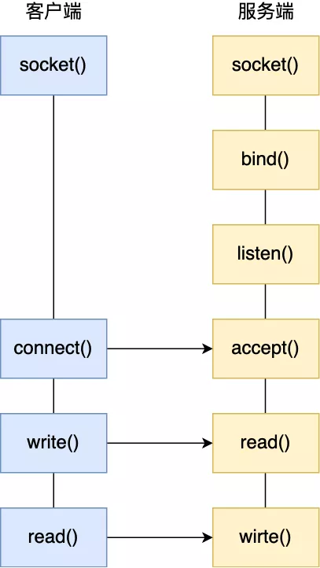
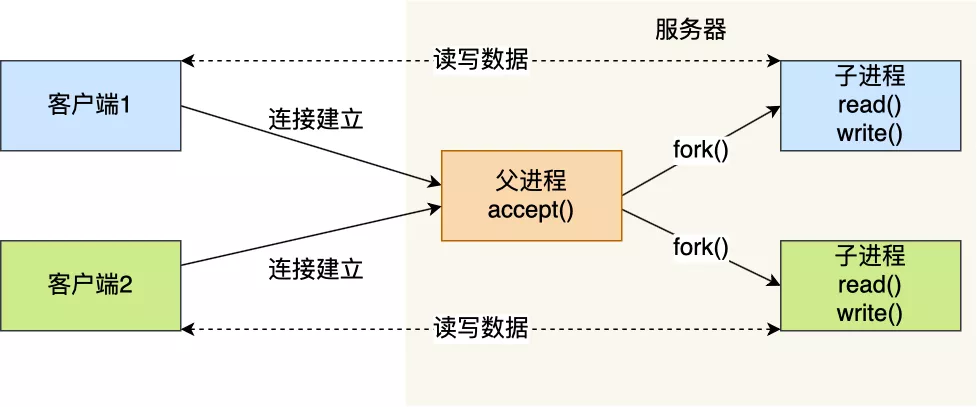
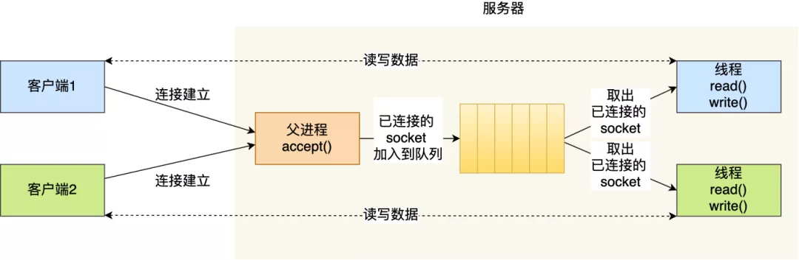
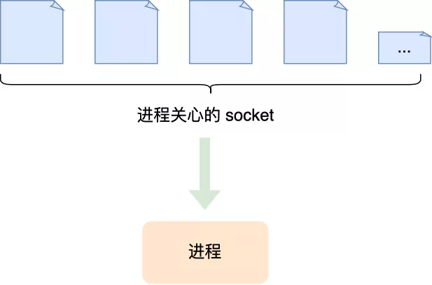
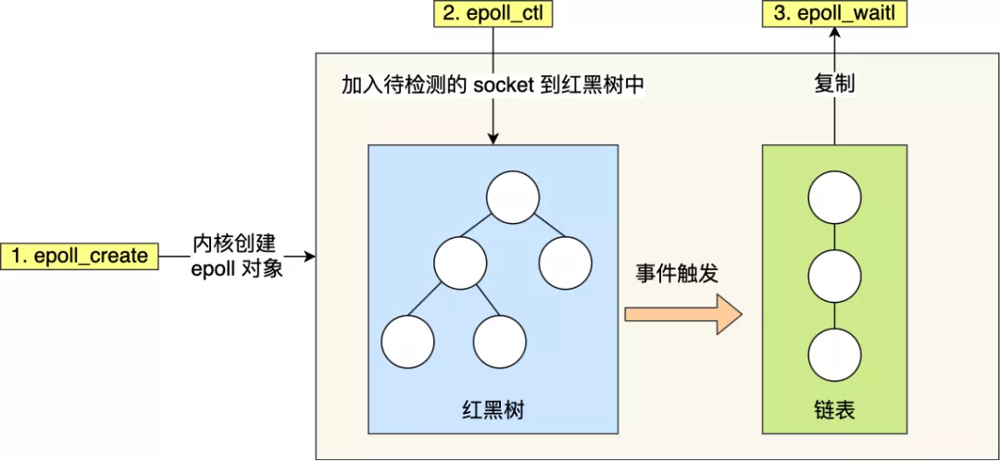
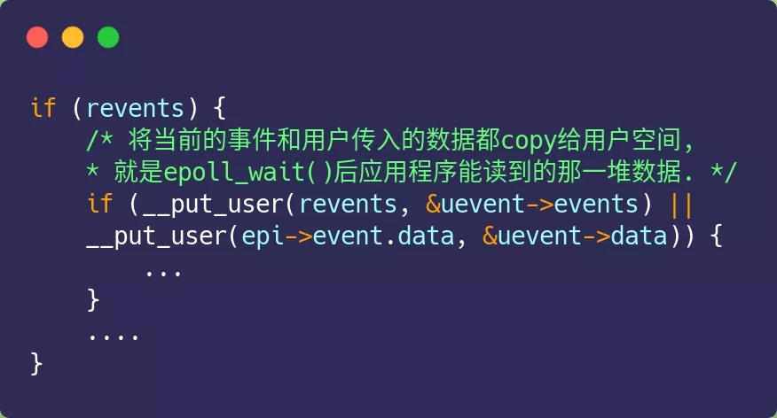

# Table of Contents

* [什么是IO](#什么是io)
* [IO阶段](#io阶段)
  * [什么是同步IO/异步IO/阻塞IO/非阻塞IO](#什么是同步io异步io阻塞io非阻塞io)
  * [小结](#小结)
* [简单Socket模型](#简单socket模型)
* [如何服务更多的用户](#如何服务更多的用户)
* [多进程模型](#多进程模型)
* [多线程模型](#多线程模型)
* [IO多路复用](#io多路复用)
* [select/poll](#selectpoll)
* [epoll](#epoll)
  * [ET LT](#et-lt)
* [总结](#总结)

终于对IO多路复用下手了，不要惧怕知识，除非你不想学习他。

# 什么是IO

IO在计算机中指Input/Output，也就是输入和输出。由于程序和运行时数据是在内存中驻留，由CPU这个超快的计算核心来执行，涉及到数据交换的地方，通常是磁盘、网络等，就需要IO接口。

+ Input Stream就是数据从外面（磁盘、网络）流进内存
+ Output Stream就是数据从内存流到外面去。

# IO阶段

IO分两阶段（一旦拿到数据后就变成了数据操作，不再是IO）

+ 准备数据：内核空间 需要准备数据
+ 数据完成：需要将数据从内核空间复制到用户空间。

## 什么是同步IO/异步IO/阻塞IO/非阻塞IO

由于CPU和内存的速度远远高于外设的速度，所以，在IO编程中，就存在速度严重不匹配的问题。

+ 阻塞IO(BIO): 2个IO阶段都会被阻塞。
+ 非阻塞IO(NIO):
  - 由用户线程发起IO请求, 进行系统调用来让内核进行IO操作
  - 此时如果内核没有准备好数据则会直接返回error，并不会阻塞用户线程，用户线程可以重复的发起IO请求
  - 当用户线程发起请求并且内核已经将数据准备好后，会将数据从内核空间拷贝到用户空间（这个过程是需要阻塞用户线程的），返回给用户

+ 同步：**read 调用，获取数据的过程，是一个同步的过程，是需要等待的过程。这里的同步指的是内核态的数据拷贝到用户程序的缓存区这个过程。**
+ 异步：「内核数据准备好」和「数据从内核态拷贝到用户态」这**两个过程都不用等待**。内核**自动将数据从内核空间拷贝到用户空间**，

## 小结

　 最后统一的总结一下：

　 用户进程发起请求从内核中获取数据那么这时候有两种情况：

- 操作系统还没有准备后数据，那么这时候怎么办，有两种方法：

　　　　　　　　a. 让用于进程等着（这种情况就是阻塞）

　　　　　　　　b. 如果没有数据就返回一个ERROR，不需要用户进程干等（这种情况就是非阻塞）

- 过了一会儿操作系统准备好数据了，这时候又有两种方法：

　　　　　　　　a. 啥也不管，等着用户进程再次来请求才把数据给它（这种情况就是同步）

　　　　　　　　b. 负责到底，数据准备好，直接给到用户进程，并且还发出一个信号，告诉用户进程数据已经准备好（这种情况就是异步）

　因此，我们可以发现：**不管是阻塞IO，还是非阻塞IO都是同步IO。**

# 简单Socket模型

> Linux一切皆文件，Socket也是文件。

具体细节看[TCP](../B.计算机网络/TCP三次握手和四次挥手.md)

> 这里补充下，监听Socket只有一个，负责监听所有的端口，

# 如何服务更多的用户

前面提到的 TCP Socket 调用流程是最简单、最基本的，它基本只能一对一通信，因为使用的是同步阻塞的方式，当服务端在还没处理完一个客户端的网络 I/O 时，或者 读写操作发生阻塞时，其他客户端是无法与服务端连接的。

> 注意是**同步阻塞**。

可如果我们服务器只能服务一个客户，那这样就太浪费资源了，于是我们要改进这个网络 I/O 模型，以支持更多的客户端。

在改进网络 I/O 模型前，我先来提一个问题，你知道服务器单机理论最大能连接多少个客户端？

相信你知道 TCP 连接是由四元组唯一确认的，这个四元组就是：**本机IP, 本机端口, 对端IP, 对端端口**。

服务器作为服务方，通常会在本地固定监听一个端口，等待客户端的连接。因此服务器的本地 IP 和端口是固定的，于是对于服务端 TCP 连接的四元组只有对端 IP 和端口是会变化的，所以**最大 TCP 连接数 = 客户端 IP 数×客户端端口数**。

对于 IPv4，客户端的 IP 数最多为 2 的 32 次方，客户端的端口数最多为 2 的 16 次方，也就是**服务端单机最大 TCP 连接数约为 2 的 48 次方**。

这个理论值相当“丰满”，但是服务器肯定承载不了那么大的连接数，主要会受两个方面的限制：

- **文件描述符**，Socket 实际上是一个文件，也就会对应一个文件描述符。在 Linux 下，单个进程打开的文件描述符数是有限制的，没有经过修改的值一般都是 1024，不过我们可以通过 ulimit 增大文件描述符的数目；
- **系统内存**，每个 TCP 连接在内核中都有对应的数据结构，意味着每个连接都是会占用一定内存的；

那如果服务器的内存只有 2 GB，网卡是千兆的，能支持并发 1 万请求吗？

并发 1 万请求，也就是经典的 C10K 问题 ，C 是 Client 单词首字母缩写，C10K 就是单机同时处理 1 万个请求的问题。

从硬件资源角度看，对于 2GB 内存千兆网卡的服务器，如果每个请求处理占用不到 200KB 的内存和 100Kbit 的网络带宽就可以满足并发 1 万个请求。

> 2G=200K*100K

不过，要想真正实现 C10K 的服务器，要考虑的地方在于服务器的网络 I/O 模型，效率低的模型，会加重系统开销，从而会离 C10K 的目标越来越远。

# 多进程模型

基于最原始的阻塞网络 I/O， 如果服务器要支持多个客户端，其中比较传统的方式，就是使用**多进程模型**，也就是为每个客户端分配一个进程来处理请求。

服务器的主进程负责监听客户的连接，一旦与客户端连接完成，accept() 函数就会返回一个「已连接 Socket」，这时就通过 `fork()` 函数创建一个子进程，实际上就把父进程所有相关的东西都**复制**一份，包括文件描述符、内存地址空间、程序计数器、执行的代码等。

这两个进程刚复制完的时候，几乎一摸一样。不过，会根据**返回值**来区分是父进程还是子进程，如果返回值是 0，则是子进程；如果返回值是其他的整数，就是父进程。

正因为子进程会**复制父进程的文件描述符**，于是就可以直接使用「已连接 Socket 」和客户端通信了，

可以发现，子进程不需要关心「监听 Socket」，只需要关心「已连接 Socket」；父进程则相反，将客户服务交给子进程来处理，因此父进程不需要关心「已连接 Socket」，只需要关心「监听 Socket」。

下面这张图描述了从连接请求到连接建立，父进程创建生子进程为客户服务。

另外，当「子进程」退出时，实际上内核里还会保留该进程的一些信息，也是会占用内存的，如果不做好“回收”工作，就会变成**僵尸进程**，随着僵尸进程越多，会慢慢耗尽我们的系统资源。

因此，父进程要“善后”好自己的孩子，怎么善后呢？那么有两种方式可以在子进程退出后回收资源，分别是调用 `wait()` 和 `waitpid()` 函数。

这种用多个进程来应付多个客户端的方式，在应对 100 个客户端还是可行的，但是当客户端数量高达一万时，肯定扛不住的，因为每产生一个进程，必会占据一定的系统资源，而且进程间上下文切换的“包袱”是很重的，性能会大打折扣。

进程的上下文切换不仅包含了虚拟内存、栈、全局变量等用户空间的资源，还包括了内核堆栈、寄存器等内核空间的资源

# 多线程模型

既然进程间上下文切换的“包袱”很重，那我们就搞个比较轻量级的模型来应对多用户的请求 —— **多线程模型**。

**线程是运行在进程中的一个“逻辑流”，单进程中可以运行多个线程**，同进程里的线程可以共享进程的部分资源的，比如文件描述符列表、进程空间、代码、全局数据、堆、共享库等，这些共享些资源在上下文切换时是不需要切换，而只需要切换线程的私有数据、寄存器等不共享的数据，因此同一个进程下的线程上下文切换的开销要比进程小得多。

当服务器与客户端 TCP 完成连接后，通过 `pthread_create()` 函数创建线程，然后将「已连接 Socket」的文件描述符传递给线程函数，接着在线程里和客户端进行通信，从而达到并发处理的目的。

如果每来一个连接就创建一个线程，线程运行完后，还得操作系统还得销毁线程，虽说线程切换的上写文开销不大，但是如果频繁创建和销毁线程，系统开销也是不小的。

那么，我们可以使用**线程池**的方式来避免线程的频繁创建和销毁，所谓的线程池，就是提前创建若干个线程，这样当由新连接建立时，将这个已连接的 Socket 放入到一个队列里，然后线程池里的线程负责从队列中取出已连接 Socket 进程处理。

需要注意的是，这个队列是全局的，每个线程都会操作，为了避免多线程竞争，线程在操作这个队列前要加锁。

上面基于进程或者线程模型的，其实还是有问题的。新到来一个 TCP 连接，就需要分配一个进程或者线程，那么如果要达到 C10K，意味着要一台机器维护 1 万个连接，相当于要维护 1 万个进程/线程，操作系统就算死扛也是扛不住的。

> 上文所说的多进程/线程模型，都是基于一个进程/线程处理一个Socket。多读几遍

# IO多路复用 

既然为每个请求分配一个进程/线程的方式不合适，那有没有可能只使用一个进程来维护多个 Socket 呢？答案是有的，那就是 **I/O 多路复用**技术。

一个进程虽然任一时刻只能处理一个请求，但是处理每个请求的事件时，耗时控制在 1 毫秒以内，这样 1 秒内就可以处理上千个请求，把时间拉长来看，多个请求复用了一个进程，这就是多路复用，这种思想很类似一个 CPU 并发多个进程，所以也叫做时分多路复用。

> 一句话，多个请求复用了一个进程。
> 

我们熟悉的 select/poll/epoll 内核提供给用户态的多路复用系统调用，**进程可以通过一个系统调用函数从内核中获取多个事件**。

select/poll/epoll 是如何获取网络事件的呢？在获取事件时，先把所有连接（文件描述符）传给内核，再由**内核返回产生了事件的连接**，然后在用户态中再处理这些连接对应的请求即可。

select/poll/epoll 这是三个多路复用接口，都能实现 C10K 吗？接下来，我们分别说说它们。

# select/poll

select 实现多路复用的方式是，

+ 将已连接的 Socket 都放到一个**文件描述符集合**，
+ 然后调用 select 函数将文件描述符集合**拷贝**到内核里，让内核来检查是否有网络事件产生，检查的方式很粗暴，就是通过**遍历**文件描述符集合的方式，
+ 当检查到有事件产生后，将此 Socket 标记为可读或可写， 接着再把整个文件描述符集合**拷贝**回用户态里，
+ 然后用户态还需要再通过**遍历**的方法找到可读或可写的 Socket，然后再对其处理。

所以，对于 select 这种方式，需要进行 **2 次「遍历」文件描述符集合**，一次是在内核态里，一个次是在用户态里 ，而且还会发生 **2 次「拷贝」文件描述符集合**，先从用户空间传入内核空间，由内核修改后，再传出到用户空间中。

select 使用**固定长度的 BitsMap**，表示文件描述符集合，而且所支持的文件描述符的个数是有限制的，在 Linux 系统中，由内核中的 FD_SETSIZE 限制， 默认最大值为 `1024`，只能监听 0~1023 的文件描述符。

poll 不再用 BitsMap 来存储所关注的文件描述符，**取而代之用动态数组，以链表形式来组织，突破了 select 的文件描述符个数限制，当然还会受到系统文件描述符限制。**

但是 poll 和 select 并没有太大的本质区别，**都是使用「线性结构」存储进程关注的 Socket 集合，因此都需要遍历文件描述符集合来找到可读或可写的 Socket，时间复杂度为 O(n)，而且也需要在用户态与内核态之间拷贝文件描述符集合**，这种方式随着并发数上来，性能的损耗会呈指数级增长。

# epoll

epoll 通过两个方面，很好解决了 select/poll 的问题。

*第一点*，epoll 在内核里使用**红黑树来跟踪进程所有待检测的文件描述字**，把需要监控的 socket 通过 `epoll_ctl()` 函数加入内核中的红黑树里，红黑树是个高效的数据结构，增删查一般时间复杂度是 `O(logn)`，通过对这棵黑红树进行操作，这样就不需要像 select/poll 每次操作时都传入整个 socket 集合，只需要传入一个待检测的 socket，减少了内核和用户空间大量的数据拷贝和内存分配。

*第二点*， epoll 使用事件驱动的机制，内核里**维护了一个链表来记录就绪事件**，当某个 socket 有事件发生时，通过回调函数内核会将其加入到这个就绪事件列表中，当用户调用 `epoll_wait()` 函数时，只会返回有事件发生的文件描述符的个数，不需要像 select/poll 那样轮询扫描整个 socket 集合，大大提高了检测的效率。

从下图你可以看到 epoll 相关的接口作用：

 epoll_wait 实现的内核代码中调用了 `__put_user` 函数，这个函数就是将**数据从内核拷贝到用户空间**。

## ET LT

epoll 支持两种事件触发模式，分别是**边缘触发（\*edge-triggered，ET\*）**和**水平触发（\*level-triggered，LT\*）**。

这两个术语还挺抽象的，其实它们的区别还是很好理解的。

- 使用边缘触发模式时，当被监控的 Socket 描述符上有可读事件发生时，**服务器端只会从 epoll_wait 中苏醒一次**，即使进程没有调用 read 函数从内核读取数据，也依然只苏醒一次，因此我们程序要保证一次性将内核缓冲区的数据读取完；
- 使用水平触发模式时，当被监控的 Socket 上有可读事件发生时，**服务器端不断地从 epoll_wait 中苏醒，直到内核缓冲区数据被 read 函数读完才结束**，目的是告诉我们有数据需要读取；

举个例子，你的快递被放到了一个快递箱里，如果快递箱只会通过短信通知你一次，即使你一直没有去取，它也不会再发送第二条短信提醒你，这个方式就是边缘触发；如果快递箱发现你的快递没有被取出，它就会不停地发短信通知你，直到你取出了快递，它才消停，这个就是水平触发的方式。

**这就是两者的区别，水平触发的意思是只要满足事件的条件，比如内核中有数据需要读，就一直不断地把这个事件传递给用户；而边缘触发的意思是只有第一次满足条件的时候才触发，之后就不会再传递同样的事件了。**

如果使用水平触发模式，当内核通知文件描述符可读写时，接下来还可以继续去检测它的状态，看它是否依然可读或可写。所以在收到通知后，没必要一次执行尽可能多的读写操作。

如果使用边缘触发模式，I/O 事件发生时只会通知一次，而且我们不知道到底能读写多少数据，所以在收到通知后应尽可能地读写数据，以免错失读写的机会。因此，我们会**循环**从文件描述符读写数据，那么如果文件描述符是阻塞的，没有数据可读写时，进程会阻塞在读写函数那里，程序就没办法继续往下执行。所以，**边缘触发模式一般和非阻塞 I/O 搭配使用**，程序会一直执行 I/O 操作，直到系统调用（如 `read` 和 `write`）返回错误，错误类型为 `EAGAIN` 或 `EWOULDBLOCK`。

一般来说，边缘触发的效率比水平触发的效率要高，因为边缘触发可以减少 epoll_wait 的系统调用次数，系统调用也是有一定的开销的的，毕竟也存在上下文的切换。

**select/poll 只有水平触发模式，epoll 默认的触发模式是水平触发，但是可以根据应用场景设置为边缘触发模式。**

另外，使用 I/O 多路复用时，最好搭配非阻塞 I/O 一起使用，Linux 手册关于 select 的内容中有如下说明：

> Under Linux, select() may report a socket file descriptor as "ready for reading", while nevertheless a subsequent read blocks. This could for example happen when data has arrived but upon examination has wrong checksum and is discarded. There may be other circumstances in which a file descriptor is spuriously reported as ready. Thus it may be safer to use O_NONBLOCK on sockets that should not block.

我谷歌翻译的结果：

> 在Linux下，select() 可能会将一个 socket 文件描述符报告为 "准备读取"，而后续的读取块却没有。例如，当数据已经到达，但经检查后发现有错误的校验和而被丢弃时，就会发生这种情况。也有可能在其他情况下，文件描述符被错误地报告为就绪。因此，在不应该阻塞的 socket 上使用 O_NONBLOCK 可能更安全。

简单点理解，就是**多路复用 API 返回的事件并不一定可读写的**，如果使用阻塞 I/O， 那么在调用 read/write 时则会发生程序阻塞，因此最好搭配非阻塞 I/O，以便应对极少数的特殊情况。

# 总结

最基础的 TCP 的 Socket 编程，它是阻塞 I/O 模型，基本上只能一对一通信，那为了服务更多的客户端，我们需要改进网络 I/O 模型。

比较传统的方式是使用多进程/线程模型，每来一个客户端连接，就分配一个进程/线程，然后后续的读写都在对应的进程/线程，这种方式处理 100 个客户端没问题，但是当客户端增大到 10000  个时，10000 个进程/线程的调度、上下文切换以及它们占用的内存，都会成为瓶颈。

为了解决上面这个问题，就出现了 I/O 的多路复用，可以只在一个进程里处理多个文件的  I/O，Linux 下有三种提供 I/O 多路复用的 API，分别是：select、poll、epoll。

select 和 poll 并没有本质区别，它们内部都是使用「线性结构」来存储进程关注的 Socket 集合。

在使用的时候，首先需要把关注的 Socket 集合通过 select/poll 系统调用从用户态拷贝到内核态，然后由内核检测事件，当有网络事件产生时，内核需要遍历进程关注 Socket 集合，找到对应的 Socket，并设置其状态为可读/可写，然后把整个 Socket 集合从内核态拷贝到用户态，用户态还要继续遍历整个 Socket 集合找到可读/可写的 Socket，然后对其处理。

很明显发现，select 和 poll 的缺陷在于，当客户端越多，也就是 Socket 集合越大，Socket 集合的遍历和拷贝会带来很大的开销，因此也很难应对 C10K。

epoll 是解决 C10K 问题的利器，通过两个方面解决了 select/poll 的问题。

- epoll 在内核里使用「红黑树」来关注进程所有待检测的 Socket，红黑树是个高效的数据结构，增删查一般时间复杂度是 O(logn)，通过对这棵黑红树的管理，不需要像 select/poll 在每次操作时都传入整个 Socket 集合，减少了内核和用户空间大量的数据拷贝和内存分配。
- epoll 使用事件驱动的机制，内核里维护了一个「链表」来记录就绪事件，只将有事件发生的 Socket 集合传递给应用程序，不需要像 select/poll 那样轮询扫描整个集合（包含有和无事件的 Socket ），大大提高了检测的效率。

而且，epoll 支持边缘触发和水平触发的方式，而 select/poll 只支持水平触发，一般而言，边缘触发的方式会比水平触发的效率高。
