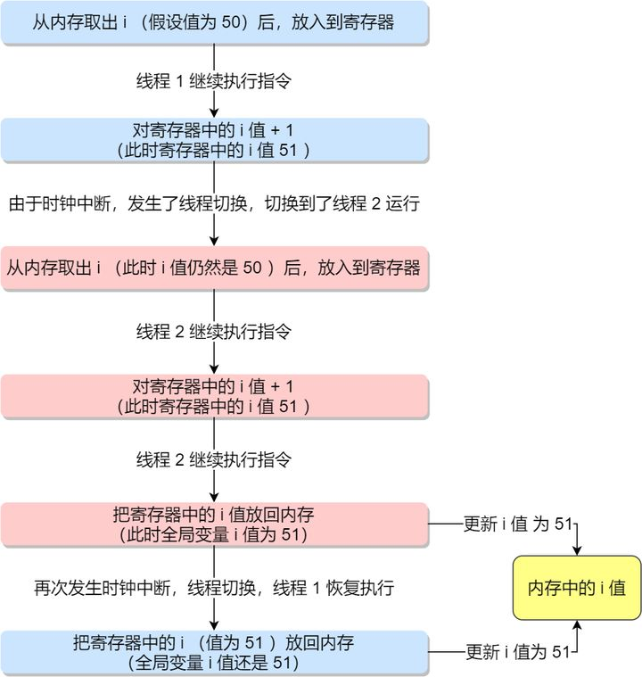

# Table of Contents

* [互斥的概念](#互斥的概念)
* [同步的概念](#同步的概念)
* [互斥与同步的实现和使用](#互斥与同步的实现和使用)
* [总结](#总结)

# 互斥的概念

上面展示的情况称为**竞争条件（\*race condition\*）**，当多线程相互竞争操作共享变量时，由于运气不好，即在执行过程中发生了上下文切换，我们得到了错误的结果，事实上，每次运行都可能得到不同的结果，因此输出的结果存在**不确定性（\*indeterminate\*）**。

由于多线程执行操作共享变量的这段代码可能会导致竞争状态，因此我们将此段代码称为**临界区（\*critical section\*），它是访问共享资源的代码片段，一定不能给多线程同时执行。**

我们希望这段代码是**互斥（\*mutualexclusion\*）的，也就说保证一个线程在临界区执行时，其他线程应该被阻止进入临界区**，说白了，就是这段代码执行过程中，最多只能出现一个线程。

# 同步的概念

互斥解决了并发进程/线程对临界区的使用问题。这种基于临界区控制的交互作用是比较简单的，只要一个进程/线程进入了临界区，其他试图想进入临界区的进程/线程都会被阻塞着，直到第一个进程/线程离开了临界区。

我们都知道在多线程里，每个线程并一定是顺序执行的，它们基本是以各自独立的、不可预知的速度向前推进，但有时候我们又希望多个线程能密切合作，以实现一个共同的任务。

例子，线程 1 是负责读入数据的，而线程 2 是负责处理数据的，这两个线程是相互合作、相互依赖的。线程 2 在没有收到线程 1 的唤醒通知时，就会一直阻塞等待，当线程 1 读完数据需要把数据传给线程 2 时，线程 1 会唤醒线程 2，并把数据交给线程 2 处理。

**所谓同步，就是并发进程/线程在一些关键点上可能需要互相等待与互通消息，这种相互制约的等待与互通信息称为进程/线程同步**。

# 互斥与同步的实现和使用

在进程/线程并发执行的过程中，进程/线程之间存在协作的关系，例如有互斥、同步的关系。

为了实现进程/线程间正确的协作，操作系统必须提供实现进程协作的措施和方法，主要的方法有两种：

- *锁*：加锁、解锁操作；
- *信号量*：P、V 操作；

这两个都可以方便地实现进程/线程互斥，而信号量比锁的功能更强一些，它还可以方便地实现进程/线程同步。

# 总结

两个进程有**数据依赖**，需要同步-生产者和消费者

两个进程见有**数据竞争**，需要互斥-读者和写者
