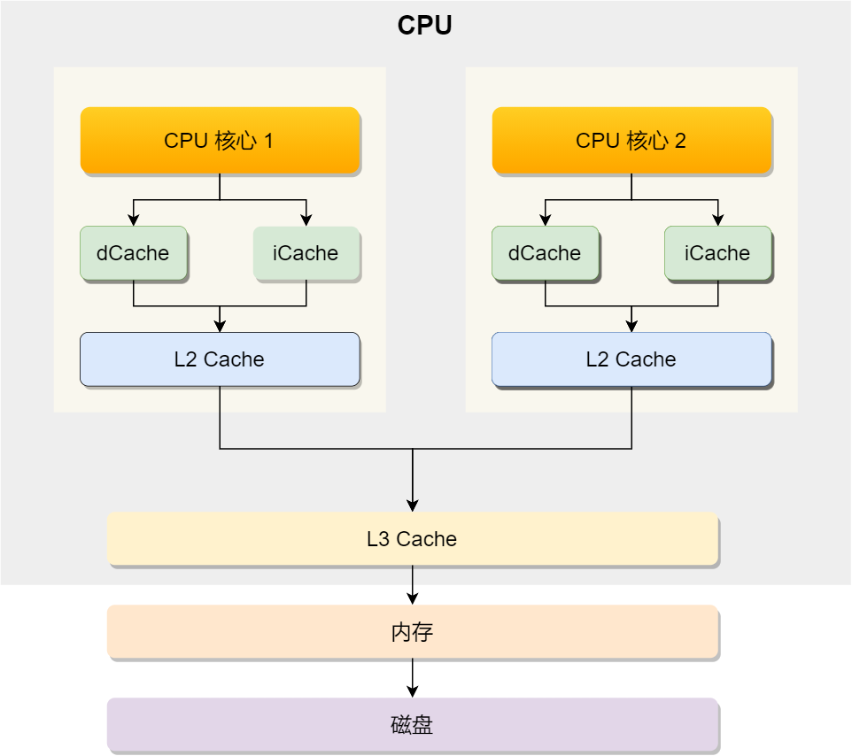
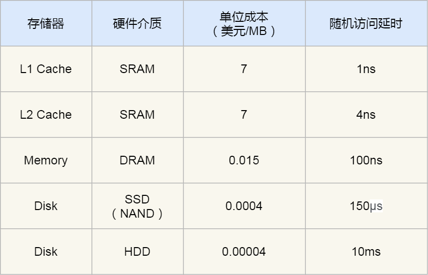
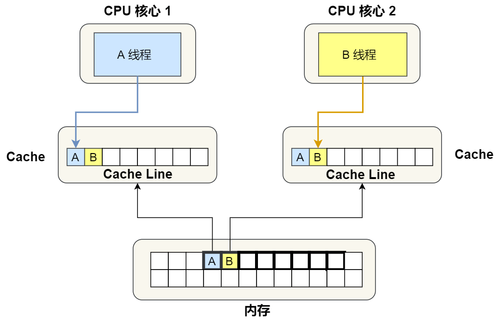
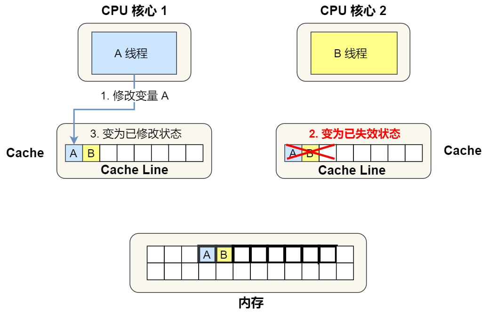
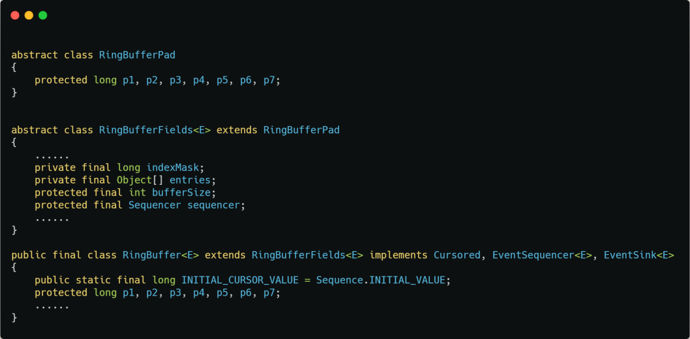
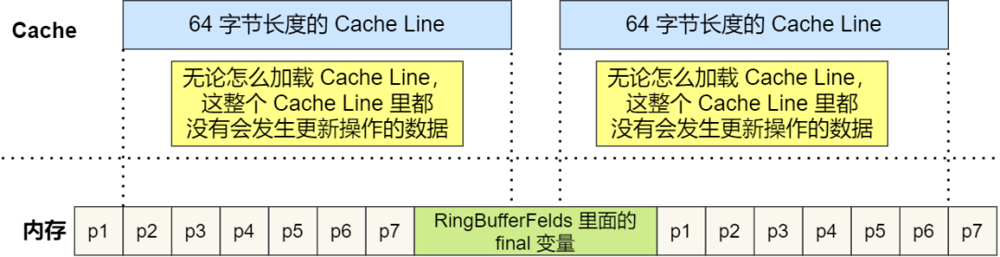

# Table of Contents

* [CPU 如何读写数据的？](#cpu-如何读写数据的)
* [什么是伪共享](#什么是伪共享)
* [分析伪共享的问题](#分析伪共享的问题)
* [如何避免伪共享](#如何避免伪共享)
* [具体应用](#具体应用)

>  多个线程同时读写同一个 Cache Line 的不同变量时，而导致 CPU Cache 失效的现象称为伪共享（False Sharing）。

# CPU 如何读写数据的？

先来认识 CPU 的架构，只有理解了 CPU 的 架构，才能更好地理解 CPU 是如何读写数据的，对于现代 CPU 的架构图如下：

每个存储设备的访问延时

你可以看到， CPU 访问 L1 Cache 速度比访问内存快 100 倍，这就是为什么 CPU 里会有 L1~L3 Cache 的原因，目的就是把 Cache 作为 CPU 与内存之间的缓存层，以减少对内存的访问频率。

CPU 从内存中读取数据到 Cache 的时候，并不是一个字节一个字节读取，而是一块一块的方式来读取数据的，这一块一块的数据被称为 CPU Line（缓存行），所以 **CPU Line 是 CPU 从内存读取数据到 Cache 的单位**。

那么对数组的加载， CPU 就会加载数组里面连续的多个数据到 Cache 里，**因此我们应该按照物理内存地址分布的顺序去访问元素**，这样访问数组元素的时候，Cache 命中率就会很高，于是就能减少从内存读取数据的频率， 从而可提高程序的性能。

> 这就是优化手段，类似Mysql数据页默认为16kb一样，加载数据的时候可以一次性读取多个数据页的树，避免重复加载。

# 什么是伪共享

现在假设有一个双核心的 CPU，这两个 CPU 核心并行运行着两个不同的线程，它们同时从内存中读取两个不同的数据，分别是类型为 `long` 的变量 A 和 B，这个两个数据的地址在物理内存上是**连续**的，如果 Cahce Line 的大小是 64 字节，并且变量 A 在 Cahce Line 的开头位置，那么这两个数据是位于**同一个 Cache Line 中**，

> long类型为8字节
> long A
>
> long B 
> 所以读取的时候是在同一个缓存line上的。

又因为 CPU Line 是 CPU 从内存读取数据到 Cache 的单位，所以这**两个数据会被同时读入到了两个 CPU 核心中各自 Cache 中。**

# 分析伪共享的问题

前提知识：「[10 张图打开 CPU 缓存一致性的大门](https://mp.weixin.qq.com/s?__biz=MzUxODAzNDg4NQ==&mid=2247486479&idx=1&sn=433a551c37a445d068ffbf8ac85f0346&scene=21#wechat_redirect)」。

1. 最开始变量 A 和 B 都还不在 Cache 里面，假设 1 号核心绑定了线程 A，2 号核心绑定了线程 B，线程 A 只会读写变量 A，线程 B 只会读写变量 B。

2. 之后，2 号核心需要修改变量 B，此时 2 号核心的 Cache 中对应的 Cache Line 是已失效状态，另外由于 1 号核心的 Cache 也有此相同的数据，且状态为「已修改」状态，

   1. 所以要先把 1 号核心的 Cache 对应的 Cache Line 写回到内存，
   2. 然后 2 号核心再从内存读取 Cache Line 大小的数据到 Cache 中，
   3. 最后把变量 B 修改到 2 号核心的 Cache 中，并将状态标记为「已修改」状态。

   > 根据MESI协议，需要将自己的缓存行置为失效，在重新读取数据进入缓存行

3. 此时1号核心在修改A变量，也会重新此步骤
4. 

因此，这种因为多个线程同时读写同一个 Cache Line 的不同变量时，而导致 CPU Cache 失效的现象称为**伪共享（\*False Sharing\*）**。

# 如何避免伪共享

> 课外知识：java对象的内存对齐
>
> 参考链接：https://mp.weixin.qq.com/s/ucK_QAt1ykQomSS1jFdDBw
>
> 比较硬核，需要多看N遍

因此，对于多个线程共享的热点数据，**即经常会修改的数据，应该避免这些数据刚好在同一个 Cache Line 中**，否则就会出现为伪共享的问题。

所以，避免  Cache 伪共享实际上是用空间换时间的思想，**浪费一部分 Cache 空间，从而换来性能的提升**。

# 具体应用

我们再来看一个应用层面的规避方案，有一个 Java 并发框架 Disruptor 使用「字节填充 + 继承」的方式，来避免伪共享的问题。

Disruptor 中有一个 RingBuffer 类会经常被多个线程使用，代码如下：

你可能会觉得 RingBufferPad 类里 7 个 long 类型的名字很奇怪，但事实上，它们虽然看起来毫无作用，但却对性能的提升起到了至关重要的作用。

我们都知道，CPU Cache 从内存读取数据的单位是 CPU Line，一般 64 位 CPU 的 CPU Line 的大小是 64 个字节**，一个 long 类型的数据是 8 个字节，所以 CPU 一下会加载 8 个 long 类型的数据。**

根据 JVM 对象继承关系中父类成员和子类成员，内存地址是连续排列布局的，因此 RingBufferPad 中的 7 个 long 类型数据作为 Cache Line **前置填充**，而 RingBuffer 中的 7 个 long 类型数据则作为 Cache Line **后置填充**，这 14 个 long 变量没有任何实际用途，更不会对它们进行读写操作。

那其实理解就是，**使用额外空间占据缓存行，导致修改的数据不在同一缓存行，这样达到了利用缓存行的目的**
