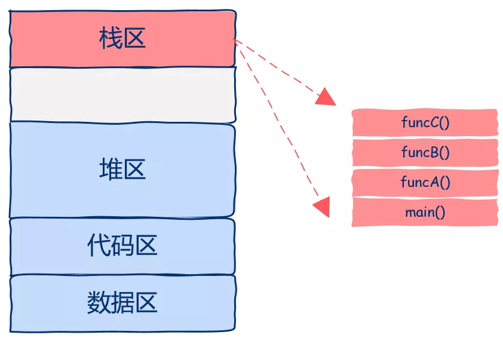
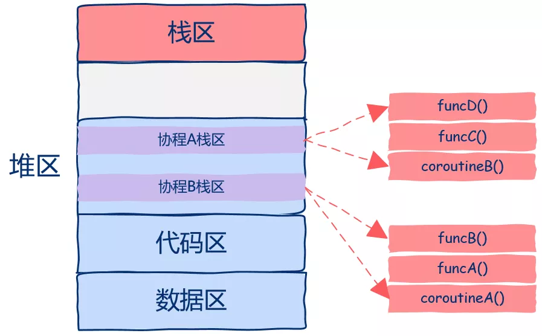

# Table of Contents

* [参考](#参考)
* [定义](#定义)

# 参考

<https://mp.weixin.qq.com/s?__biz=MzUxODAzNDg4NQ==&mid=2247488003&idx=2&sn=cc32dee02330123d9f4081cefa531271&scene=21#wechat_redirect>

# 定义

协程的本质是什么呢？

其实就是可以被暂停以及可以被恢复运行的函数。

协程之所以可以被暂停也可以继续，那么一定要记录下被暂停时的状态，也就是上下文，当继续运行的时候要恢复其上下文(状态)，那么接下来很自然的一个问题就是，函数运行时的状态是什么？

函数运行时栈就是我们需要保存的状态，也就是所谓的上下文，如图所示：

从图中我们可以看出，该进程中只有一个线程，栈区中有四个栈帧，main函数调用A函数，A函数调用B函数，B函数调用C函数，当C函数在运行时整个进程的状态就如图所示。

现在我们已经知道了函数的运行时状态就保存在栈区的栈帧中，接下来重点来了哦。

既然函数的运行时状态保存在栈区的栈帧中，那么如果我们想暂停协程的运行就必须保存整个栈帧的数据，那么我们该将整个栈帧中的数据保存在哪里呢？

很显然，这就是堆区啊，heap，我们可以将栈帧保存在堆区中，那么我们该怎么在堆区中保存数据呢？希望你还没有晕，在堆区中开辟空间就是我们常用的C语言中的malloc或者C++中的new。

我们需要做的就是在堆区中申请一段空间，让后把协程的整个栈区保存下，当需要恢复协程的运行时再从堆区中copy出来恢复函数运行时状态。

再仔细想一想，为什么我们要这么麻烦的来回copy数据呢？

实际上，我们需要做的是直接把协程的运行需要的栈帧空间直接开辟在堆区中，这样都不用来回copy数据了，如图所示。

从图中我们可以看到，该程序中开启了两个协程，这两个协程的栈区都是在堆上分配的，这样我们就可以随时中断或者恢复协程的执行了。

有的同学可能会问，那么进程地址空间最上层的栈区现在的作用是什么呢？

这一区域依然是用来保存函数栈帧的，只不过这些函数并不是运行在协程而是普通线程中的。

现在你应该看到了吧，在上图中实际上有3个执行流：

1. 一个普通线程
2. 两个协程

虽然有3个执行流但我们创建了几个线程呢？

**一个线程**。

现在你应该明白为什么要使用协程了吧，使用协程理论上我们可以**开启无数并发执行流，只要堆区空间足够**，同时还没有创建线程的开销，所有协程的调度、切换都发生在用户态，这就是为什么协程也被称作用户态线程的原因所在。

