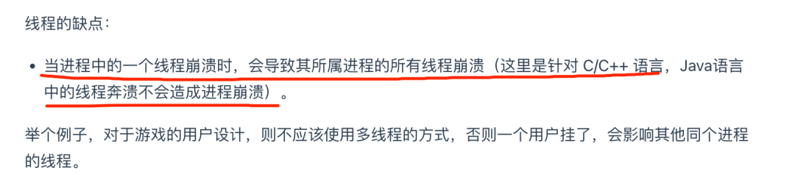

# Table of Contents

* [线程崩溃，进程一定会崩溃吗](#线程崩溃进程一定会崩溃吗)
* [进程是如何崩溃的-信号机制简介](#进程是如何崩溃的-信号机制简介)
* [为什么线程崩溃不会导致 JVM 进程崩溃](#为什么线程崩溃不会导致-jvm-进程崩溃)
* [openJDK 源码解析](#openjdk-源码解析)
* [总结](#总结)
* [参考资料](#参考资料)


之前分享这篇文章的时候：[进程和线程基础知识全家桶，30 张图一套带走](http://mp.weixin.qq.com/s?__biz=MzUxODAzNDg4NQ==&mid=2247485175&idx=1&sn=eda03758d4e810afd897ade44c19a508&chksm=f98e425dcef9cb4b3da63e6054f34d5012068b16eb3503d7e5a93bc2a857f1e5116ff793f1d9&scene=21#wechat_redirect)，提到说线程的一个缺点：




很多同学就好奇，**为什么 C/C++ 语言里，线程崩溃后，进程也会崩溃，而 Java 语言里却不会呢？**

刚好网上看到一个类似问题，**美团面试题：为什么线程崩溃崩溃不会导致 JVM 崩溃。**

这个问题我看了不少回答，但发现都没答到根上，所以决定答一答，相信大家看完肯定会有收获，本文分以下几节来探讨

1. 线程崩溃，进程一定会崩溃吗
2. 进程是如何崩溃的-信号机制简介
3. 为什么在 JVM 中线程崩溃不会导致 JVM 进程崩溃
4. openJDK 源码解析


 # 线程崩溃，进程一定会崩溃吗


 一般来说如果线程是因为非法访问内存引起的崩溃，那么进程肯定会崩溃，为什么系统要让进程崩溃呢，这主要是因为在进程中，**各个线程的地址空间是共享的**，既然是共享，那么某个线程对地址的非法访问就会导致内存的不确定性，进而可能会影响到其他线程，这种操作是危险的，操作系统会认为这很可能导致一系列严重的后果，于是干脆让整个进程崩溃 


# 进程是如何崩溃的-信号机制简介


那么线程崩溃后，进程是如何崩溃的呢，这背后的机制到底是怎样的，答案是**信号**，大家想想要干掉一个正在运行的进程是不是经常用 kill -9 pid 这样的命令，这里的 kill 其实就是给指定 pid 发送终止信号的意思，其中的 9 就是信号，其实信号有很多类型的，在 Linux 中可以通过 `kill -l`查看所有可用的信号


那么发个信号进程怎么就崩溃了呢，这背后的原理到底是怎样的？

其背后的机制如下

1. CPU 执行正常的进程指令
2. 调用 kill 系统调用向进程发送信号
3. 进程收到操作系统发的信号，CPU 暂停当前程序运行，并将控制权转交给操作系统
4. 调用 kill 系统调用向进程发送信号（假设为 11，即 SIGSEGV，一般非法访问内存报的都是这个错误）
5. **操作系统根据情况执行相应的信号处理程序（函数），一般执行完信号处理程序逻辑后会让进程退出**

注意上面的第五步，**如果进程没有注册自己的信号处理函数**，那么操作系统会执行默认的信号处理程序（一般最后会让进程退出），**但如果注册了，则会执行自己的信号处理函数**，这样的话就给了进程一个垂死挣扎的机会，它收到 kill 信号后，可以调用 exit() 来退出，**但也可以使用 sigsetjmp，siglongjmp 这两个函数来恢复进程的执行**


也就是说虽然给进程发送了 kill 信号，但如果进程自己定义了信号处理函数或者无视信号就有机会逃出生天，当然了 kill -9 命令例外，不管进程是否定义了信号处理函数，都会马上被干掉

**说到这大家是否想起了一道经典面试题：如何让正在运行的 Java 工程的优雅停机，通过上面的介绍大家不难发现，其实是 JVM 自己定义了信号处理函数，这样当发送 kill pid 命令（默认会传 15 也就是 SIGTERM）后，JVM 就可以在信号处理函数中执行一些资源清理之后再调用 exit 退出。这种场景显然不能用 kill -9，不然一下把进程干掉了资源就来不及清除了**


# 为什么线程崩溃不会导致 JVM 进程崩溃

 现在我们再来看看开头这个问题，相信你多少会心中有数，想想看在 Java 中有哪些是常见的由于非法访问内存而产生的 Exception 或 error 呢，常见的是大家熟悉的 StackoverflowError 或者NPE（NullPointerException）,NPE 我们都了解，属于是访问了不存在的内存 


 既然 StackoverflowError 或者 NPE 都属于非法访问内存， JVM 为什么不会崩溃呢，有了上一节的铺垫，相信你不难回答，其实就是因为 JVM 自定义了自己的信号处理函数，拦截了 SIGSEGV 信号，针对这两者不让它们崩溃，怎么证明这个推测呢，我们来看下 JVM 的源码来一探究竟 


# openJDK 源码解析

HotSpot 虚拟机目前使用范围最广的 Java 虚拟机，据 R 大所述， Oracle JDK 与 OpenJDK 里的 JVM 都是 HotSpot VM，从源码层面说，两者基本上是同一个东西，OpenJDK 是开源的，所以我们主要研究下 Java 8 的 OpenJDK 即可，地址如下：https://github.com/AdoptOpenJDK/openjdk-jdk8u，有兴趣的可以下载来看看

我们只要研究 Linux 下的 JVM，为了便于说明，也方便大家查阅，我把其中关于信号处理的关键流程整理了下（忽略其中的次要代码）


可以看到，在启动 JVM 的时候，也设置了信号处理函数，收到 SIGSEGV，SIGPIPE 等信号后最终会调用 JVM_handle_linux_signal 这个自定义信号处理函数，再来看下这个函数的主要逻辑

```
JVM_handle_linux_signal(int sig,                        siginfo_t* info,                        void* ucVoid,                        int abort_if_unrecognized) {   // Must do this before SignalHandlerMark, if crash protection installed we will longjmp away  // 这段代码里会调用 siglongjmp，主要做线程恢复之用  os::ThreadCrashProtection::check_crash_protection(sig, t);  if (info != NULL && uc != NULL && thread != NULL) {    pc = (address) os::Linux::ucontext_get_pc(uc);    // Handle ALL stack overflow variations here    if (sig == SIGSEGV) {      // Si_addr may not be valid due to a bug in the linux-ppc64 kernel (see      // comment below). Use get_stack_bang_address instead of si_addr.      address addr = ((NativeInstruction*)pc)->get_stack_bang_address(uc);      // 判断是否栈溢出了      if (addr < thread->stack_base() &&          addr >= thread->stack_base() - thread->stack_size()) {        if (thread->thread_state() == _thread_in_Java) {// 针对栈溢出 JVM 的内部处理            stub = SharedRuntime::continuation_for_implicit_exception(thread, pc, SharedRuntime::STACK_OVERFLOW);        }      }    }  }  if (sig == SIGSEGV &&               !MacroAssembler::needs_explicit_null_check((intptr_t)info->si_addr)) {         // 此处会做空指针检查      stub = SharedRuntime::continuation_for_implicit_exception(thread, pc, SharedRuntime::IMPLICIT_NULL);  }  // 如果是栈溢出或者空指针最终会返回 true，不会走最后的 report_and_die，所以 JVM 不会退出  if (stub != NULL) {    // save all thread context in case we need to restore it    if (thread != NULL) thread->set_saved_exception_pc(pc);    uc->uc_mcontext.gregs[REG_PC] = (greg_t)stub;    // 返回 true 代表 JVM 进程不会退出    return true;  }  VMError err(t, sig, pc, info, ucVoid);  // 生成 hs_err_pid_xxx.log 文件并退出  err.report_and_die();  ShouldNotReachHere();  return true; // Mute compiler}
```

从以上代码（注意看加粗的红线字体部分）我们可以知道以下信息

1. 发生 stackoverflow 还有空指针错误，确实都发送了 SIGSEGV，只是虚拟机不选择退出，而是自己内部作了额外的处理，其实是恢复了线程的执行，并抛出 StackoverflowError 和 NPE，这就是为什么 JVM 不会崩溃且我们能捕获这两个错误/异常的原因
2. 如果针对 SIGSEGV 等信号，在以上的函数中 JVM 没有做额外的处理，那么最终会走到 report_and_die 这个方法，这个方法主要做的事情是生成 hs_err_pid_xxx.log crash 文件（记录了一些堆栈信息或错误），然后退出

至此我相信大家明白了为什么发生了 StackoverflowError 和 NPE 这两个非法访问内存的错误，JVM 却没有崩溃。

原因其实就是虚拟机内部定义了信号处理函数，而在信号处理函数中对这两者做了额外的处理以让 JVM 不崩溃，另一方面也可以看出如果 JVM 不对信号做额外的处理，最后会自己退出并产生 crash 文件 hs_err_pid_xxx.log（可以通过 -XX:ErrorFile=/var/*log*/hs_err.log 这样的方式指定），这个文件记录了虚拟机崩溃的重要原因，所以也可以说，虚拟机是否崩溃只要看它是否会产生此崩溃日志文件


# 总结

正常情况下，操作系统为了保证系统安全，所以针对非法内存访问会发送一个 SIGSEGV 信号，而操作系统一般会调用默认的信号处理函数（一般会让相关的进程崩溃）。

**但如果进程觉得"罪不致死"，那么它也可以选择自定义一个信号处理函数，这样的话它就可以做一些自定义的逻辑，比如记录 crash 信息等有意义的事。**

回过头来看为什么虚拟机会针对 StackoverflowError 和 NullPointerException 做额外处理让线程恢复呢，针对 stackoverflow 其实它采用了一种栈回溯的方法保证线程可以一直执行下去，而捕获空指针错误主要是这个错误实在太普遍了。

为了这一个很常见的错误而让 JVM 崩溃那线上的 JVM 要宕机多少次，所以出于工程健壮性的考虑，与其直接让 JVM 崩溃倒不如让线程起死回生，并且将这两个错误/异常抛给用户来处理


# 参考资料

https://mp.weixin.qq.com/s/easnVQ75Rq-C07W4YWeclQ
