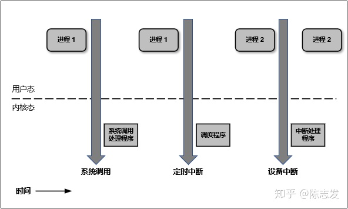
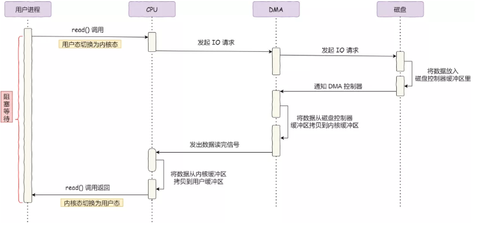
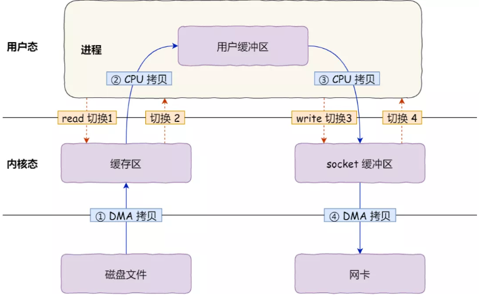
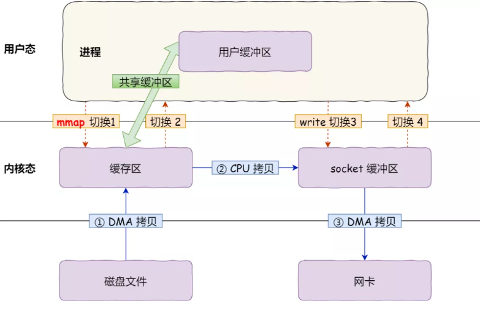
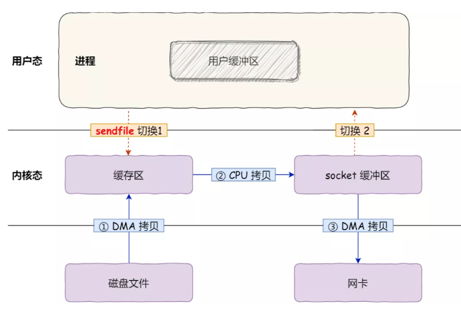
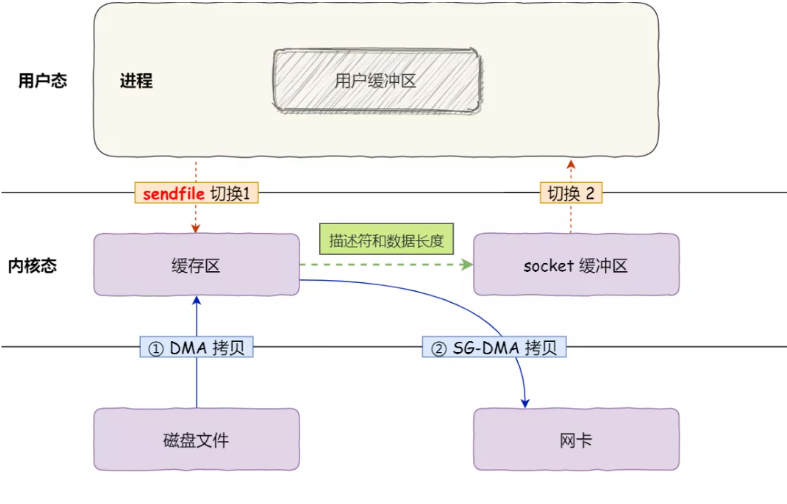
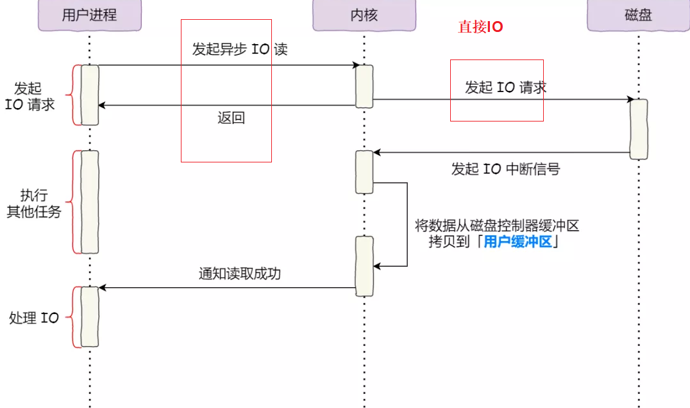

# Table of Contents

* [用户空间](#用户空间)
* [内核空间](#内核空间)
* [为什么要区分内核空间和用户空间](#为什么要区分内核空间和用户空间)
* [内核态与用户态](#内核态与用户态)
* [**如何从用户空间进入内核空间**](#如何从用户空间进入内核空间)
* [为什么要有DMA技术](#为什么要有dma技术)
* [DMA(**Direct Memory Access**)](#dmadirect-memory-access)
* [传统文件传输](#传统文件传输)
* [如何优化文件传输的性能？](#如何优化文件传输的性能)
* [如何实现零拷贝？](#如何实现零拷贝)
  * [mmap + write](#mmap--write)
  * [sendfile](#sendfile)
  * [SG-DMA](#sg-dma)
* [项目应用](#项目应用)
* [PageCache 有什么作用？](#pagecache-有什么作用)
* [大文件传输用什么方式实现？](#大文件传输用什么方式实现)
* [总结](#总结)


 `零拷贝技术` 是编写高性能服务器的一个关键技术，在介绍 `零拷贝技术` 前先说明一下基础知识。

这里特别强调下：零拷贝只是没有数据从内核空间到用户空间。

本篇只是简单介绍了零拷贝的概念，如DMA 或者怎么实现，比较偏操作系统i，日后有条件在更新此文章


有兴趣可以看下这个,会更清楚[大神讲解](https://strikefreedom.top/linux-io-and-zero-copy)


# 用户空间

 通俗的说，`用户空间` 就是运行着用户编写的<font color=red>应用程序的虚拟内存空间</font>。类似我们运行的JVM虚拟机等

在32位的操作系统中，每个进程都有 4GB 独立的虚拟内存空间，而 0 ~ 3GB 的虚拟内存空间就是用户空间 。 

# 内核空间

 `内核空间` 就是运行着操作<font color=red>系统代码的虚拟内存空间</font>，而 3GB ~ 4GB 的虚拟内存空间就是内核空间。 


# 为什么要区分内核空间和用户空间

在 CPU 的所有指令中，有些指令是非常危险的，如果错用，将导致系统崩溃，比如清内存、设置时钟等。如果允许所有的程序都可以使用这些指令，那么系统崩溃的概率将大大增加。

所以，CPU 将指令分为特权指令和非特权指令，对于那些危险的指令，只允许操作系统及其相关模块使用，普通应用程序只能使用那些不会造成灾难的指令。


 操作系统的核心是内核(kernel)，它独立于普通的应用程序，可以访问受保护的内存空间，也有访问底层硬件设备的所有权限。<font color=red>为了保证内核的安全，现在的操作系统一般都强制用户进程不能直接操作内核。 </font>


<font color=red> **区分内核空间和用户空间本质上是要提高操作系统的稳定性及可用性。**</font>

#  内核态与用户态

好了我们现在需要再解释一下什么是内核态、用户态：**「当进程运行在内核空间时就处于内核态，而进程运行在用户空间时则处于用户态。」**

在内核态下，进程运行在内核地址空间中，此时 CPU 可以执行任何指令。运行的代码也不受任何的限制，可以自由地访问任何有效地址，也可以直接进行端口的访问。

在用户态下，进程运行在用户地址空间中，被执行的代码要受到 CPU 的诸多检查，<font color=red>它们只能访问映射其地址空间的页表项中规定的在用户态下可访问页面的虚拟地址，且只能对任务状态段(TSS)中 I/O 许可位图(I/O Permission Bitmap)中规定的可访问端口进行直接访问。</font>


# **如何从用户空间进入内核空间**


 所有的<font color=red>系统资源管理都是在内核空间中完成的</font>。比如读写磁盘文件，分配回收内存，从网络接口读写数据等等。 

 我们的应用程序是无法直接进行这样的操作的。但是我们可以通过内核提供的接口来完成这样的任务。 

比如应用程序要读取磁盘上的一个文件，它可以向内核发起一个 "系统调用" 告诉内核："我要读取磁盘上的某某文件"。

其实就是通过一个特殊的指令让进程从用户态进入到内核态(到了内核空间)，在内核空间中，CPU 可以执行任何的指令，当然也包括从磁盘上读取数据。具体过程是先把数据读取到内核空间中，然后再把数据拷贝到用户空间并从内核态切换到用户态。




概括的说，有三种方式：`系统调用、软中断和硬件中断`。这三种方式每一种都涉及到大量的操作系统知识，所以这里不做展开。


# 为什么要有DMA技术


在没有 DMA 技术前，I/O 的过程是这样的：

- CPU 发出对应的指令给磁盘控制器，然后返回；
- 磁盘控制器收到指令后，于是就开始准备数据，会把数据放入到磁盘控制器的内部缓冲区中，然后产生一个**中断**；
- CPU 收到中断信号后，停下手头的工作，接着把磁盘控制器的缓冲区的数据一次一个字节地读进自己的寄存器，然后再把寄存器里的数据写入到内存，**而在数据传输的期间 CPU 是无法执行其他任务的**。


<font color=red>`PageCache`是用来作什么的？后面会说到</font>

CPU这么宝贵的资源，肯定是不能浪费的!


# DMA(**Direct Memory Access**)

什么是 DMA 技术？简单理解就是，**在进行 I/O 设备和内存的数据传输的时候，数据搬运的工作全部交给 DMA 控制器，而 CPU 不再参与任何与数据搬运相关的事情，这样 CPU 就可以去处理别的事务**。




- 用户进程调用 read 方法，向操作系统发出 I/O 请求，请求读取数据到自己的内存缓冲区中，进程进入阻塞状态；
- 操作系统收到请求后，进一步将 I/O 请求发送 DMA，然后让 CPU 执行其他任务；
- DMA 进一步将 I/O 请求发送给磁盘；
- 磁盘收到 DMA 的 I/O 请求，把数据从磁盘读取到磁盘控制器的缓冲区中，当磁盘控制器的缓冲区被读满后，向 DMA 发起中断信号，告知自己缓冲区已满；
- **DMA 收到磁盘的信号，将磁盘控制器缓冲区中的数据拷贝到内核缓冲区中，此时不占用 CPU，CPU 可以执行其他任务**；
- 当 DMA 读取了足够多的数据，就会发送中断信号给 CPU；
- CPU 收到 DMA 的信号，知道数据已经准备好，于是将数据从内核拷贝到用户空间，系统调用返回；


> DMA就是CPU的小弟，指哪打哪


早期 DMA 只存在在主板上，如今由于 I/O 设备越来越多，数据传输的需求也不尽相同，所以每个 I/O 设备里面都有自己的 DMA 控制器。


# 传统文件传输

+ 读取文件(内核)数据到用户空间缓冲区
+ 将缓冲区数据发送到客户端Socket  [socket详情](OSI七层模型.md)


下面我们仔细看数据的交换过程

1.  `read`   文件中读取数据到内核的 `页缓存（page cache）`，然后再从页缓存中复制到用户空间的缓冲区中。 
2. `write` 系统调用把用户空间缓冲区中的数据发送到客户端 Socket 时，首先会把缓冲区的数据复制到内核的 Socket 缓冲区中，网卡驱动会把 Socket 缓冲区的数据发送出去 




首先，期间共**发生了 4 次用户态与内核态的上下文切换**，因为发生了两次系统调用，一次是 `read()` ，一次是 `write()`，每次系统调用**都得先从用户态切换到内核态，等内核完成任务后，再从内核态切换回用户态**。

其次，还**发生了 4 次数据拷贝**，其中两次是 DMA 的拷贝，另外两次则是通过 CPU 拷贝的，下面说一下这个过程：

- *第一次拷贝*，把磁盘上的数据拷贝到操作系统内核的缓冲区里，这个拷贝的过程是通过 DMA 搬运的。
- *第二次拷贝*，把内核缓冲区的数据拷贝到用户的缓冲区里，于是我们应用程序就可以使用这部分数据了，这个拷贝到过程是由 CPU 完成的。
- *第三次拷贝*，把刚才拷贝到用户的缓冲区里的数据，再拷贝到内核的 socket 的缓冲区里，这个过程依然还是由 CPU 搬运的。
- *第四次拷贝*，把内核的 socket 缓冲区里的数据，拷贝到网卡的缓冲区里，这个过程又是由 DMA 搬运的。


所以，**要想提高文件传输的性能，就需要减少「用户态与内核态的上下文切换」和「内存拷贝」的次数**。


# 如何优化文件传输的性能？

**要想减少上下文切换到次数，就要减少系统调用的次数**。

因为文件传输的应用场景中，在用户空间我们并不会对数据「再加工」，所以数据实际上可以不用搬运到用户空间，因此**用户的缓冲区是没有必要存在的**。


# 如何实现零拷贝？

## mmap + write

在前面我们知道，`read()` 系统调用的过程中会把内核缓冲区的数据拷贝到用户的缓冲区里，于是为了减少这一步开销，我们可以用 `mmap()` 替换 `read()` 系统调用函数。

```
buf = mmap(file, len);
write(sockfd, buf, len);
```

`mmap()` 系统调用函数会直接把内核缓冲区里的数据「**映射**」到用户空间，这样，操作系统内核与用户空间就不需要再进行任何的数据拷贝操作。




我们可以得知，通过使用 `mmap()` 来代替 `read()`， 可以**减少一次数据拷贝**的过程。

但这还不是最理想的零拷贝，因为仍然需要通过 CPU 把内核缓冲区的数据拷贝到 socket 缓冲区里，而且仍然需要 4 次上下文切换，因为系统调用还是 2 次。


## sendfile

在 Linux 内核版本 2.1 中，提供了一个专门发送文件的系统调用函数 `sendfile()`，函数形式如下：

```
#include <sys/socket.h>
ssize_t sendfile(int out_fd, int in_fd, off_t *offset, size_t count);
```

它的前两个参数分别是目的端和源端的文件描述符，后面两个参数是源端的偏移量和复制数据的长度，返回值是实际复制数据的长度

首先，它可以替代前面的 `read()` 和 `write()` 这两个系统调用，这样就可以减少一次系统调用，也就减少了 2 次上下文切换的开销。

其次，该系统调用，可以直接把内核缓冲区里的数据拷贝到 socket 缓冲区里，不再拷贝到用户态，这样就只有 2 次上下文切换，和 3 次数据拷贝。如下图：





## SG-DMA

于是，从 Linux 内核 `2.4` 版本开始起，对于支持网卡支持 SG-DMA 技术的情况下， `sendfile()` 系统调用的过程发生了点变化，具体过程如下：

- 第一步，通过 DMA 将磁盘上的数据拷贝到内核缓冲区里；
- 第二步，缓冲区描述符和数据长度传到 socket 缓冲区，这样网卡的 SG-DMA 控制器就可以直接将内核缓存中的数据拷贝到网卡的缓冲区里，此过程不需要将数据从操作系统内核缓冲区拷贝到 socket 缓冲区中，这样就减少了一次数据拷贝；

所以，这个过程之中，只进行了 2 次数据拷贝，如下图：




这就是所谓的**零拷贝（Zero-copy）技术，因为我们没有在内存层面去拷贝数据，也就是说全程没有通过 CPU 来搬运数据，所有的数据都是通过 DMA 来进行传输的。**

零拷贝技术的文件传输方式相比传统文件传输的方式，减少了 2 次上下文切换和数据拷贝次数，**只需要 2 次上下文切换和数据拷贝次数，就可以完成文件的传输，而且 2 次的数据拷贝过程，都不需要通过 CPU，2 次都是由 DMA 来搬运。**

所以，总体来看，**零拷贝技术可以把文件传输的性能提高至少一倍以上**。


# 项目应用

事实上，Kafka 这个开源项目，就利用了「零拷贝」技术，从而大幅提升了 I/O 的吞吐率，这也是 Kafka 在处理海量数据为什么这么快的原因之一。

如果你追溯 Kafka 文件传输的代码，你会发现，最终它调用了 Java NIO 库里的 `transferTo`方法：

```
@Overridepublic 
long transferFrom(FileChannel fileChannel, long position, long count) throws IOException { 
    return fileChannel.transferTo(position, count, socketChannel);
}
```

如果 Linux 系统支持 `sendfile()` 系统调用，那么 `transferTo()` 实际上最后就会使用到 `sendfile()` 系统调用函数。

曾经有大佬专门写过程序测试过，在同样的硬件条件下，传统文件传输和零拷拷贝文件传输的性能差异，你可以看到下面这张测试数据图，使用了零拷贝能够缩短 `65%` 的时间，大幅度提升了机器传输数据的吞吐量。

另外，Nginx 也支持零拷贝技术，一般默认是开启零拷贝技术，这样有利于提高文件传输的效率，是否开启零拷贝技术的配置如下：

```
http {
...
    sendfile on
...
}
```

sendfile 配置的具体意思: 

- 设置为 on 表示，使用零拷贝技术来传输文件：sendfile ，这样只需要 2 次上下文切换，和 2 次数据拷贝。
- 设置为 off 表示，使用传统的文件传输技术：read + write，这时就需要 4 次上下文切换，和 4 次数据拷贝。

当然，要使用 sendfile，Linux 内核版本必须要 2.1 以上的版本。


# PageCache 有什么作用？

回顾前面说道文件传输过程，其中第一步都是先需要先把磁盘文件数据拷贝「内核缓冲区」里，这个「内核缓冲区」实际上是**磁盘高速缓存（PageCache）**。

- 缓存最近被访问的数据；
- 预读功能；

**但是，在传输大文件（GB 级别的文件）的时候，PageCache 会不起作用，那就白白浪费 DMA 多做的一次数据拷贝，造成性能的降低，即使使用了 PageCache 的零拷贝也会损失性能**

这是因为如果你有很多 GB 级别文件需要传输，每当用户访问这些大文件的时候，内核就会把它们载入 PageCache 中，于是 PageCache 空间很快被这些大文件占满。

另外，由于文件太大，可能某些部分的文件数据被再次访问的概率比较低，这样就会带来 2 个问题：

- PageCache 由于长时间被大文件占据，其他「热点」的小文件可能就无法充分使用到 PageCache，于是这样磁盘读写的性能就会下降了；
- PageCache 中的大文件数据，由于没有享受到缓存带来的好处，但却耗费 DMA 多拷贝到 PageCache 一次；

所以，针对大文件的传输，不应该使用 PageCache，也就是说不应该使用零拷贝技术，因为可能由于 PageCache 被大文件占据，而导致「热点」小文件无法利用到 PageCache，这样在高并发的环境下，会带来严重的性能问题。


# 大文件传输用什么方式实现？


对于阻塞的问题，可以用异步 I/O 来解决，它工作方式如下图：




它把读操作分为两部分：

- 前半部分，内核向磁盘发起读请求，但是可以**不等待数据就位就可以返回**，于是进程此时可以处理其他任务；
- 后半部分，当内核将磁盘中的数据拷贝到进程缓冲区后，进程将接收到内核的**通知**，再去处理数据；


> `直接I/O` 就是对用户进行的 I/O 操作直接与块设备进行交互，而不进行缓存。
>
> 异步IO应该是针对操作系统
> 操作系统以异步IO的方式通知磁盘进行直接IO

而且，我们可以发现，异步 I/O 并没有涉及到 PageCache，所以使用异步 I/O 就意味着要绕开 PageCache。
绕开 PageCache 的 I/O 叫直接 I/O，使用 PageCache 的 I/O 则叫缓存 I/O。通常，对于磁盘，异步 I/O 只支持直接 I/O。

前面也提到，大文件的传输不应该使用 PageCache，因为可能由于 PageCache 被大文件占据，而导致「热点」小文件无法利用到 PageCache。

于是，**在高并发的场景下，针对大文件的传输的方式，应该使用「异步 I/O + 直接 I/O」来替代零拷贝技术**。

所以，传输文件的时候，我们要根据文件的大小来使用不同的方式：

- 传输大文件的时候，使用「异步 I/O + 直接 I/O」；
- 传输小文件的时候，则使用「零拷贝技术」；

在 Nginx 中，我们可以用如下配置，来根据文件的大小来使用不同的方式：

```
location /video/ { 
    sendfile on; 
    aio on; 
    directio 1024m; 
}
```

当文件大小大于 `directio` 值后，使用「异步 I/O + 直接 I/O」，否则使用「零拷贝技术」。


# 总结

早期 I/O 操作，内存与磁盘的数据传输的工作都是由 CPU 完成的，而此时 CPU 不能执行其他任务，会特别浪费 CPU 资源。

于是，为了解决这一问题，DMA 技术就出现了，每个 I/O 设备都有自己的 DMA 控制器，通过这个 DMA 控制器，CPU 只需要告诉 DMA 控制器，我们要传输什么数据，从哪里来，到哪里去，就可以放心离开了。后续的实际数据传输工作，都会由 DMA 控制器来完成，CPU 不需要参与数据传输的工作。

传统 IO 的工作方式，从硬盘读取数据，然后再通过网卡向外发送，我们需要进行 4 上下文切换，和 4 次数据拷贝，其中 2 次数据拷贝发生在内存里的缓冲区和对应的硬件设备之间，这个是由 DMA 完成，另外 2 次则发生在内核态和用户态之间，这个数据搬移工作是由 CPU 完成的。

为了提高文件传输的性能，于是就出现了零拷贝技术，它通过一次系统调用（`sendfile` 方法）合并了磁盘读取与网络发送两个操作，降低了上下文切换次数。另外，拷贝数据都是发生在内核中的，天然就降低了数据拷贝的次数。

Kafka 和 Nginx 都有实现零拷贝技术，这将大大提高文件传输的性能。

零拷贝技术是基于 PageCache 的，PageCache 会缓存最近访问的数据，提升了访问缓存数据的性能，同时，为了解决**机械硬盘寻址慢**的问题，**它还协助 I/O 调度算法实现了 IO 合并与预读，这也是顺序读比随机读性能好的原因**。这些优势，进一步提升了零拷贝的性能。

需要注意的是，零拷贝技术是不允许进程对文件内容作进一步的加工的，比如压缩数据再发送。

另外，当传输大文件时，不能使用零拷贝，因为可能由于 PageCache 被大文件占据，而导致「热点」小文件无法利用到 PageCache，并且大文件的缓存命中率不高，这时就需要使用「异步 IO + 直接 IO 」的方式。

在 Nginx 里，可以通过配置，设定一个文件大小阈值，针对大文件使用异步 IO 和直接 IO，而对小文件使用零拷贝。
