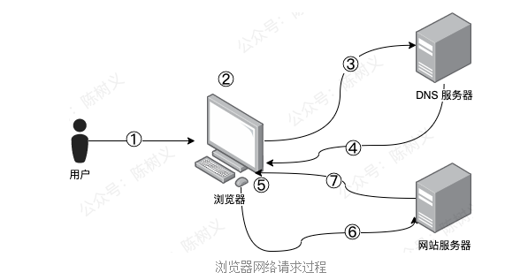
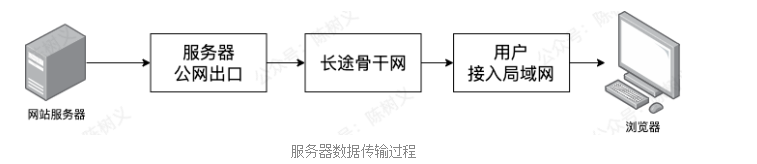
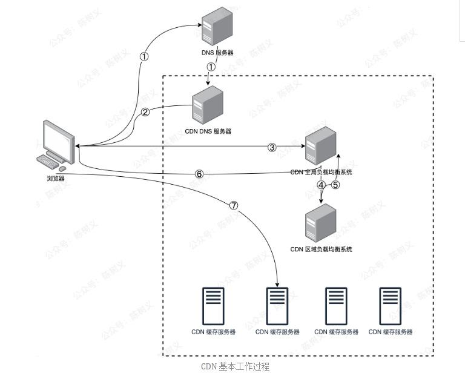

# Table of Contents

* [浏览器的网络请求](#浏览器的网络请求)
* [什么是CDN](#什么是cdn)
* [总结](#总结)

# 浏览器的网络请求

要理解 CDN 这件事情，我们就得先理解浏览器发出一个请求的过程是怎样的，其整体过程如下图所示。

1. 用户在浏览器中输入要访问的网址域名。
2. 浏览器向本地 DNS 服务器请求对域名的解析。
3. 如果本地 DNS 服务器有域名的解析结果，那么直接响应用户请求，返回该域名对应的 IP 地址。
4. 如果本地 DNS 服务器没有域名的解析结果，那么则会递归地向 DNS 系统请求解析，随后将该结果返回给用户。
5. 浏览器得到域名解析结果后，其实也就是域名对应的 IP 地址。
6. 随后浏览器向服务器请求内容。
7. 服务器将用户请求内容返回给浏览器。

通过这么复杂的步骤，用户就可以看到页面内容了。但实际上，在第 6、7 这两步的时候，其中间也经过了非常复杂的过程。为了更清晰地表述，我们可以将这个过程分为 3 个主要节点，如下图所示。

网站服务器通过公网出口，再通过长途骨干网，最后通过用户的宽带广猫到达用户所在的局域网，最终才到达用户电脑的浏览器。

**其中长途骨干网的传输是最为耗时的，它需要经过网站服务器所在的机房、骨干网、用户所在城域网、用户所在接入网等，其物理传输距离非常遥远。** 

# 什么是CDN

到了这里，相信大家都知道 CDN 是什么了。但实际上 CDN 是如何与 DNS 结合起来的，这里面还是有点复杂的。加入了 CDN 之后，浏览器的网络请求就变成如下图所示的情况。

1. 浏览器发起图片 URL 请求，经过本地 DNS 解析，会将域名解析权交给域名 CNAME 指向的 CDN 专用 DNS 服务器。
2. CDN 的 DNS 服务器将 CDN 的全局负载均衡设备 IP 地址返回给浏览器。
3. 浏览器向 CDN 全局负载均衡设备发起 URL 请求。
4. CDN 全局负载均衡设备根据用户 IP 地址，以及用户请求的 URL，选择一台用户所属区域的区域负载均衡设备，向其发起请求。
5. 区域负载均衡设备会为用户选择最合适的 CDN 缓存服务器（考虑的依据包括：服务器负载情况，距离用户的距离等），并返回给全局负载均衡设备。
6. 全局负载均衡设备将选中的 CDN 缓存服务器 IP 地址返回给用户。
7. 用户向 CDN 缓存服务器发起请求，缓存服务器响应用户请求，最终将用户所需要偶的内容返回给浏览器。

使用 CDN 服务的网站，只需要将域名解析权交给 CDN 服务商，接着将需要分发的内容上传到 CDN，就可以实现内容加速了！

> 个人理解:就是中间层加了一层DNS服务集群。

# CDN如何解决与服务器之间数据的一致性

1. 源站控制文件的缓存时间，一般通过max-age头域携带缓存时长，CDN节点对文件缓存之后，如果超过max-age时长，就必须回源。
2. 遇到需要立即刷新CDN节点文件的，也可以直接调用CDN厂家提供的文件刷新接口。

> 直白的讲：
>
> 1. 缓存时间
> 2. 实时刷新缓存。

# 总结

1. 这么看下来，其实 CDN 内容分发网络，**本质上就是一大堆遍布在全球各个角落的缓存服务器**。通过与 DNS 的配合，找到最靠近用户的一台 CDN 缓存服务器，然后把数据快速地分发给用户。

   

# 参考资料
https://mp.weixin.qq.com/s/bHGxezDzhYNSB7XV44CKtQ