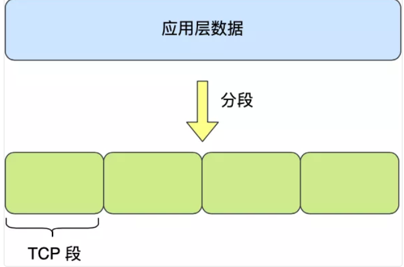
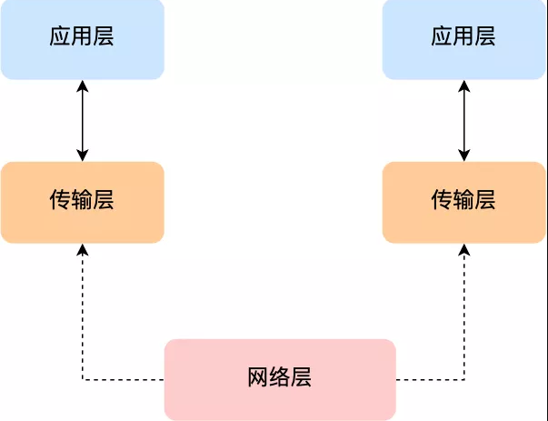
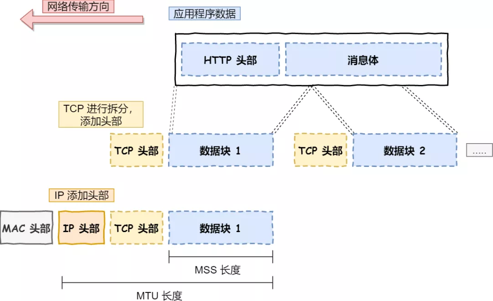

# Table of Contents

* [OSI](#osi)
* [应用层](#应用层)
* [传输层](#传输层)
* [网络](#网络)
* [数据链路层](#数据链路层)
* [物理层](#物理层)

对于同一台设备上的进程间通信，有很多种方式，比如有管道、消息队列、共享内存、信号等方式，而对于不同设备上的进程间通信，就需要网络通信，而设备是多样性的，所以要兼容多种多样的设备，就协商出了一套**通用的网络协议**。

# OSI

- **物理层**：

解决两个硬件之间怎么通信的问题，常见的物理媒介有光纤、电缆、中继器等。它主要定义物理设备标准，如网线的接口类型、光纤的接口类型、各种传输介质的传输速率等。

它的主要作用是传输比特流（就是由1、0转化为电流强弱来进行传输，到达目的地后在转化为1、0，也就是我们常说的数模转换与模数转换）。这一层的数据叫做比特。

- **数据链路层：**

在计算机网络中由于各种干扰的存在，物理链路是不可靠的。该层的主要功能就是：通过各种控制协议，将有差错的物理信道变为无差错的、能可靠传输数据帧的数据链路。

它的具体工作是接收来自物理层的位流形式的数据，并封装成帧，传送到上一层；同样，也将来自上层的数据帧，拆装为位流形式的数据转发到物理层。这一层的数据叫做帧。

- **网络层：**

计算机网络中如果有多台计算机，怎么找到要发的那台？如果中间有多个节点，怎么选择路径？这就是路由要做的事。

该层的主要任务就是：通过路由选择算法，为报文（该层的数据单位，由上一层数据打包而来）通过通信子网选择最适当的路径。这一层定义的是IP地址，通过IP地址寻址，所以产生了IP协议。

- **传输层：**

当发送大量数据时，很可能会出现丢包的情况，另一台电脑要告诉是否完整接收到全部的包。如果缺了，就告诉丢了哪些包，然后再发一次，直至全部接收为止。

简单来说，传输层的主要功能就是：监控数据传输服务的质量，保证报文的正确传输。

- **会话层：**

虽然已经可以实现给正确的计算机，发送正确的封装过后的信息了。但我们总不可能每次都要调用传输层协议去打包，然后再调用IP协议去找路由，所以我们要建立一个自动收发包，自动寻址的功能。于是会话层出现了：它的作用就是建立和管理应用程序之间的通信。

- **表示层：**

表示层负责数据格式的转换，将应用处理的信息转换为适合网络传输的格式，或者将来自下一层的数据转换为上层能处理的格式。

- **应用层：**

应用层是计算机用户，以及各种应用程序和网络之间的接口，其功能是直接向用户提供服务，完成用户希望在网络上完成的各种工作。前端同学对应用层肯定是最熟悉的。

> 但是平时我们都是只分5层

# 应用层

最上层的，也是我们能直接接触到的就是**应用层**（*Application Layer*），我们电脑或手机使用的应用软件都是在应用层实现。那么，当两个不同设备的应用需要通信的时候，应用就把应用数据传给下一层，也就是传输层。

所以，**应用层只需要专注于为用户提供应用功能**，不用去关心数据是如何传输的，就类似于，我们寄快递的时候，只需要把包裹交给快递员，由他负责运输快递，我们不需要关心快速是如何被运输的。

**而且应用层是工作在操作系统中的用户态，传输层及以下则工作在内核态**。

# 传输层

应用层的数据包会传给传输层，**传输层**（**Transport Layer**）是为应用层提供网络支持的。

在传输层会有两个传输协议，分别是 TCP 和 UDP。

TCP 的全称叫传输层控制协议（*Transmission Control Protocol*），大部分应用使用的正是 TCP 传输层协议，比如 HTTP 应用层协议。TCP 相比 UDP 多了很多特性，比如流量控制、超时重传、拥塞控制等，这些都是为了保证数据包能可靠地传输给对方。 

UDP 就相对很简单，简单到只负责发送数据包，不保证数据包是否能抵达对方，但它实时性相对更好，传输效率也高。当然，UDP 也可以实现可靠传输，把 TCP 的特性在应用层上实现就可以，不过要实现一个商用的可靠 UDP 传输协议，也不是一件简单的事情。

应用需要传输的数据可能会非常大，如果直接传输就不好控制，因此当传输层的数据包大小超过 **MSS（TCP 最大报文段长度）** ，就要将数据包分块，这样即使中途有一个分块丢失或损坏了，只需要重新这一个分块，而不用重新发送整个数据包。在 TCP 协议中，我们把每个分块称为一个 **TCP 段**（*TCP Segment*）。

当设备作为接收方时，传输层则要负责把数据包传给应用，但是一台设备上可能会有很多应用在接收或者传输数据，因此需要用一个编号将应用区分开来，这个编号就是**端口**。

比如 80 端口通常是 Web 服务器用的，22 端口通常是远程登录服务器用的。而对于浏览器（客户端）中的每个标签栏都是一个独立的进程，操作系统会为这些进程分配临时的端口号。

由于传输层的报文中会携带端口号，因此接收方可以识别出该报文是发送给哪个应用。

# 网络

传输层可能大家刚接触的时候，会认为它负责将数据从一个设备传输到另一个设备，事实上它并不负责。

实际场景中的网络环节是错综复杂的，中间有各种各样的线路和分叉路口，如果一个设备的数据要传输给另一个设备，就需要在各种各样的路径和节点进行选择，而传输层的设计理念是简单、高效、专注，如果传输层还负责这一块功能就有点违背设计原则了。

也就是说，我们不希望传输层协议处理太多的事情，只需要服务好应用即可，让其作为应用间数据传输的媒介，帮助实现应用到应用的通信，而实际的传输功能就交给下一层，也就是**网络层**（*Internet Layer*）。

网络层最常使用的是 IP 协议（*Internet Protocol*），IP 协议会将传输层的报文作为数据部分，再加上 IP 包头组装成 IP 报文，**如果 IP 报文大小超过 MTU（以太网中一般为 1500 字节）**就会**再次进行分片**，得到一个即将发送到网络的 IP 报文。

> 为什么是1500

网络层负责将数据从一个设备传输到另一个设备，世界上那么多设备，又该如何找到对方呢？因此，网络层需要有区分设备的编号。

我们一般用 IP 地址给设备进行编号，对于 IPv4 协议， IP 地址共 32 位，分成了四段，每段是 8 位。只有一个单纯的 IP 地址虽然做到了区分设备，但是寻址起来就特别麻烦，全世界那么多台设备，难道一个一个去匹配？这显然不科学。

因此，需要将 IP 地址分成两种意义：

- 一个是**网络号**，负责标识该 IP 地址是属于哪个子网的；
- 一个是**主机号**，负责标识同一子网下的不同主机；

怎么分的呢？这需要配合**子网掩码**才能算出 IP 地址 的网络号和主机号。那么在寻址的过程中，先匹配到相同的网络号，才会去找对应的主机。

除了寻址能力， IP 协议还有另一个重要的能力就是**路由**。实际场景中，两台设备并不是用一条网线连接起来的，而是通过很多网关、路由器、交换机等众多网络设备连接起来的，那么就会形成很多条网络的路径，因此当数据包到达一个网络节点，就需要通过算法决定下一步走哪条路径。

所以，**IP 协议的寻址作用是告诉我们去往下一个目的地该朝哪个方向走，路由则是根据「下一个目的地」选择路径。寻址更像在导航，路由更像在操作方向盘**。

# 数据链路层

实际场景中，网络并不是一个整体，比如你家和我家就不属于一个网络，所以数据不仅可以在同一个网络中设备间进行传输，也可以跨网络进行传输。

一旦数据需要跨网络传输，就需要有一个设备同时在两个网络当中，这个设备一般是路由器，路由器可以通过路由表计算出下一个要去的 IP 地址。

那问题来了，路由器怎么知道这个 IP 地址是哪个设备的呢？

于是，就需要有一个专门的层来标识网络中的设备，让数据在一个链路中传输，这就是**数据链路层**（*Data Link Layer*），它主要为网络层提供链路级别传输的服务。

每一台设备的网卡都会有一个 MAC 地址，它就是用来唯一标识设备的。路由器计算出了下一个目的地 IP 地址，再通过 ARP 协议找到该目的地的 MAC 地址，这样就知道这个 IP 地址是哪个设备的了。

# 物理层

当数据准备要从设备发送到网络时，需要把数据包转换成电信号，让其可以在物理介质中传输，这一层就是**物理层**（*Physical Layer*），它主要是为数据链路层提供二进制传输的服务。

像网卡之类的。

