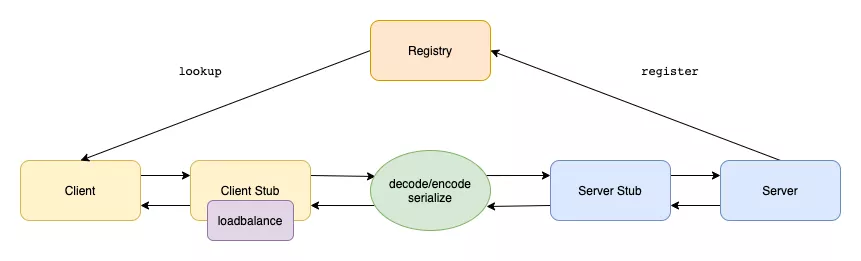

# Table of Contents

* [RPC是什么？](#rpc是什么)
* [RPC和HTTP?](#rpc和http)
* [GRPC](#grpc)
* [基本架构图](#基本架构图)
* [Dubbo](#dubbo)
* [Dubbo和Spring Cloudd对比](#dubbo和spring-cloudd对比)

#  RPC是什么？

RPC（Remote Procedure Call）远程过程调用协议，一种通过网络从远程计算机上请求服务，而不需要了解底层网络技术的协议。

**RPC的本质是提供了一种轻量无感知的跨进程通信的方式**，在分布式机器上调用其他方法与本地调用无异（远程调用的过程是透明的，你并不知道这个调用的方法是部署在哪里，通过PRC能够解耦服务）。

[OSI七层模详情](OSI七层模型.md)

+ RPC就是从一台机器（客户端）上**通过参数传递的方式调用**另一台机器（服务器）上的一个函数或方法（可以统称为服务）并得到返回的结果。

+ RPC会**隐藏底层的通讯细节**（不需要直接处理Socket通讯或Http通讯）。

+ 客户端发起请求，服务器返回响应（类似于Http的工作方式）RPC在**使用形式上像调用本地函数（或方法）一样去调用远程的函数（或方法）**。

**最终解决的问题：让分布式或者微服务系统中不同服务之间的调用（远程调用）像本地调用一样简单！**

# RPC和HTTP?

【RPC 只是一种概念、一种设计】就是为了解决 **不同服务之间的调用问题**, 它一般会包含有 **传输协议** 和 **序列化协议** 这两个。

你可以用Http1来实现，也可以用Http2来实现，取决于你的业务场景。

简单来说成熟的rpc库相对http容器，更多的是封装了“服务发现”，"负载均衡"，“熔断降级”一类面向服务的高级特性。可以这么理解，rpc框架是面向服务的更高级的封装。**如果把一个http servlet容器上封装一层服务发现和函数代理调用，那它就已经可以做一个rpc框架了。**

所以为什么要用rpc调用？

因为良好的rpc调用是面向服务的封装，针对服务的可用性和效率等都做了优化。单纯使用http调用则缺少了这些特性

# GRPC

**gRPC是谷歌开源的一个 RPC 框架，面向移动和 HTTP/2 设计。**

+ 内容交换格式采用ProtoBuf(Google Protocol Buffers)，开源已久，提供了一种灵活、高效、自动序列化结构数据的机制，作用与XML，Json类似，但使用二进制，（反）序列化速度快，压缩效率高。

+ 传输协议 采用http2，性能比http1.1好了很多

> 目前一般使用的都是GRPC

# 基本架构图

RPC框架的实现基本上都是如下架构

一个RPC调用的过程如下

1. 调用方发送请求后由代理类将调用的方法，参数组装成能进行网络传输的消息体
2. 调用方代理类将消息体发送到提供方
3. 提供方代理类将消息进行解码，得到调用的方法和参数
4. 提供方代理类执行相应的方法，并将结果返回

# Dubbo

Dubbo 是一个分布式服务框架，致力于提供高性能和透明化的 **RPC 远程服务调用方案**，以及 **SOA 服务治理方案**。简单的说，Dubbo 就是个服务框架，说白了就是个**远程服务调用的分布式框架**。

# Dubbo和Spring Cloudd对比

