# Table of Contents

* [前言](#前言)
* [什么是 TCP 半连接队列和全连接队列？](#什么是-tcp-半连接队列和全连接队列)
* [实战 - TCP 全连接队列溢出](#实战---tcp-全连接队列溢出)
  * [如何知道应用程序的 TCP 全连接队列大小？](#如何知道应用程序的-tcp-全连接队列大小)
  * [全连接队列满了，就只会丢弃连接吗？](#全连接队列满了就只会丢弃连接吗)
  * [如何增大 TCP 全连接队列呢？](#如何增大-tcp-全连接队列呢)
* [实战 - TCP 半连接队列溢出](#实战---tcp-半连接队列溢出)
  * [接下来，走进 Linux 内核的源码，来分析 TCP 半连接队列的最大值是如何决定的。](#接下来走进-linux-内核的源码来分析-tcp-半连接队列的最大值是如何决定的)
  * [半连接队列最大值 max_qlen_log 就表示服务端处于 SYN_REVC 状态的最大个数吗？](#半连接队列最大值-max_qlen_log-就表示服务端处于-syn_revc-状态的最大个数吗)
  * [如何防御 SYN 攻击？](#如何防御-syn-攻击)
* [总结](#总结)

# 前言

网上许多博客针对增大 TCP 半连接队列和全连接队列的方式如下：

- 增大 TCP 半连接队列方式是增大 tcp_max_syn_backlog；
- 增大 TCP 全连接队列方式是增大 listen() 函数中的 backlog；

这里先跟大家说下，**上面的方式都是不准确的。**

# 什么是 TCP 半连接队列和全连接队列？

在 TCP 三次握手的时候，Linux 内核会维护两个队列，分别是：

- 半连接队列，也称 SYN 队列；
- 全连接队列，也称 accepet 队列；

服务端收到客户端发起的 SYN 请求后，**内核会把该连接存储到半连接队列**，并向客户端响应 SYN+ACK，接着客户端会返回 ACK，服务端收到第三次握手的 ACK 后，**内核会把连接从半连接队列移除，然后创建新的完全的连接，并将其添加到 accept 队列，等待进程调用 accept 函数时把连接取出来。**

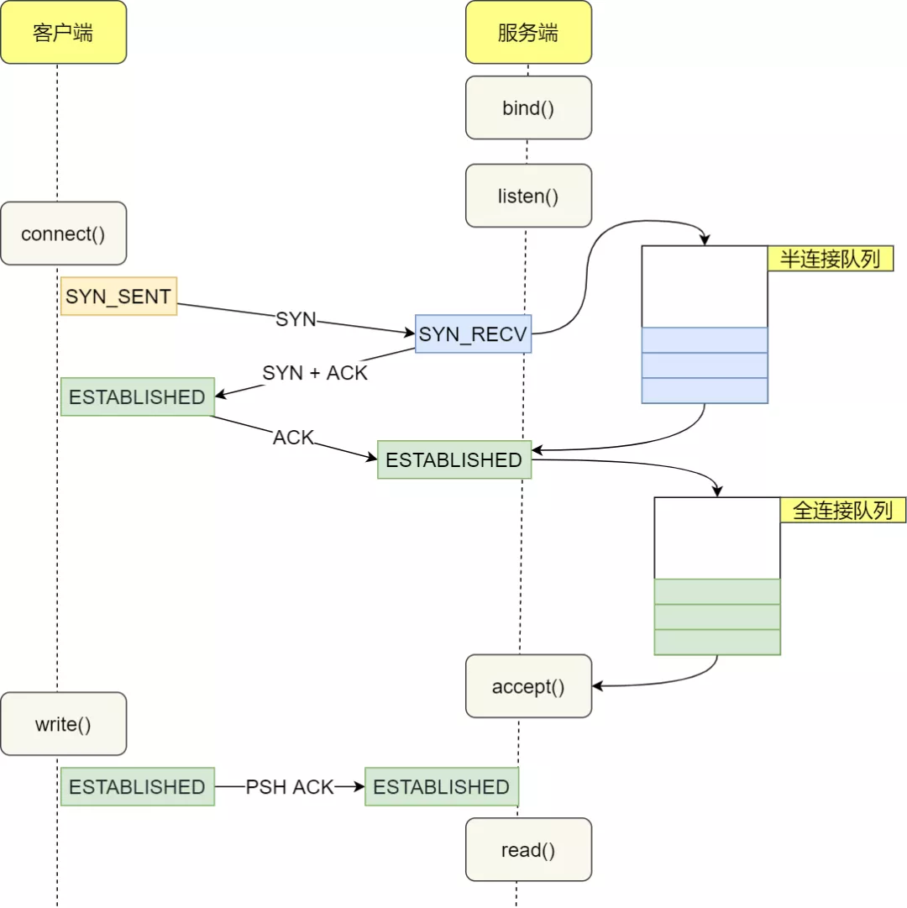

不管是半连接队列还是全连接队列，都有最大长度限制，超过限制时，内核会直接丢弃，或返回 RST 包。

# 实战 - TCP 全连接队列溢出

## 如何知道应用程序的 TCP 全连接队列大小？

在服务端可以使用 `ss` 命令，来查看 TCP 全连接队列的情况：

但需要注意的是 `ss` 命令获取的 `Recv-Q/Send-Q` 在「LISTEN 状态」和「非 LISTEN 状态」所表达的含义是不同的。从下面的内核代码可以看出区别：

在「LISTEN 状态」时，`Recv-Q/Send-Q` 表示的含义如下：

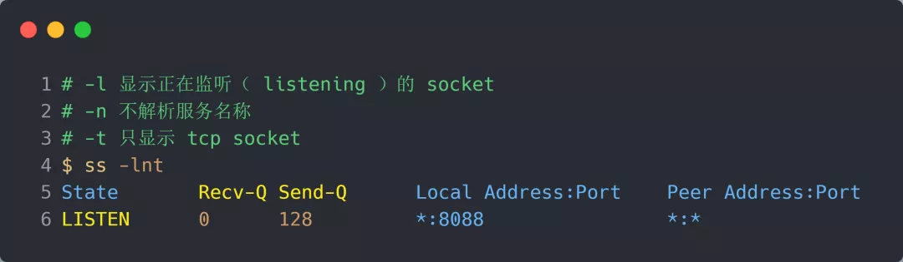

- Recv-Q：当前全连接队列的大小，也就是当前已完成三次握手并等待服务端 `accept()` 的 TCP 连接个数；
- Send-Q：当前全连接最大队列长度，上面的输出结果说明监听 8088 端口的 TCP 服务进程，最大全连接长度为 128；

在「非 LISTEN 状态」时，`Recv-Q/Send-Q` 表示的含义如下：

- Recv-Q：已收到但未被应用进程读取的字节数；
- Send-Q：已发送但未收到确认的字节数；

> 如何模拟 TCP 全连接队列溢出的场景？

从上面的模拟结果，可以得知，**当服务端并发处理大量请求时，如果 TCP 全连接队列过小，就容易溢出。发生 TCP 全连接队溢出的时候，后续的请求就会被丢弃，这样就会出现服务端请求数量上不去的现象。**

## 全连接队列满了，就只会丢弃连接吗？

实际上，丢弃连接只是 Linux 的默认行为，我们还可以选择向客户端发送 RST 复位报文，告诉客户端连接已经建立失败。

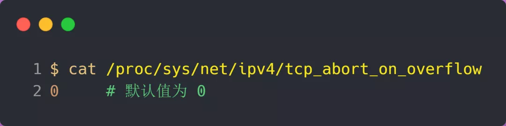

tcp_abort_on_overflow 共有两个值分别是 0 和 1，其分别表示：

- 0 ：表示如果全连接队列满了，那么 server 扔掉 client  发过来的 ack ；
- 1 ：表示如果全连接队列满了，那么 server 发送一个 `reset` 包给 client，表示废掉这个握手过程和这个连接；

如果要想知道客户端连接不上服务端，是不是服务端 TCP 全连接队列满的原因，那么可以把 tcp_abort_on_overflow 设置为 1，这时如果在客户端异常中可以看到很多 `connection reset by peer` 的错误，那么就可以证明是由于服务端 TCP 全连接队列溢出的问题。

通常情况下，应当把 tcp_abort_on_overflow 设置为 0，因为这样更有利于应对突发流量。

举个例子，当 TCP 全连接队列满导致服务器丢掉了 ACK，与此同时，客户端的连接状态却是 ESTABLISHED，进程就在建立好的连接上发送请求。只要服务器没有为请求回复 ACK，请求就会被多次**重发**。如果服务器上的进程只是**短暂的繁忙造成 accept 队列满，那么当 TCP 全连接队列有空位时，再次接收到的请求报文由于含有 ACK，仍然会触发服务器端成功建立连接。**

所以，tcp_abort_on_overflow 设为 0 可以提高连接建立的成功率，只有你非常肯定 TCP 全连接队列会长期溢出时，才能设置为 1 以尽快通知客户端。

## 如何增大 TCP 全连接队列呢？

是的，当发现 TCP 全连接队列发生溢出的时候，我们就需要增大该队列的大小，以便可以应对客户端大量的请求。

**TCP 全连接队列足最大值取决于 somaxconn 和 backlog 之间的最小值，也就是 min(somaxconn, backlog)**。从下面的 Linux 内核代码可以得知：

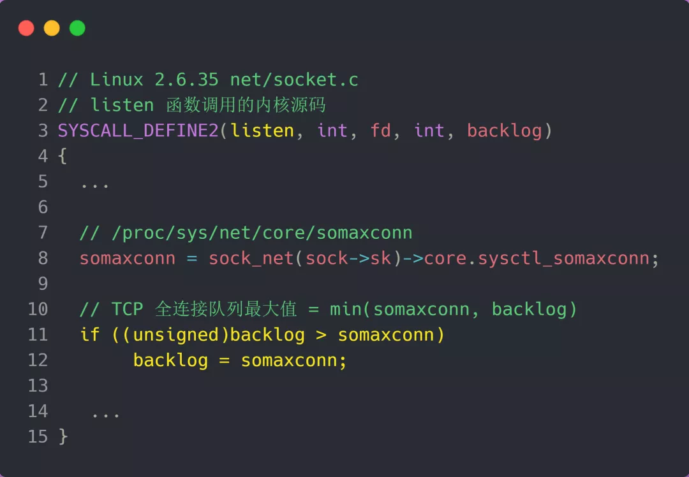

`somaxconn` 是 Linux 内核的参数，默认值是 128，可以通过 `/proc/sys/net/core/somaxconn` 来设置其值；

`backlog` 是 `listen(int sockfd, int backlog)` 函数中的 backlog 大小，Nginx 默认值是 511，可以通过修改配置文件设置其长度；

**如果持续不断地有连接因为 TCP 全连接队列溢出被丢弃，就应该调大 backlog 以及 somaxconn 参数。**

> 但是也不能无限增大，本身tcp连接也会占用内存

# 实战 - TCP 半连接队列溢出

> 如何查看 TCP 半连接队列长度？

很遗憾，TCP 半连接队列长度的长度，没有像全连接队列那样可以用 ss 命令查看。

但是我们可以抓住 TCP 半连接的特点，就是服务端处于 `SYN_RECV` 状态的 TCP 连接，就是在 TCP 半连接队列。

于是，我们可以使用如下命令计算当前 TCP 半连接队列长度：

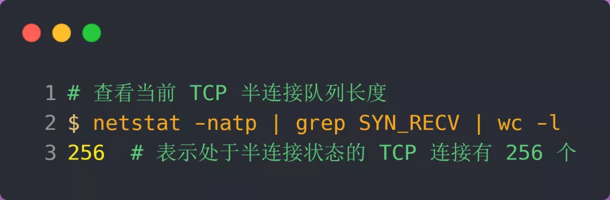

> 如何模拟 TCP 半连接队列溢出场景？

模拟 TCP 半连接溢出场景不难，实际上就是对服务端一直发送 TCP SYN 包，但是不回第三次握手 ACK，这样就会使得服务端有大量的处于 `SYN_RECV` 状态的 TCP 连接。

这其实也就是所谓的 SYN 洪泛、SYN 攻击、DDos 攻击。

> 大部分人都说 tcp_max_syn_backlog 是指定半连接队列的大小，是真的吗？

很遗憾，半连接队列的大小并不单单只跟 `tcp_max_syn_backlog` 有关系。

上面模拟 SYN 攻击场景时，服务端的 tcp_max_syn_backlog 的默认值如下：

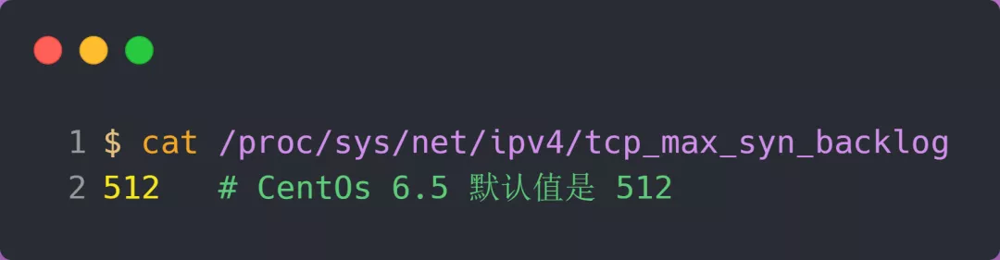

但是在测试的时候发现，服务端最多只有 256 个半连接队列，而不是 512，所以**半连接队列的最大长度不一定由 tcp_max_syn_backlog 值决定的**。

## 接下来，走进 Linux 内核的源码，来分析 TCP 半连接队列的最大值是如何决定的。

TCP 第一次握手（收到 SYN 包）的 Linux 内核代码如下，其中缩减了大量的代码，只需要重点关注 TCP 半连接队列溢出的处理逻辑：

从源码中，我可以得出共有三个条件因队列长度的关系而被丢弃的：

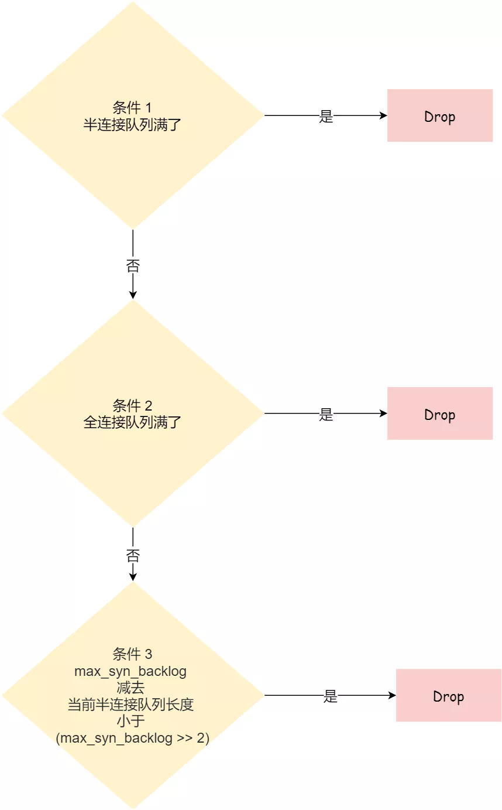

1. **如果半连接队列满了，并且没有开启 tcp_syncookies，则会丢弃；**
2. **若全连接队列满了，且没有重传 SYN+ACK 包的连接请求多于 1 个，则会丢弃；**
3. **如果没有开启 tcp_syncookies，并且 max_syn_backlog 减去 当前半连接队列长度小于 (max_syn_backlog >> 2)，则会丢弃；**

关于 tcp_syncookies 的设置，后面在详细说明，可以先给大家说一下，开启 tcp_syncookies 是缓解 SYN 攻击其中一个手段。

接下来，我们继续跟一下检测半连接队列是否满的函数 inet_csk_reqsk_queue_is_full 和 检测全连接队列是否满的函数 sk_acceptq_is_full ：

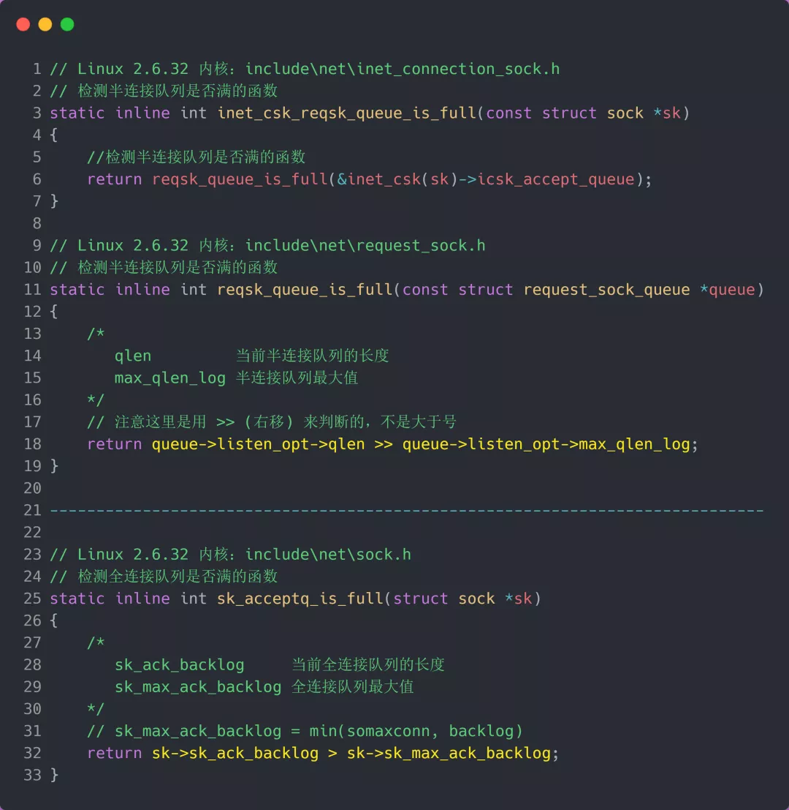

从上面源码，可以得知：

- **全**连接队列的最大值是 `sk_max_ack_backlog` 变量，sk_max_ack_backlog 实际上是在 listen() 源码里指定的，也就是 **min(somaxconn, backlog)**；
- **半**连接队列的最大值是 `max_qlen_log` 变量，max_qlen_log 是在哪指定的呢？现在暂时还不知道，我们继续跟进；

我们继续跟进代码，看一下是哪里初始化了半连接队列的最大值 max_qlen_log：

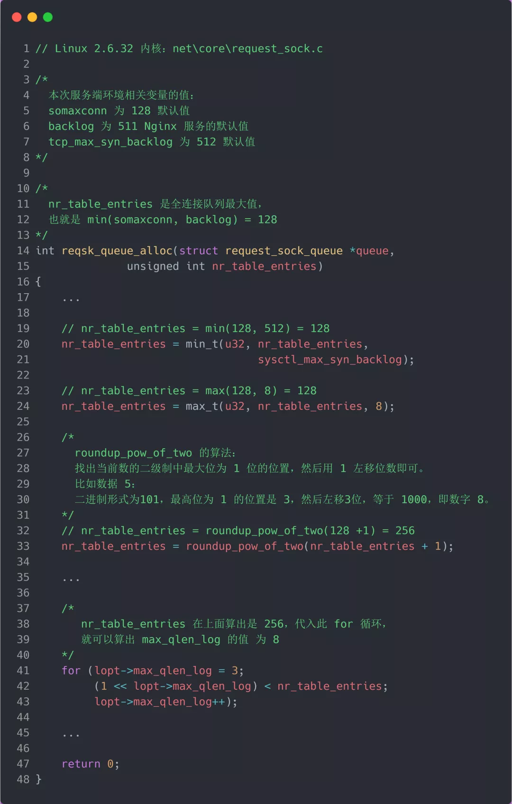

在 Linux 2.6.32 内核版本，它们之间的关系，总体可以概况为：

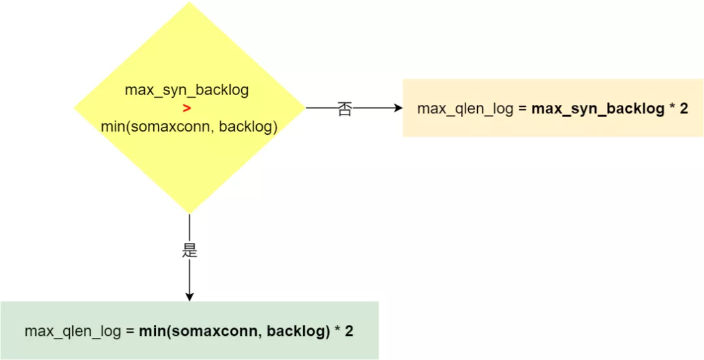

1. 当 max_syn_backlog > min(somaxconn, backlog) 时， 半连接队列最大值 max_qlen_log = min(somaxconn, backlog) * 2;

2. 当 max_syn_backlog < min(somaxconn, backlog) 时， 半连接队列最大值 max_qlen_log = max_syn_backlog * 2;

## 半连接队列最大值 max_qlen_log 就表示服务端处于 SYN_REVC 状态的最大个数吗？

依然很遗憾，并不是。

max_qlen_log 是**理论**半连接队列最大值，并不一定代表服务端处于 SYN_REVC 状态的最大个数。

在前面我们在分析 TCP 第一次握手（收到 SYN 包）时会被丢弃的三种条件：

1. 如果半连接队列满了，并且没有开启 tcp_syncookies，则会丢弃；
2. 若全连接队列满了，且没有重传 SYN+ACK 包的连接请求多于 1 个，则会丢弃；
3. **如果没有开启 tcp_syncookies，并且 max_syn_backlog 减去 当前半连接队列长度小于 (max_syn_backlog >> 2)，则会丢弃；**

假设条件 1 当前半连接队列的长度 「没有超过」理论的半连接队列最大值  max_qlen_log，那么如果条件 3 成立，则依然会丢弃 SYN 包，也就会使得服务端处于 SYN_REVC 状态的最大个数不会是理论值 max_qlen_log。

似乎很难理解，我们继续接着做实验，实验见真知。

> 如果 SYN 半连接队列已满，只能丢弃连接吗？

并不是这样，**开启 syncookies 功能就可以在不使用 SYN 半连接队列的情况下成功建立连接**，在前面我们源码分析也可以看到这点，当开启了  syncookies 功能就不会丢弃连接。

syncookies 是这么做的：服务器根据当前状态计算出一个值，放在己方发出的 SYN+ACK 报文中发出，当客户端返回 ACK 报文时，取出该值验证，如果合法，就认为连接建立成功，如下图所示。

syncookies 参数主要有以下三个值：

- 0 值，表示关闭该功能；
- 1 值，表示仅当 SYN 半连接队列放不下时，再启用它；
- 2 值，表示无条件开启功能；

那么在应对 SYN 攻击时，只需要设置为 1 即可：

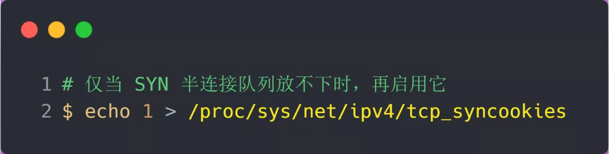

## 如何防御 SYN 攻击？

这里给出几种防御 SYN 攻击的方法：

- 增大半连接队列；
- 开启 tcp_syncookies 功能
- 减少 SYN+ACK 重传次数

*方式一：增大半连接队列*

在前面源码和实验中，得知**要想增大半连接队列，我们得知不能只单纯增大 tcp_max_syn_backlog 的值，还需一同增大 somaxconn 和 backlog，也就是增大全连接队列**。否则，只单纯增大 tcp_max_syn_backlog 是无效的。

增大 tcp_max_syn_backlog 和 somaxconn 的方法是修改 Linux 内核参数：

*方式二：开启 tcp_syncookies 功能*

开启 tcp_syncookies 功能的方式也很简单，修改 Linux 内核参数：

*方式三：减少 SYN+ACK 重传次数*

当服务端受到 SYN 攻击时，就会有大量处于 SYN_REVC 状态的 TCP 连接，处于这个状态的 TCP 会重传 SYN+ACK ，当重传超过次数达到上限后，就会断开连接。

那么针对 SYN 攻击的场景，我们可以减少 SYN+ACK 的重传次数，以加快处于 SYN_REVC 状态的 TCP 连接断开。

# 总结

1. accept队列是由min(somaxcoon,backlog)决定的

2. syn队列是由

   1. 当 max_syn_backlog > min(somaxconn, backlog) 时， 半连接队列最大值 max_qlen_log = min(somaxconn, backlog) * 2;

   ​    2. 当 max_syn_backlog < min(somaxconn, backlog) 时， 半连接队列最大值 max_qlen_log = max_syn_backlog * 2;

3. 实际中基本达不到max_qlen_log ，因为syn队列还有丢弃条件
