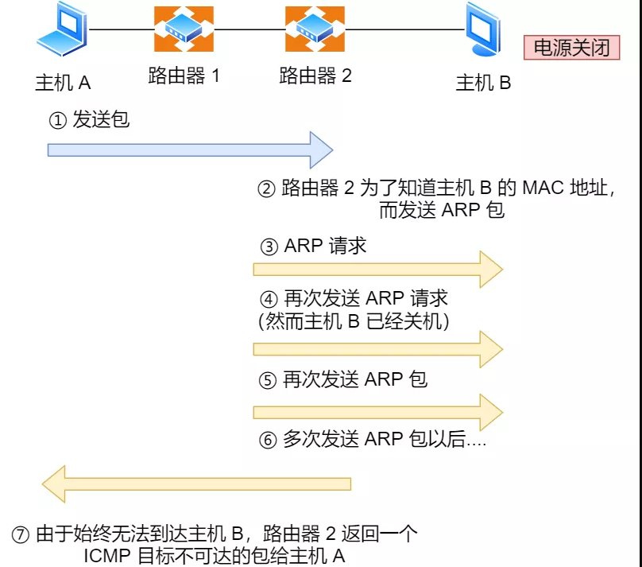

# Table of Contents

* [IP协议的助手 —— ICMP 协议](#ip协议的助手--icmp-协议)

在日常生活或工作中，我们在判断与对方**网络是否畅通**，使用的最多的莫过于 `ping` 命令了。

“**那你知道 ping 是如何工作的吗？**”

# IP协议的助手 —— ICMP 协议

ping 是基于 `ICMP` 协议工作的，所以要明白 ping 的工作，首先我们先来熟悉 **ICMP 协议**。

> ICMP 是什么？

ICMP 全称是 **Internet Control Message Protocol**，也就是**互联网控制报文协议**。

里面有个关键词 —— **控制**，如何控制的呢？

网络包在复杂的网络传输环境里，常常会遇到各种问题。当遇到问题的时候，总不能死个不明不白，没头没脑的作风不是计算机网络的风格。所以需要传出消息，报告遇到了什么问题，这样才可以调整传输策略，以此来控制整个局面。

> ICMP 功能都有啥？

`ICMP` 主要的功能包括：**确认 IP 包是否成功送达目标地址、报告发送过程中 IP 包被废弃的原因和改善网络设置等。**

在 `IP` 通信中如果某个 `IP` 包因为某种原因未能达到目标地址，那么这个具体的原因将**由 ICMP 负责通知**。

如上图例子，主机 `A` 向主机 `B` 发送了数据包，由于某种原因，途中的路由器 `2` 未能发现主机 `B` 的存在，这时，路由器 `2` 就会向主机 `A` 发送一个 `ICMP` 目标不可达数据包，说明发往主机 `B` 的包未能成功。

ICMP 的这种通知消息会使用 `IP` 进行发送 。

因此，从路由器 `2` 返回的 ICMP 包会按照往常的路由控制先经过路由器 `1` 再转发给主机 `A` 。

收到该 ICMP 包的主机 `A` 则分解 ICMP 的**首部和数据域**以后得知具体发生问题的原因。

