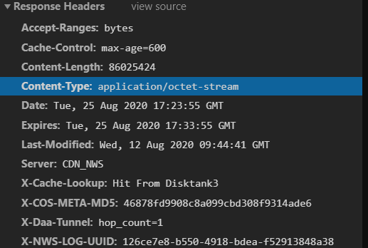

# Table of Contents

* [要求](#要求)
* [原理](#原理)
* [实现](#实现)

# 要求

1. 把一个文件下载流分成 n 份，即 n 个线程各下载一份
2. 等待所有线程搞定，之后将 n 个文件合并为一个

# 原理

HTTP response

 Content-Length： 字段标志了当前文件长度的大小

Accept-Ranges：**bytes=0-1023** 表示只获取文件从 0 到 1023（包括）共1024字节的部分文件

# 实现

1. 先发送一个 head 请求，获取文件的长度 contentLength
2. 构建多个请求，这里是 5 个
3. 启动多个并发请求
4. 合并文件

