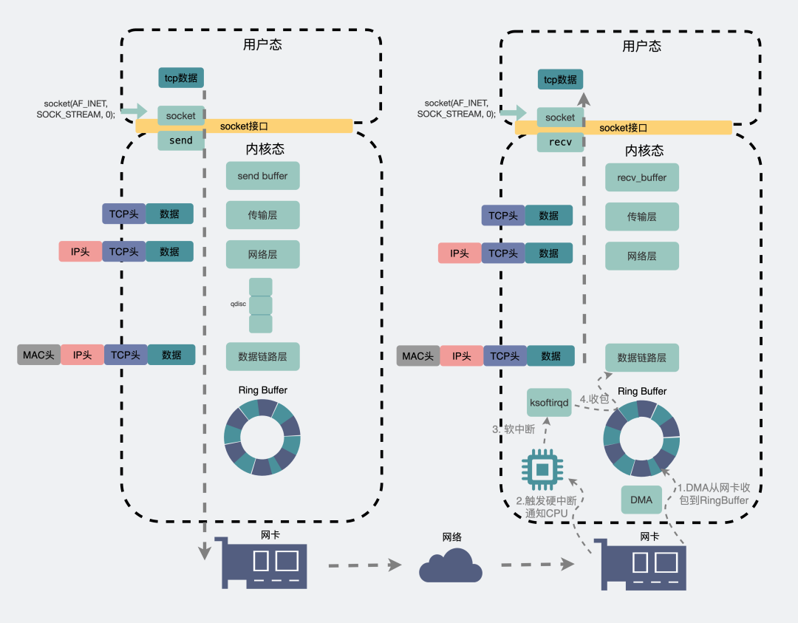
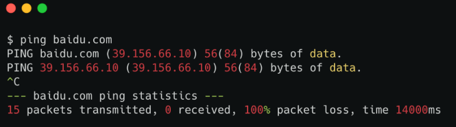
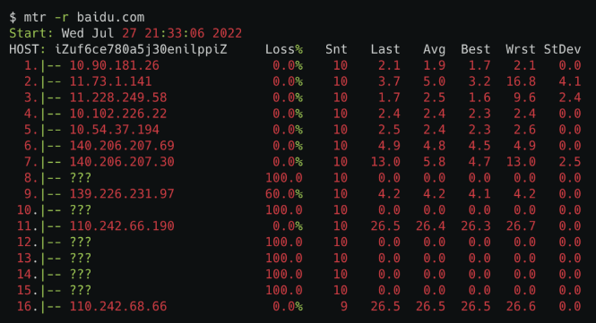

# Table of Contents

* [**数据包的发送流程**](#数据包的发送流程)
* [**建立连接时丢包**](#建立连接时丢包)
* [**流量控制丢包**](#流量控制丢包)
* [**网卡丢包**](#网卡丢包)
* [**接收缓冲区丢包**](#接收缓冲区丢包)
* [**两端之间的网络丢包**](#两端之间的网络丢包)
  * [**ping命令查看丢包**](#ping命令查看丢包)
  * [mtr命令可以查看到你的机器和目的机器之间的每个节点的丢包情况。](#mtr命令可以查看到你的机器和目的机器之间的每个节点的丢包情况)
* [**发生丢包了怎么办**](#发生丢包了怎么办)
* [**总结**](#总结)


TCP 是一个可靠的传输协议，那它一定能保证数据不丢失吗？


# **数据包的发送流程**

一个数据包，从聊天框里发出，消息会从**聊天软件**所在的**用户空间**拷贝到**内核空间**的**发送缓冲区（send buffer）**，数据包就这样顺着**传输层、网络层，进入到数据链路层，在这里数据包会经过流控（qdisc），再通过RingBuffer发到物理层的网卡**。数据就这样顺着**网卡**发到了**纷繁复杂**的网络世界里。这里头数据会经过n多个**路由器和交换机**之间的跳转，最后到达**目的机器的网卡**处。

此时目的机器的网卡会通知**DMA**将数据包信息放到`RingBuffer`中，再触发一个**硬中断**给`CPU`，`CPU`触发**软中断**让`ksoftirqd`去`RingBuffer`收包，于是一个数据包就这样顺着**物理层，数据链路层，网络层，传输层**，最后从内核空间拷贝到用户空间里的**聊天软件**里。




# **建立连接时丢包**

在服务端，第一次握手之后，会先建立个**半连接**，然后再发出第二次握手。这时候需要有个地方可以**暂存**这些半连接。这个地方就叫**半连接队列**。

如果之后第三次握手来了，半连接就会升级为全连接，然后暂存到另外一个叫**全连接队列**的地方，坐等程序执行`accept()`方法将其取走使用。


.png)


# **流量控制丢包**

应用层能发网络数据包的软件有那么多，如果所有数据不加控制一股脑冲入到网卡，网卡会吃不消，那怎么办？让数据按一定的规则排个队依次处理，也就是所谓的**qdisc**(**Q**ueueing **Disc**iplines，排队规则)，这也是我们常说的**流量控制**机制。

排队，得先有个队列，而队列有个**长度**。

我们可以通过下面的`ifconfig`命令查看到，里面涉及到的`txqueuelen`后面的数字`1000`，其实就是流控队列的长度。

当发送数据过快，流控队列长度`txqueuelen`又不够大时，就容易出现**丢包**现象。


# **网卡丢包**

网卡和它的驱动导致丢包的场景也比较常见，原因很多，比如**网线质量差，接触不良**。除此之外，我们来聊几个常见的场景。


# **接收缓冲区丢包**

我们一般使用`TCP socket`进行网络编程的时候，内核都会分配一个**发送缓冲区**和一个**接收缓冲区**。

当我们想要发一个数据包，会在代码里执行`send(msg)`，这时候数据包并不是一把梭直接就走网卡飞出去的。而是将数据拷贝到内核**发送缓冲区**就完事**返回**了，至于**什么时候发数据，发多少数据**，这个后续由内核自己做决定。


# **两端之间的网络丢包**

前面提到的是两端机器内部的网络丢包，除此之外，两端之间那么长的一条链路都属于外部网络，这中间有各种路由器和交换机还有光缆啥的，丢包也是很经常发生的。

这些丢包行为发生在中间链路的某些个机器上，我们当然是没权限去登录这些机器。但我们可以通过一些命令观察整个链路的连通情况。


## **ping命令查看丢包**

比如我们知道目的地的域名是 `baidu.com`。想知道你的机器到baidu服务器之间，有没有产生丢包行为。可以使用ping命令。



倒数第二行里有个`100% packet loss`，意思是丢包率100%。

但这样其实你只能知道**你的机器和目的机器之间有没有丢包。**

**那如果你想知道你和目的机器之间的这条链路，哪个节点丢包了，有没有办法呢?**

有。

## mtr命令可以查看到你的机器和目的机器之间的每个节点的丢包情况。

```java
mtr -r baidu.com
```




# **发生丢包了怎么办**

说了这么多。只是想告诉大家，**丢包是很常见的，几乎不可避免的一件事情**。

但问题来了，发生丢包了怎么办？

这个好办，用**TCP协议**去做传输。


建立了TCP连接的两端，发送端在发出数据后会等待接收端回复`ack包`，`ack包`的目的是为了告诉对方自己确实收到了数据，但如果中间链路发生了丢包，那发送端会迟迟收不到确认ack，于是就会进行**重传**。以此来保证每个数据包都确确实实到达了接收端。


# **总结**

- 数据从发送端到接收端，链路很长，任何一个地方都可能发生丢包，几乎可以说丢包不可避免。
- 平时没事也不用关注丢包，大部分时候TCP的重传机制保证了消息可靠性。
- 当你发现服务异常的时候，比如接口延时很高，总是失败的时候，可以用ping或者mtr命令看下是不是中间链路发生了丢包。
- **TCP只保证传输层的消息可靠性，并不保证应用层的消息可靠性。**如果我们还想保证应用层的消息可靠性，就需要应用层自己去实现逻辑做保证。
