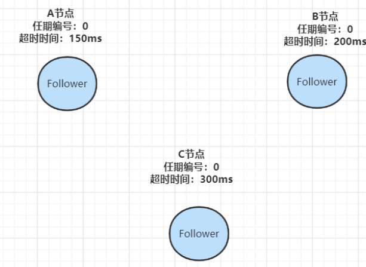
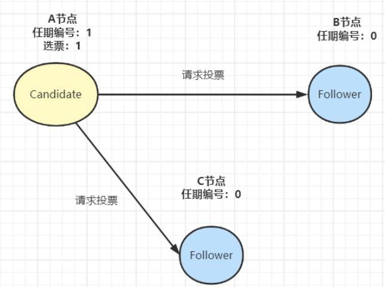
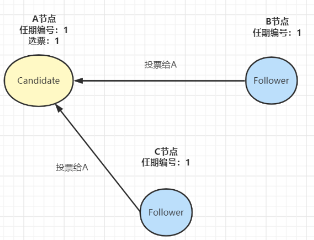
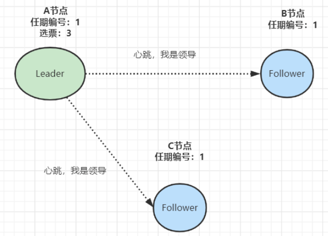
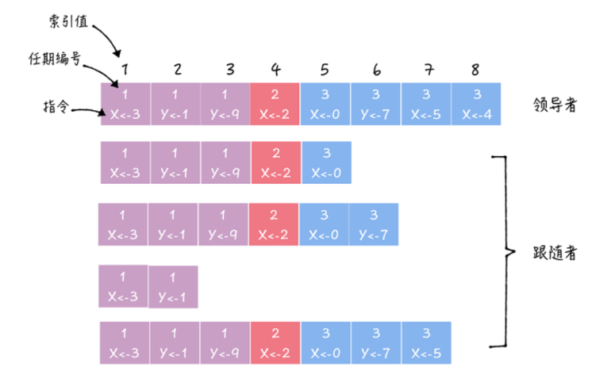
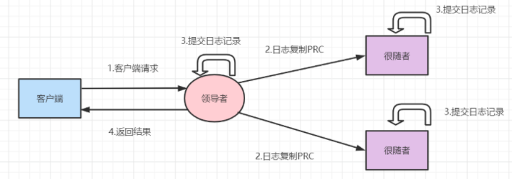

# Table of Contents

* [Raft选举过程涉及三种角色和任期（Term）：](#raft选举过程涉及三种角色和任期term)
* [**领导选举过程**](#领导选举过程)
* [日志复制](#日志复制)

Nacos作为配置中心的功能是基于**Raft算法**来实现的。

Raft 算法是分布式系统开发首选的共识算法，它通过“一切以领导者为准”的方式，实现一系列值的共识和各节点日志的一致。

> 人人都想当领导

# Raft选举过程涉及三种角色和任期（Term）：

- `Follower`：默默地接收和处理来自Leader的消息，当等待Leader心跳信息超时的时候，就主动站出来，推荐自己当Candidate。
- `Candidate`：向其他节点发送投票请求，通知其他节点来投票，如果赢得了大多数（N/2+1）选票，就晋升Leader。
- `Leader`：负责处理客户端请求，进行日志复制等操作，每一轮选举的目标就是选出一个领导者；领导者会不断地发送心跳信息，通知其他节点“我是领导者，我还活着，你们不要发起新的选举，不用找个新领导者来替代我。”
- `Term`：这跟民主社会的选举很像，每一届新的履职期称之为一届任期

# **领导选举过程**

1. 在初始时，集群中所有的节点都Follower状态，都被设定一个随机选举超时时间（一般150ms-300ms）：

2. 如果Follower在规定的超时时间，都没有收到来自Leader的心跳，它就发起选举：将自己的状态切为 Candidate，增加自己的任期编号，然后向集群中的其它Follower节点发送请求，询问其是否选举自己成为Leader：

   

3. 其他节点收到候选人A的请求投票消息后，如果在编号为1的这届任期内还没有进行过投票，那么它将把选票投给节点A，并增加自己的任期编号：

   

4. 收到来自集群中过半节点的接受投票后，A节点即成为本届任期内 Leader，他将周期性地发送心跳消息，通知其他节点我是Leader，阻止Follower发起新的选举：

# 日志复制

当有了leader，系统可以对外工作期啦。客户端的一切请求来发送到leader，leader来调度这些并发请求的顺序，并且保证leader与followers状态的一致性。Leader接收到来自客户端写请求后，处理写请求的过程其实就是一个**日志复制**的过程。

日志项长什么样呢？如下图：

请求完整过程：

1. 当系统leader收到一个来自客户端的写请求，就会添加一个log entry（日志项）到本地日志。
2. Leader通过日志复制（AppendEntries）RPC 消息，将日志项并行复制到集群其它Follower节点。
3. 如果Leader接收到**大多数的“复制成功”**响应后，它将日志项应用到自己的状态机，并返回成功给客户端。相反没有收到大多数的“复制成功”响应，那么就返回错误给客户端；
4. 当Follower接收到心跳信息，或者新的AppendEntries消息后，如果发现Leader已经提交了某条日志项，而自己还没应用，那么Follower就会将这条日志项应用到本地的状态机中。

Raft算法，**Leader是通过强制Follower直接复制自己的日志项**，来处理不一致日志，从而最终实现了集群各节点日志的一致。

> 注意是强制
