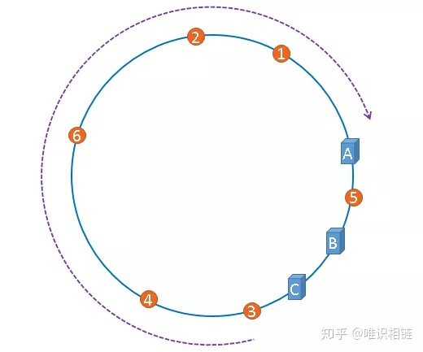

# Table of Contents

* [一致性Hash算法引入](#一致性hash算法引入)
* [一致性Hash算法简介](#一致性hash算法简介)
* [一致性Hash算法](#一致性hash算法)
  * [Hash 环](#hash-环)
  * [删除节点](#删除节点)
  * [添加节点](#添加节点)
  * [不平衡问题](#不平衡问题)
  * [虚拟节点](#虚拟节点)
* [总结](#总结)
* [一致性Hash应用](#一致性hash应用)
* [参考资料](#参考资料)


# 一致性Hash算法引入


> 在分布式集群中，对机器的添加删除，或者机器故障后自动脱离集群这些操作是分布式集群管理最基本的功能。

如果采用常用的hash(object)%N算法，那么在有机器添加或者删除后，很多原有的数据就无法找到了，这样严重的违反了**单调性**原则。

```java
1：hash(k)%N
机器0 上保存的数据有：3，6，9
机器1 上保存的数据有：1，4，7，10
机器2 上保存的数据有：2，5，8	

2：hash(k)%(N+1)
机器0 上保存的数据有：4，8
机器1 上保存的数据有：1，5，9
机器2 上保存的数据有：2，6，10
机器3 上保存的数据有：3，7
```


只有数据1和数据2没有移动，所以当集群中数据量很大时，采用一般的哈希函数，在**节点数量动态变化**的情况下会造成**大量的数据迁移**，导致网络通信压力的剧增，严重情况，还可能导致数据库宕机。


# 一致性Hash算法简介

一致性哈希算法在1997年由麻省理工学院提出的一种分布式哈希(DHT)实现算法，设计目标是为了解决因特网中的热点(Hot spot)问题，初衷和CARP十分类似。一致性哈希修正了CARP使用的简 单哈希算法带来的问题，使得分布式哈希(DHT)可以在P2P环境中真正得到应用。

一致性hash算法提出了在动态变化的Cache环境中，判定哈希算法好坏的四个定义:

- `平衡性(Balance)`: 平衡性是指哈希的结果能够尽可能分布到所有的缓冲中去，这样可以使得所有的缓冲空间都得到利用。很多哈希算法都能够满足这一条件。
- `单调性(Monotonicity)`: 单调性是指如果已经有一些内容通过哈希分派到了相应的缓冲中，又有新的缓冲加入到系统中。<font color=red>哈希的结果应能够保证原有已分配的内容可以被映射到原有的或者新的缓冲中去，而不会被映射到旧的缓冲集合中的其他缓冲区。</font>
- `分散性(Spread)`: 在分布式环境中，终端有可能看不到所有的缓冲，而是只能看到其中的一部分。当终端希望通过哈希过程将内容映射到缓冲上时，由于不同终端所见的缓冲范围有可能不同，从而导致哈希的结果不一致，最终的结果是相同的内容被不同的终端映射到不同的缓冲区中。这种情况显然是应该避免的，因为它导致相同内容被存储到不同缓冲中去，降低了系统存储的效率。分散性的定义就是上述情况发生的严重程度。好的哈希算法应能够尽量避免不一致的情况发生，也就是尽量降低分散性。
- `负载(Load)`: 负载问题实际上是从另一个角度看待分散性问题。既然不同的终端可能将相同的内容映射到不同的缓冲区中，那么对于一个特定的缓冲区而言，也可能被不同的用户映射为不同 的内容。与分散性一样，这种情况也是应当避免的，因此好的哈希算法应能够尽量降低缓冲的负荷。


> 分散带来平衡和减少负载。
>
> 单调不太好理解


#  一致性Hash算法

## Hash 环


使用常见的hash算法可以把一个key值哈希到一个具有2^32个桶的空间中。

也可以理解成，将key值哈希到 [0, 2^32) 的一个数字空间中。

 **我们假设这个是个首尾连接的环形空间**(<font color=red>注意是假设</font>)。如下图:


假设我们现在有key1,key2,key3,key4 4个key值，我们通过一定的hash算法，将其对应到上面的环形hash空间中。

```java
k1=hash(key1);
k2=hash(key2);
k3=hash(key3);
k4=hash(key4);

```


同样的，假设我们有3台cache服务器，把缓存服务器通过hash算法，加入到上述的环中。

一般情况下是根据**机器的IP地址**或者**唯一的计算机别名**进行哈希。


接下来就是数据如何存储到cache服务器上了，

<font color=red>key值哈希之后的结果顺时针找上述环形hash空间中，距离自己最近的机器节点，然后将数据存储到上面</font>

如上图所示，k1 存储到 c3 服务器上， k4,k3存储到c1服务器上， k2存储在c2服务器上。用图表示如下:


## 删除节点

假设cache3服务器宕机，这时候需要从集群中将其摘除。那么，之前存储再c3上的k1，将会顺时针寻找距离它最近的一个节点，也就是c1节点，这样，k1就会存储到c1上了，看一看下下面的图，比较清晰。


摘除c3节点之后，只影响到了原先存储再c3上的k1，而k3、k4、k2都没有受到影响，也就意味着解决了最开始的解决方案(hash(key)%N)中可能带来的雪崩问题。


## 添加节点

新增C4节点之后，原先存储到C1的k4，迁移到了C4，分担了C1上的存储压力和流量压力。


## 不平衡问题


当集群中的节点数量较少时，可能会出现节点在哈希空间中分布不平衡的问题

图中节点A、B、C分布较为集中，造成**hash环的倾斜**。数据1、2、3、4、6全部被存储到了节点A上，节点B上只存储了数据5，而节点C上什么数据都没有存储。**A、B、C三台机器的负载极其不均衡**





在极端情况下，假如A节点出现故障，存储在A上的数据要全部转移到B上，大量的数据导可能会导致节点B的崩溃，之后A和B上所有的数据向节点C迁移，导致节点C也崩溃，由此导致整个集群宕机。这种情况被称为**雪崩效应**。


## 虚拟节点


解决哈希环偏斜问题的方法就是，让集群中的节点尽可能的多，从而让各个节点均匀的分布在哈希空间中。在现实情境下，机器的数量一般都是固定的，所以我们只能将现有的物理节通过虚拟的方法复制多个出来，这些由实际节点虚拟复制而来的节点被称为**虚拟节点**。

> A=hash(A)
>
> A=hash(A#1)
>
> A=hash(A#2)


这个就解决之前的问题了，某个节点宕机之后，存储及流量压力并没有全部转移到某台机器上，而是分散到了多台节点上。解决了节点宕机可能存在的雪崩问题。

当物理节点多的时候，虚拟节点多，这个的雪崩可能就越小。


# 总结

不同的负载均衡算法适用的业务场景也不同的。

轮训这类的策略只能适用与每个节点的数据都是相同的场景，访问任意节点都能请求到数据。但是不适用分布式系统，因为分布式系统意味着数据水平切分到了不同的节点上，访问数据的时候，一定要寻址存储该数据的节点。

哈希算法虽然能建立数据和节点的映射关系，但是每次在节点数量发生变化的时候，最坏情况下所有数据都需要迁移，这样太麻烦了，所以不适用节点数量变化的场景。

**为了减少迁移的数据量**，就出现了一致性哈希算法。

**一致性哈希是指将「存储节点」和「数据」都映射到一个首尾相连的哈希环上，如果增加或者移除一个节点，仅影响该节点在哈希环上顺时针相邻的后继节点，其它数据也不会受到影响。**

但是一致性哈希算法不能够均匀的分布节点，会出现大量请求都集中在一个节点的情况，在这种情况下进行容灾与扩容时，容易出现雪崩的连锁反应。

为了解决一致性哈希算法不能够均匀的分布节点的问题，**就需要引入虚拟节点，对一个真实节点做多个副本**。**不再将真实节点映射到哈希环上，而是将虚拟节点映射到哈希环上，并将虚拟节点映射到实际节点，所以这里有「两层」映射关系。**

引入虚拟节点后，可以会提高节点的均衡度，还会提高系统的稳定性。所以，带虚拟节点的一致性哈希方法不仅适合硬件配置不同的节点的场景，而且适合节点规模会发生变化的场景。

#  一致性Hash应用

分布式系统中节点的管理

+ 如Redis中的Hash Solt就是对一致性Hash的扩展.

  

Redis为什么不用一致性Hash而是hash slot？

+ 一致性hash数据分布，如果节点少，数据倾斜严重
+ hash slot恢复数据相对比较简单。

# 参考资料

https://mp.weixin.qq.com/s/hJHMlbQpANwMjx9BetwkUg
