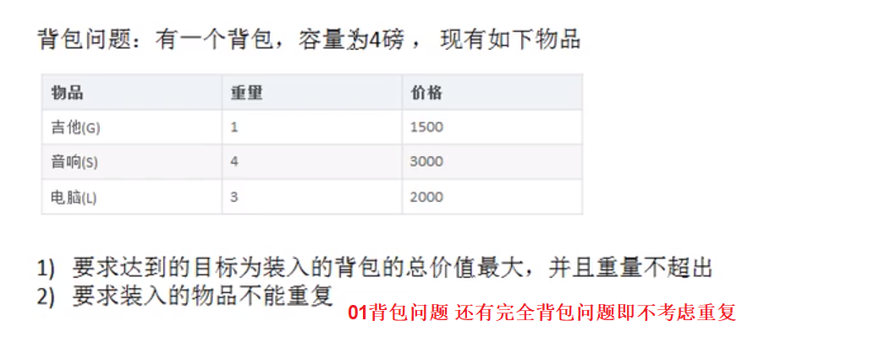
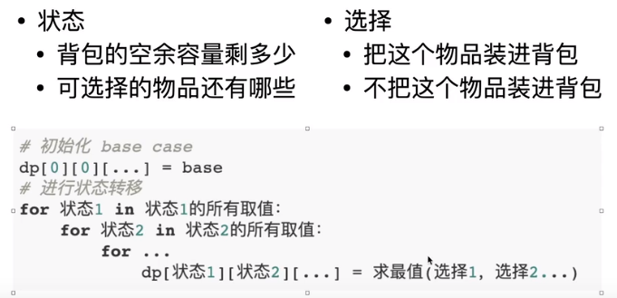

# Table of Contents

* [背包问题(01)](#背包问题01)
  * [核心思想](#核心思想)
  * [思路分析](#思路分析)
  * [代码](#代码)


# 背包问题(01)

参考资料

https://www.bilibili.com/video/BV15B4y1P7X7/



## 核心思想

> 动态规划保存了子问题的解，避免重复计算。


将大问题划分为小问题进行解决，从而一步步获取最优解的处理算法。
与分治法不同的是，适用**于动态规划的问题，分解的子问题往往不是互相独立的**。（即下一个子阶段的求解是建立在上一个子阶段的基础上，进行的求解）

递归和动态规划都是将原问题拆成多个子问题然后求解，他们之间最本质的区别是，<font color=red>动态规划保存了子问题的解，避免重复计算。</font>

**可以用上台阶来体会！**


## 思路分析

每次遍历I个物品，根据W[i]和V[i]来确定是否需要将该物品放入背包，

$$V[i] W[i]$$ :为第i个商品的价值和重量 

$$C$$:为背包容量。

1. 第一步明确【状态】和【选择】

   导致状态变化的是选择



> 这里明确一点，背包是在动态扩缩的，不一定要全部装满或者装一部分。

$$dp[i] [j]​$$表示在前i个物品，当背包的容量为J时，最大价值为$$dp[i][j]​$$

比如：$$dp[3] 5j=6]$$表示的就是对其中三个物品进行选择时,当背包容量为5的时候,最大价值为6

我们想计算的结果时$$dp[i][j]$$


+ V [i] [0]=V[0] [I]=0

+ W[i]>j ： dp[i] [j]=dp[i-1] [j]      说明当前物品重量超过背包容量时

+ W[i]<=j : 当前新增商品小于背包容量，是不是要加进去，加进去怎么看价值最大或者最小呢？

  dp[i] [j]=max( dp[i-1] [j] ,V[i]+dp[i-1] [J-W[i]])

  dp[i-1] [j] ：上一个物品的最大价值

  V[i]+dp[i-1] [J-W[i]]：本次商品价值+上一次商品价值

第 i 件物品可添加也可以不添加，取决于哪种情况下最大价值更大。因此，0-1 背包的状态转移方程为:


## 代码

```java
 int[] w = {1, 4, 3};//物品重量
        int[] v = {1500, 3000, 2000};//物品的价值
        int c = 4;//背包容量
        int n = w.length;//物品个数
        // 前i个物品能够装入容量为J的背包的最大价值
        int[][] dp = new int[n + 1][c + 1];

        //初始化第一行和第一列为0  可不处理
        for (int i = 1; i < dp.length; i++) {

            for (int j = 1; j < dp[i].length; j++) {
			
                if (w[i - 1] > j) {
                    dp[i][j] = dp[i - 1][j];
                } else {
                    dp[i][j] = Math.max(dp[i - 1][j], v[i - 1] + dp[i - 1][j - w[i - 1]]);
                }
            }
        }

        for (int[] ints : dp) {
            System.out.println(Arrays.toString(ints));
        }
```

