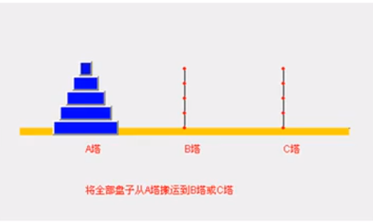

# Table of Contents

* [二分查找](#二分查找)
* [分治算法DC](#分治算法dc)
  * [汉诺塔游戏](#汉诺塔游戏)


#  二分查找


+ 非递归版

```java
//数组不为空 且数组大于2
public static int binary(int[] arr, int target) {

        int left = 0;
        int right = arr.length - 1;

        while (left <= right) {
            int medium = (left + right) / 2;
            if (arr[medium] == target) {
                return medium;
            } else if (arr[medium] > target) {
                right = medium - 1;
            } else if (arr[medium] < target) {
                left = medium + 1;
            }
        }
        return -1;
    }
```

+ 递归版

```java
////数组不为空 且数组大于2
 public static int binaryCur(int[] arr, int n, int m, int target) {
        int left = 0;
        int right = arr.length - 1;

        while (left <= right) {
            int medium = (left + right) / 2;
            if (arr[medium] == target) {
                return medium;
            } else if (arr[medium] > target) {
                right = binaryCur(arr, left, right - 1, target);
            } else if (arr[medium] < target) {
                right = binaryCur(arr, left + 1, right, target);
            }
        }

        return -1;
    }
```


# 分治算法DC

分治法是一个很重要的算法，就是把一个复杂的问题分成2个或者更多相同或相似的问题，原问题的解即子问题的解的合并。<font color=red>重要的是怎么分.这点很难,需要锻炼</font>

可以解决

+ 二分查找
+ 快排
+ 归并排序
+ ....等等


一般是3个步骤

+ 分解:将原问题分解成若干个规模较小,相互独立,与原问题形式相同的子问题.
+ 解决:子问题规模小,直接解决,否则递归解决解决问题.
+ 合并:将各个子问题的解合并成原问题的解.


## 汉诺塔游戏



分析

+ 只有一个,A->C
+ 如果有n(你>=2),可以看作2个盘 <font color=red>`n-1`和n个盘</font>
  + n-1移动到B
  + n移动到C
  + B->C

```java
 public static void main(String[] args) {

        tow(4, 'A', 'B', 'C');

    }

	//思想很重要 剩下就是代码实现了
    public static void tow(int num, char a, char b, char c) {

        if (num == 1) {
            System.out.println("第1个盘从" + a + "->" + c);
            return;
        }
        //n-1移动到B
        tow(num - 1, a, c, b);
        //n移动到C
        System.out.println("第" + num + "个盘从" + a + "->" + c);
        //n-1移动到C
        tow(num - 1, b, a, c);

    }
```


