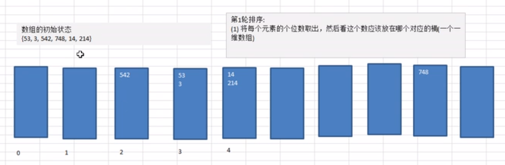
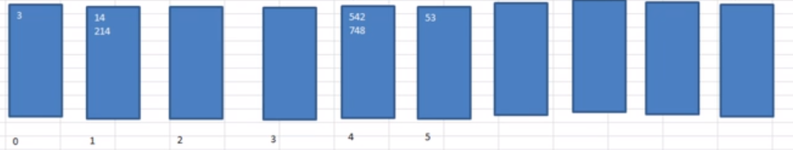
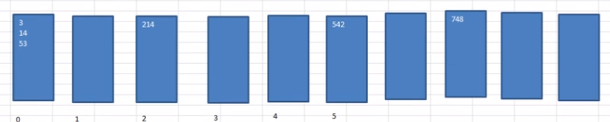

# Table of Contents

* [基本思想](#基本思想)
* [推演](#推演)
* [代码实现](#代码实现)
  * [推演](#推演-1)
  * [进阶版](#进阶版)
* [注意事项](#注意事项)


# 基本思想


是桶排序的扩展。

桶排序(Bucket Sort)的原理很简单，将数组分到有限数量的桶子里。每个桶子再个别排序（有可能再使用别的排序算法或是以递归方式继续使用桶排序进行排序）


<font color=red>经典空间换时间</font>

# 推演


1. 将每个元素的<font color=red>个位数</font>取出，然后看应该放在哪个桶（一维数组）

<div align=left>
	
</div>


2. .按照桶的顺序的下标依次取出数据，放入原来的数组

`arr={542,53,3,14,214,748} `

3. 将每个元素的<font color=red>十位数</font>取出，然后看应该放在哪个桶（一维数组） <font color=red>位数没有就是0</font>

<div align=left>
	
</div>
   

4. 按照桶的顺序的下标依次取出数据，放入原来的数组
   `arr={3,14,214,542,748,53} `

5. 将每个元素的<font color=red>百位数</font>取出

<div align=left>
	
</div>


6. 按照桶的顺序的下标依次取出数据，放入原来的数组
   `arr={3,14,53,214,542,748} `


# 代码实现


## 推演

```java
  public static void radixSort(int[] arr) {

        //很明显 空间换时间
        int bucket[][] = new int[10][arr.length];

        //每个桶的有效数量
        int[] bucketCounts = new int[10];


        for (int i = 0; i <= arr.length - 1; i++) {

            int a = arr[i] % 10;

            //放在对应桶的一维数组中
            bucket[a][bucketCounts[a]] = arr[i];

            bucketCounts[a]++;
        }
        int index = 0;

        for (int i = 0; i <= bucketCounts.length - 1; i++) {
            if (bucketCounts[i] != 0) {

                for (int j = 0; j < bucketCounts[i]; j++) {
                    arr[index++] = bucket[i][j];
                }
            }
            bucketCounts[i] = 0;
        }


        for (int i = 0; i <= arr.length - 1; i++) {

            int a = arr[i] / 10 % 10;

            //放在对应桶的一维数组中
            bucket[a][bucketCounts[a]] = arr[i];

            bucketCounts[a]++;
        }

        index = 0;

        for (int i = 0; i <= bucketCounts.length - 1; i++) {
            if (bucketCounts[i] != 0) {

                for (int j = 0; j < bucketCounts[i]; j++) {
                    arr[index++] = bucket[i][j];
                }
            }
            bucketCounts[i] = 0;

        }

        // 依次类推
    }
```

## 进阶版


```java
 public static void radixSort(int[] arr) {
        //选择一个最大数
        int max = arr[0];
        for (int i = 0; i <= arr.length - 1; i++) {
            if (arr[i] > max) {
                max = arr[i];
            }
        }

        int length = String.valueOf(max).length();


        //很明显 空间换时间
        int bucket[][] = new int[10][arr.length];

        //每个桶的有效数量
        int[] bucketCounts = new int[10];

        for (int m = 0, n = 1; m <= length - 1; m++, n = n * 10) {
            for (int i = 0; i <= arr.length - 1; i++) {

                int a = arr[i] / n % 10;

                //放在对应桶的一维数组中
                bucket[a][bucketCounts[a]] = arr[i];

                bucketCounts[a]++;
            }
            int index = 0;

            for (int i = 0; i <= bucketCounts.length - 1; i++) {
                if (bucketCounts[i] != 0) {

                    for (int j = 0; j < bucketCounts[i]; j++) {
                        arr[index++] = bucket[i][j];
                    }
                }
                bucketCounts[i] = 0;
            }
        }


    }
```


# 注意事项


大批量数据不建议使用 直接GG
