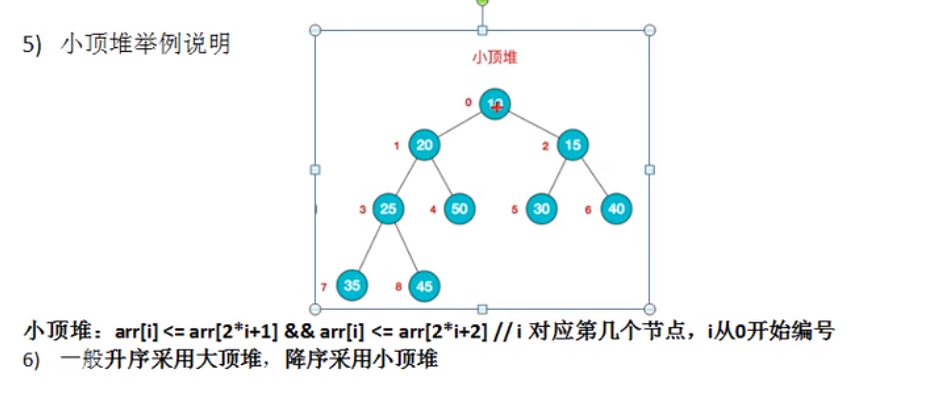

# Table of Contents

* [什么是堆排序](#什么是堆排序)
* [基本思想](#基本思想)
* [堆存储](#堆存储)
* [图解实现](#图解实现)
* [代码实现](#代码实现)


# 什么是堆排序





# 基本思想

+ 将待排序序列构造成一个大顶堆。---》本质是一个数组！
+ 序列最大值是堆顶的根节点。
+ 每次找最大的，移除数组。


# 堆存储

一般用数组来表示堆，下标为 i 的结点的父结点下标为(i-1)/2；其左右子结点分别为 (2i + 1)、(2i + 2)


# 图解实现

<div align=left>
	
</div>

<div align=left>
	
</div>

<div align=left>
	
</div>


i=2 ....

i=1....

i=0....


上面是maxheap_down(a, 0, 9)调整过程。maxheap_down(a, 0, 9)的作用是将a[0...9]进行下调；a[0]的左孩子是a[1]，右孩子是a[2]。调整时，选择左右孩子中较大的一个(即a[2])和a[0]交换。交换之后，a[2]为20，它比它的左右孩子要大，选择较大的孩子(即左孩子)和a[2]交换。

调整完毕，就得到了最大堆。此时，数组{20,30,90,40,70,110,60,10,100,50,80}也就变成了{110,100,90,40,80,20,60,10,30,50,70}。


+ 交换数据 


<div align=left>
	
</div>

上面是当n=10时，交换数据的示意图。 当n=10时，首先交换a[0]和a[10]，使得a[10]是a[0...10]之间的最大值；然后，<font color=red>调整a[0...9]使它称为最大堆</font>。交换之后: a[10]是有序的！ 当n=9时， 首先交换a[0]和a[9]，使得a[9]是a[0...9]之间的最大值；然后，调整a[0...8]使它称为最大堆。交换之后: a[9...10]是有序的！ ... 依此类推，直到a[0...10]是有序的。


<font color=red>其实就是每一次构造最大堆，然后最大值放在最后，依次类推。</font>


# 代码实现

堆排序的最核心代码就是：<font color=red>怎么将一个数组构造成大顶堆和小顶堆</font>？

```java
 public static void heapSort(int[] arr) {
        int temp = 0;
        for (int i = arr.length / 2 - 1; i >= 0; i--) {
            adjustHeapSort(arr, i, arr.length);
        }

        //为什么不排序了？
        for (int j = arr.length - 1; j >= 0; j--) {
            temp = arr[j];
            arr[j] = arr[0];
            arr[0] = temp;
            //为什么是从0开始
            adjustHeapSort(arr, 0, j);
        }

    }


    /**
     * 待调整数组构造 大顶堆
     *
     * @param arr
     * @param i 当前非叶子节点
     * @param length
     */
    public static void adjustHeapSort(int[] arr, int i, int length) {

        int temp = arr[i];

        for (int k = i * 2 + 1; k < length; k = k * 2 + 1) {

            //比较当前非叶子节点的 左右叶子节点的大小
            if (k + 1 < length && arr[k] < arr[k + 1]) {
                k++;
            }
            if (arr[k] > temp) {
                arr[i] = arr[k];
                i = k;//要看这个节点还有没有子节点需要比较
            } else {
                break;
            }
        }
        arr[i] = temp;//这里为什么要放在外面？
    }
```

