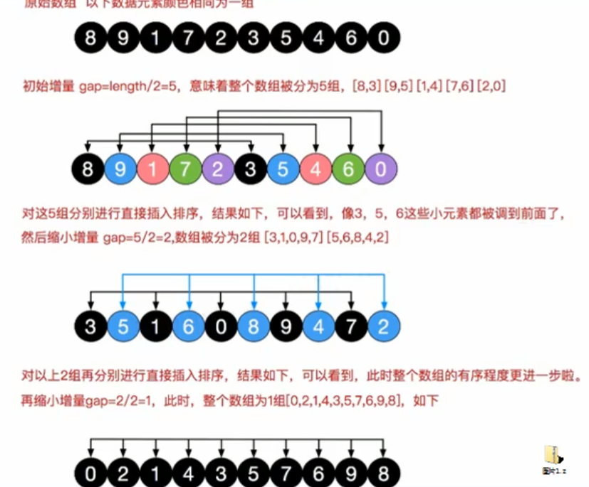

# Table of Contents

* [插入排序存在的问题](#插入排序存在的问题)
* [希尔排序](#希尔排序)
* [基本思想](#基本思想)
* [演化](#演化)
* [进阶-交换](#进阶-交换)
* [进阶-插入](#进阶-插入)


# 插入排序存在的问题


<div align=left>
	
</div>

# 希尔排序

插入排序的高级版，也称为缩小增量排序


# 基本思想

对于n个待排序的数列，<font color=red>取一个小于n的整数gap(gap被称为步长)</font>将待排序元素分成若干个组子序列，所有距离为gap的倍数的记录放在同一个组中；然后，对各组内的元素进行直接插入排序。 这一趟排序完成之后，每一个组的元素都是有序的。然后减小gap的值，并重复执行上述的分组和排序。重复这样的操作，当gap=1时，整个数列就是有序的。





# 演化


```java
 int[] arr = {8, 9, 1, 7, 2, 5, 4, 3, 6, 1};
```


```java
  

//逐步推导法
    public static void shellSort(int[] arr,int n) {
        //第一轮排序
        //先将元素分为5组 gap=n/2=5
        for(int i = 5; i<n;i++){
            //这里为什么是 -=5 不太明白
            for(int j = i-5; j>=0;j=j-5){
                if(arr[j]>arr[j+5]){
                    int temp = arr[j + 5];
                    arr[j + 5] = arr[j];
                    arr[j] = temp;
                }
            }
        }

        System.out.println(Arrays.toString(arr));


        //第二轮排序
        // gap=5/2=2
        for(int i = 2; i<n;i++){
            //这里为什么是 -=5 不太明白
            for(int j = i-2; j>=0;j=j-2){
                if(arr[j]>arr[j+2]){
                    int temp = arr[j + 2];
                    arr[j + 2] = arr[j];
                    arr[j] = temp;
                }
            }
        }

        System.out.println(Arrays.toString(arr));

        //第二轮排序
        // gap=2/2=1
        for(int i = 1; i<n;i++){
            //这里为什么是 -=5 不太明白
            for(int j = i-1; j>=0;j=j-1){
                if(arr[j]>arr[j+1]){
                    int temp = arr[j + 1];
                    arr[j + 1] = arr[j];
                    arr[j] = temp;
                }
            }
        }

        System.out.println(Arrays.toString(arr));
    }


[5, 4, 1, 6, 1, 8, 9, 3, 7, 2]
[1, 2, 1, 3, 5, 4, 7, 6, 9, 8]
[1, 1, 2, 3, 4, 5, 6, 7, 8, 9]

```


# 进阶-交换

```java
 //进阶版
    public static void shellSort(int[] arr, int n) {
        //第一轮排序
        //先将元素分为5组 gap=n/2=5

        for (int gap = n / 2; gap > 0; gap=gap/2) {
            for (int i = gap; i < n; i++) {
                //这里为什么是 -=5 不太明白
                for (int j = i - gap; j >= 0; j = j - gap) {
                    if (arr[j] > arr[j + gap]) {
                        int temp = arr[j + gap];
                        arr[j + gap] = arr[j];
                        arr[j] = temp;
                    }
                }
            }
        }

        System.out.println(Arrays.toString(arr));

    }
[1, 1, 2, 3, 4, 5, 6, 7, 8, 9]
```

# 进阶-插入

```java
 //进阶-移动
    public static void shellSort(int[] arr, int n) {
        for (int gap = n / 2; gap > 0; gap = gap / 2) {
            for (int i = gap; i < n; i++) {

                int j = i;
                int temp = arr[j];
                while (j - gap >=0 && temp < arr[j - gap]) {
                    arr[j] = arr[j - gap];
                    j -= gap;
                }
                arr[j] = temp;
            }
        }
        System.out.println(Arrays.toString(arr));
    }
```


