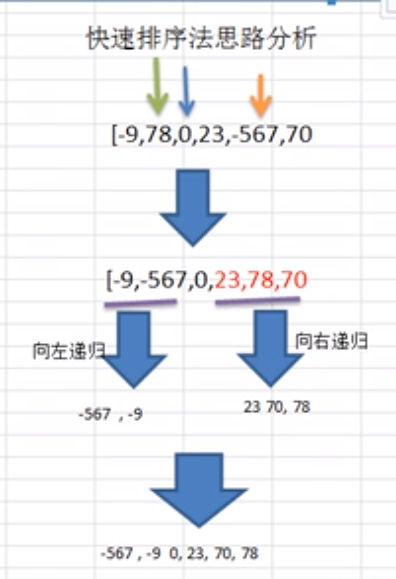

# Table of Contents

* [基本思想](#基本思想)
* [思路分析](#思路分析)
* [代码实现](#代码实现)


# 基本思想


对冒泡排序的一种改进 (使用了递归)


它的基本思想是: <font color=red>选择一个基准数，通过一趟排序将要排序的数据分割成独立的两部分；其中一部分的所有数据都比另外一部分的所有数据都要小。</font>然后，再按此方法对这两部分数据分别进行快速排序，整个排序过程可以递归进行，以此达到整个数据变成有序序列。


# 思路分析


+ 从数列中挑出一个基准值。

+ 将所有比基准值小的摆放在基准前面，所有比基准值大的摆在基准的后面(相同的数可以到任一边)；在这个分区退出之后，该基准就处于数列的中间位置。

+ <font color=red>递归</font>地把"基准值前面的子数列"和"基准值后面的子数列"进行排序。





# 代码实现

```java
  /**
     * @param arr   待排序的数组
     * @param left  左边索引
     * @param right 右边索引
     * @date 2021-07-17
     */
    public static void quickSort(int[] arr, int left, int right) {

        int l = left;
        int r = right;

        // int medium = arr[(l + r) / 2];
        int medium = arr[left];

        while (l < r) {
            while (arr[l] < medium) {
                l++;
            }
            while (arr[r] > medium) {
                r--;
            }

            int temp = arr[l];
            arr[l] = arr[r];
            arr[r] = temp;
            if (l >= r) {
                break;
            }

            //防止死循环 左边和右边 出现和 medium一样的值 这事需要 左+ 有-
            if (arr[l] == medium) {
                r--;
            }
            if (arr[r] == medium) {
                l++;
            }
        }
        //第一次交换完毕
        if (l == r) {
            l++;
            r--;
        }
        //向左递归

        if (left < r) {
            quickSort(arr, left, r);
        }

        if (l < right) {
            quickSort(arr, l, right);
        }
    }


```

