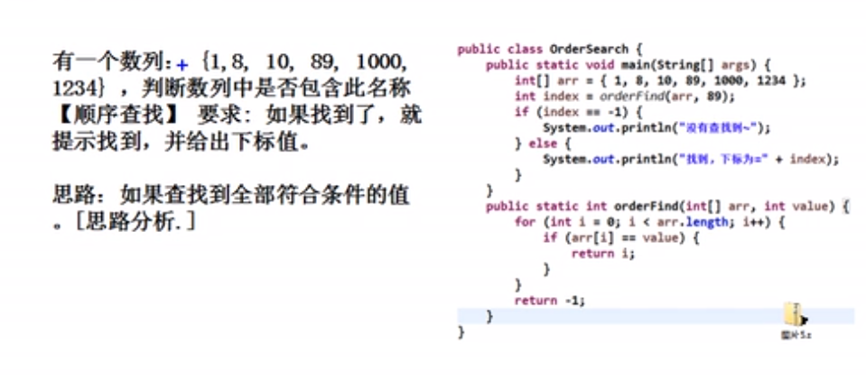
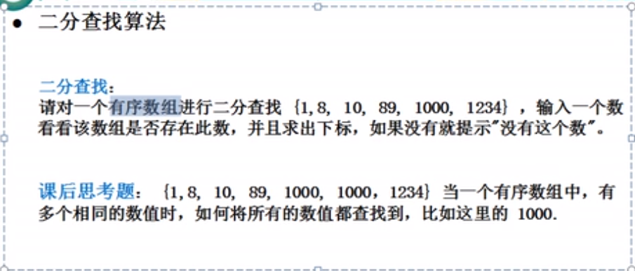
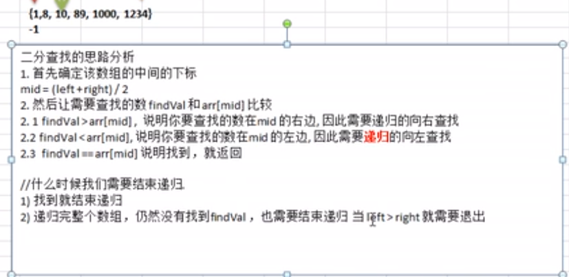

# Table of Contents

* [查找算法](#查找算法)
* [线性查找](#线性查找)
* [二分查找](#二分查找)
* [插值查找](#插值查找)
* [斐波那契查找](#斐波那契查找)

# 查找算法

+ 顺序（线性）查找
+ 二分查找
+ 插值查找
+ 斐波那契查找

# 线性查找

	

逐一比对，有相同值， 就返回下标。

# 二分查找

类似快排

	

# 插值查找

# 斐波那契查找

