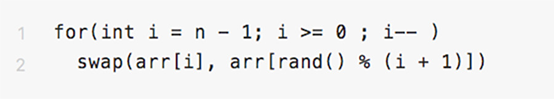
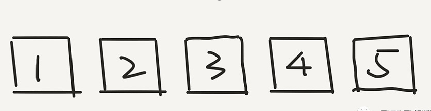
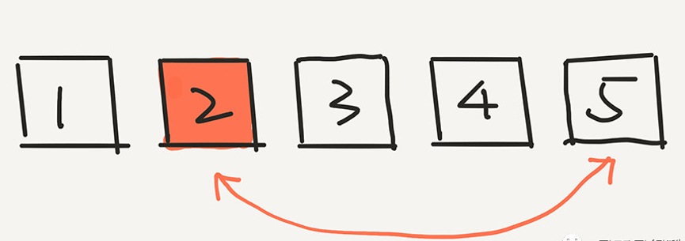
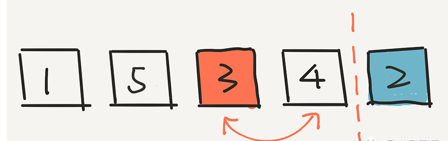
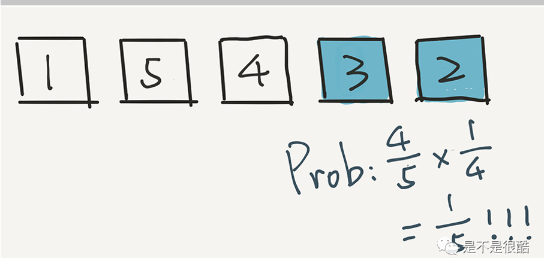
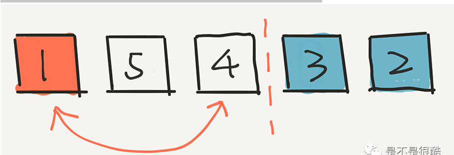
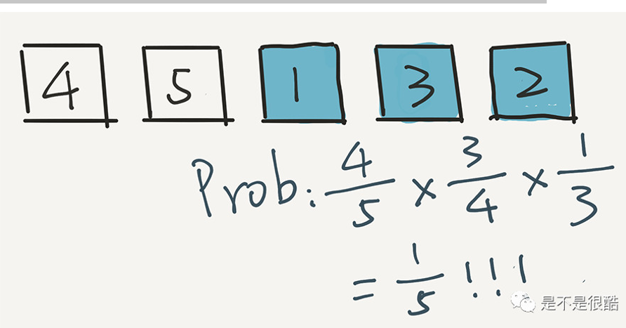
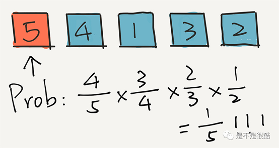

# Table of Contents

* [伪随机](#伪随机)
* [正文](#正文)
* [knuth洗牌算法](#knuth洗牌算法)
* [为什么是公平的？](#为什么是公平的)
* [参考资料](#参考资料)

# 伪随机

计算机里的确的确没有“真随机”，因为计算机是由0和1组成，不存在不确定的因素。但是程序经常会用到随机的功能，因此出现了“伪随机”,这是相对“真随机”的一个概念。

- ### 真随机

“真随机”就是我们现实世界中的随机，每次发生都是独立事件，概率不会相互影响。
比如一件事发生的概率是20%，不管是否发生，那么下次再发生的概率依然是20%。

- ### 伪随机

**随机数生成器**是一个函数y=f(x)，而**随机种子**则是变量x。所以一旦x和f(x)确定了，那么产生的随机数y也就确定。
“伪随机”正是通过，在**随机数生成器**中传入的**随机种子**得到结果产生随机数。之所以为“伪随机”，是因为能够出现的结果以及次序其实已经在**随机数生成器**这个函数中确定了，如果f(x)一定，而程序通过输入x的变化，而产生不同结果，达到随机的效果。**“伪”指的是有规律，而不是“假”。**
比如3次输入的x值相同，那么得到的3次结果也将相同。但是如果将当前时间节点（时钟）当做输入x，x则必然不同，则达到了随机的效果。

> 伪随机也有一个好处，就是出现问题的时候，可以复现当时的情况。

# 正文

如何设计一个【公平】的洗牌算法？

在没看相关文章之前，我是这么想的，如果有N副牌，每次取两张牌交换位置，随机 N次即可。

但是N要取多少最为合理？ 10 100 1000 1000

> 那么这个算法【公平】吗？

对于N个元素，一共产生的可能性是N!个，然后随机抽取一个，这样肯定是【公平】的。

但是时间复杂度是O(n!),是不能忍受的。

# knuth洗牌算法

我们再换一个角度思考“公平”这个话题。其实，我们也可以认为，公平是指，**对于生成的排列，每一个元素都能等概率地出现在每一个位置。**或者反过来，**每一个位置都能等概率地放置每个元素。**

 

这个定义和上面的**最终洗牌结果，可以等概率地给出这 n! 个排列中的任意一个，是等价的。**这个等价性，可以证明出来。并不难。如果正在学习概率论的同学，还比较习惯概率论处理问题的思想，应该能很快搞定：）

 

基于这个定义，我们就可以给出一个简单的算法了。说这个算法简单，是因为他的逻辑太容易了，就一个循环：

 

这么简单的一个算法，可以保证上面我所说的，**对于生成的排列，每一个元素都能等概率的出现在每一个位置。**或者反过来，**每一个位置都能等概率的放置每个元素。**

 

大家可以先简单的理解一下这个循环在做什么。其实非常简单，i 从后向前，每次随机一个 [0...i] 之间的下标，然后将 arr[i] 和这个随机的下标元素，也就是 arr[rand() % (i + 1)] 交换位置。

大家注意，由于每次是随机一个 [0...i] 之间的下标，所以，我们的计算方式是 rand() % (i + 1)，要对 i + 1 取余，保证随机的索引在 [0...i] 之间。

> 如果从前到后呢？ 
>
> 因为生成 [0, i] 范围的随机数比生成 [i, n) 范围的随机数简单。 

**这个算法就是大名鼎鼎的 Knuth-Shuffle，即 Knuth 洗牌算法。**

# 为什么是公平的？

在这里，我们模拟一下算法的执行过程，同时，对于每一步，计算一下概率值。

我们简单的只是用 5 个数字进行模拟。假设初始的时候，是按照 1，2，3，4，5 进行排列的。

那么，根据这个算法，首先会在这五个元素中选一个元素，和最后一个元素 5 交换位置。假设随机出了 2

下面，我们计算 2 出现在最后一个位置的概率是多少？非常简单，因为是从 5 个元素中选的嘛，就是 1/5。实际上，根据这一步，任意一个元素出现在最后一个位置的概率，都是 1/5。

下面，根据这个算法，我们就已经不用管 2 了，而是在前面 4 个元素中，随机一个元素，放在倒数第二的位置。假设我们随机的是 3。3 和现在倒数第二个位置的元素 4 交换位置。

下面的计算非常重要。3 出现在这个位置的概率是多少？计算方式是这样的：

其实很简单，因为 3 逃出了第一轮的筛选，概率是 4/5，但是 3 没有逃过这一轮的选择。在这一轮，一共有4个元素，所以 3 被选中的概率是 1/4。因此，最终，3 出现在这个倒数第二的位置，概率是 4/5 * 1/4 = 1/5。还是 1/5 !

实际上，用这个方法计算，任意一个元素出现在这个倒数第二位置的概率，都是 1/5。

我们再进行下一步，在剩下的三个元素中随机一个元素，放在中间的位置。假设我们随机的是 1。

关键是：1 出现在这个位置的概率是多少？计算方式是这样的：

即 1 首先在第一轮没被选中，概率是 4/5，在第二轮又没被选中，概率是 3/4 ，但是在第三轮被选中了，概率是 1/3。乘在一起，4/5 * 3/4 * 1/3 = 1/5。

用这个方法计算，任意一个元素出现在中间位置的概率，都是 1/5。

现在，我们只剩下两个元素了，在剩下的两个元素中，随机选一个，比如是4。将4放到第二个位置。

然后，4 出现在这个位置的概率是多少？4 首先在第一轮没被选中，概率是 4/5；在第二轮又没被选中，概率是 3/4；第三轮还没选中，概率是 2/3，但是在第四轮被选中了，概率是 1/2。乘在一起，4/5 * 3/4 * 2/3 * 1/2 = 1/5。

用这个方法计算，任意一个元素出现在第二个位置的概率，都是 1/5。

那么 5 留在第一个位置的概率是多少？即在前 4 轮，5 都没有选中的概率是多少

在第一轮没被选中，概率是 4/5；在第二轮又没被选中，概率是 3/4；第三轮还没选中，概率是 2/3，在第四轮依然没有被选中，概率是 1/2。乘在一起，4/5 * 3/4 * 2/3 * 1/2 = 1/5。

# 参考资料

https://www.zhihu.com/question/26934313/answer/743798587
