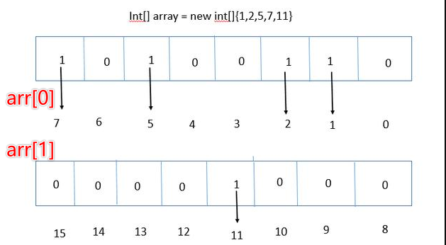
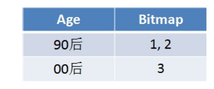
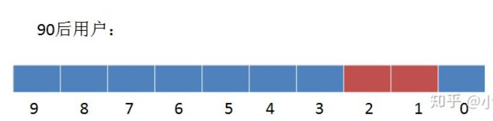
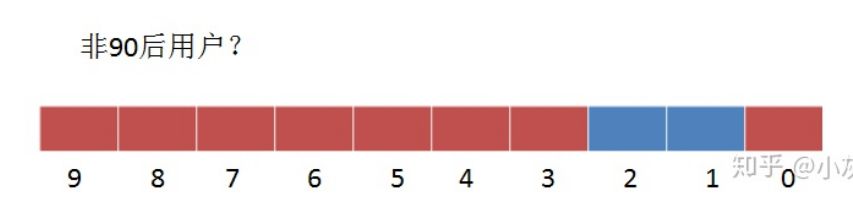
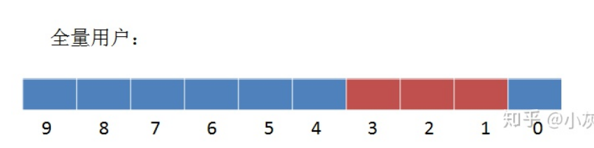
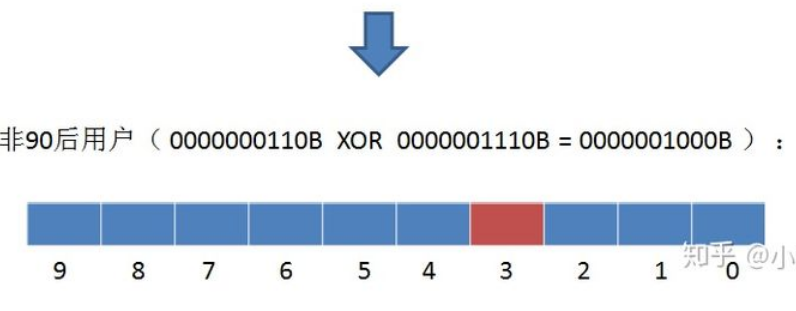

# Table of Contents

* [问题](#问题)
* [常规做法](#常规做法)
* [BitMap思想](#bitmap思想)
* [如何应用呢？](#如何应用呢)
* [缺点](#缺点)
  * [无法进行非运算](#无法进行非运算)
* [优化](#优化)


> - BitMap从字面的意思，很多人认为是位图，其实准确的来说，翻译成基于位的映射，怎么理解呢?


# 问题

有10亿个不重复的无序的数字，如果快速排序？

有很多变种题，不过无非是大数据量怎么进行排序。或者查找某个数值。


# 常规做法

先不管用归并还是其他算法，我们 先看下这么多数据需要占用内存

```java
1000000000 * 4 / 1024 / 1024 = 3800MB
 
1G=1024M
1M=1024K
1K=1024Byte
1Byte=8bit
```

这里前提是一个int占4byte。那么就需要将近4G的内存。


# BitMap思想

一个byte是占8个bit，如果每一个bit的值就是有或者没有，也就是二进制的0或者1，如果用bit的位置代表数组值有还是没有，那么0代表该数值没有出现过，1代表该数组值出现过。不也能描述数据了吗?具体如下图：



那么原来的数据占用内存就是:3800/32,节省了32 倍的空间。


# 如何应用呢？


> 一个数如何定位自己的位置？

定义Byte[index]数组,定义Position为数在当前元素的位置

Index(N)代表N的索引号，Position(N)代表N的所在的位置号。

- Index(N) = N/8 = N >> 3;
- Position(N) = N%8 = N & (8-1)111;


# 缺点


## 无法进行非运算







非运算的基础是，所有数据都在同一个基础上，显然bitmap不是。

如果非要求非运算呢？






# 优化


如果很长的BitMap中，只有少部分数据，这样也是很浪费空间的，


虽然有部分算法对其进行优化，但还是建议存储数据的时候，按照顺序去存储。

