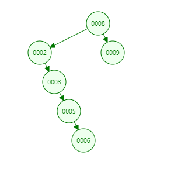

# Table of Contents

* [查找](#查找)
* [添加](#添加)
* [删除](#删除)


+ 为什么使用二叉查找树？

[二叉查找树](树基础.md)


<div align=left>
	
</div>


当构造好二叉查找树后，直接使用中序遍历，即可得到排序好的结果。


# 查找

```java
public BSTNode<Integer> serarch(Integer key, BSTNode<Integer> cur) {
        if (key == null) {
            return null;
        }
        if (key < cur.key) {
            return serarch(key, cur.left);
        } else if (key > cur.key) {
            return serarch(key, cur.right);
        } else {
            return cur;
        }

    }
```


# 添加

```java
 public void add(BSTNode<Integer> bstNode, BSTNode<Integer> cur) {
        if (null == bstNode) {
            return;
        }
        if (bstNode.key <= cur.key) {
            if (cur.left == null) {
                cur.left = bstNode;
                bstNode.parent = cur;
            } else {
                add(bstNode, cur.left);
            }
        } else {
            if (bstNode.key >= cur.key) {
                if (cur.right == null) {
                    cur.right = bstNode;
                    bstNode.parent = cur;
                } else {
                    add(bstNode, cur.right);
                }
            }
        }
    }
```


<div align=left>
	
</div>


其实在做的过程中，就发现问题了。<font color=red>二叉查找树会退化成一个链表</font>！


# 删除


<div align=left>
	
</div>

+ 删除叶子节点

  直接删除当前节点,需要找到当前父节点。

+ 删除有一个一颗子树的节点 比如1

  将当前删除节点的左/右子树，挂在当前删除节点的父节点的左/右

+ 删除有一个二颗子树的节点 比如6


  根据BST树的特点，当前删除节点的左边一定比他小，<font color=red>需要找到当前节点的右子树下最小的叶子节点，删除。并替换当前节点</font>。


```java
 public void delete(Integer key, BSTNode<Integer> cur) {

        if (cur == null) {
            return;
        }
        if (mRoot.left == null && mRoot.right == null) {
            return;
        }

        BSTNode<Integer> serarch = serarch(key, cur);
        if (null == serarch) {
            return;
        }
        BSTNode<Integer> parent = serarch.parent;


        if (serarch.left == null && serarch.right == null) {
            if (null != parent.left && parent.left == serarch) {
                parent.left = null;
            }
            if (null != parent.right && parent.right == serarch) {
                parent.right = null;
            }
        } else if (serarch.left != null && serarch.right != null) {
			//需要找到当前节点的右子树下最小的叶子节点
            BSTNode<Integer> integerBSTNode = delMin(serarch.right);
            serarch.key = integerBSTNode.key;

        } else {
            if (serarch.left != null) {
                if(parent!=null){
                    if (null != parent.left && parent.left.key == key) {
                        parent.left = serarch.left;
                    } else {
                        parent.right = serarch.left;
                    }
                }else {//父节点只有一个字树
                    mRoot.key = (T) serarch.left;
                }

            } else {
                if(parent!=null){
                    if (null != parent.right && parent.right.key == key) {
                        parent.right = serarch.right;
                    } else {
                        parent.left = serarch.right;
                    }
                }else {
                    mRoot.key = (T) serarch.right;
                }

            }
        }

    }


    public BSTNode<Integer> delMin( BSTNode<Integer> cur){
        BSTNode<Integer> target = cur;

        while (target.left!=null){
            target = target.left;
        }
        delete(target.key,cur);
        return target;
    }
```


对于有子树的节点，我最开始的想法是，找到删除节点下所有节点，在调用add方法加入进去。

