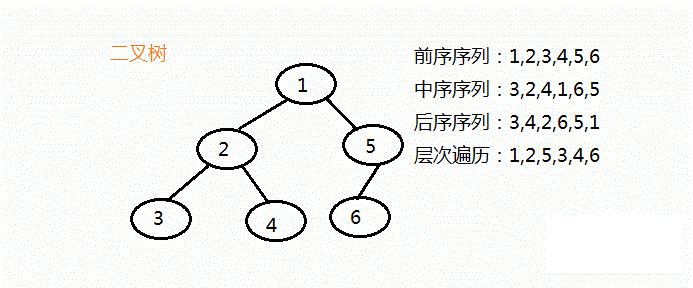
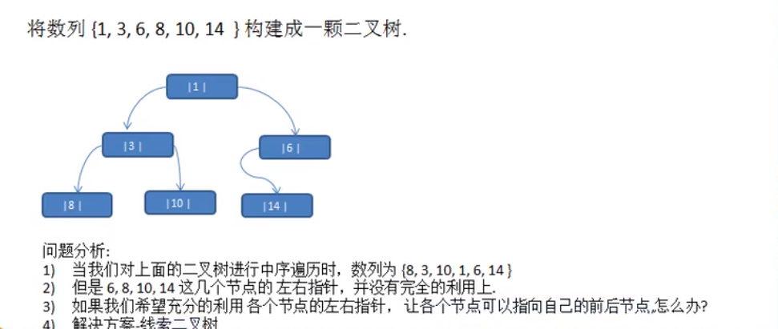
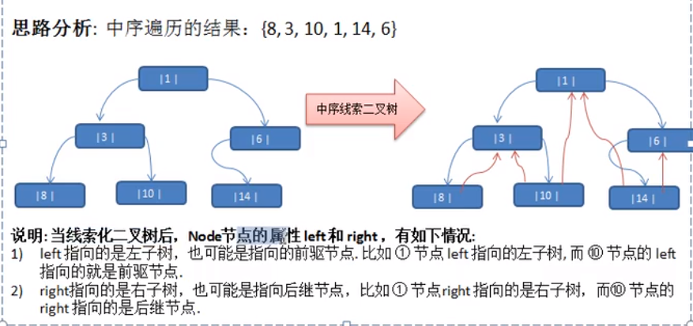

# Table of Contents

* [节点](#节点)
* [遍历](#遍历)
  * [前序、中序、后序、层次](#前序中序后序层次)
  * [层次遍历](#层次遍历)
* [查找](#查找)
* [删除](#删除)
* [顺序存储二叉树](#顺序存储二叉树)
* [线索化二叉树](#线索化二叉树)
  * [中序线索化二叉树](#中序线索化二叉树)


# 节点


BSTree是二叉树，它保护了二叉树的根节点mRoot；mRoot是BSTNode类型，而BSTNode是二叉查找树的节点，它是BSTree的内部类。BSTNode包含二叉查找树的几个基本信息:

- key -- 它是<font color=red>关键字，是用来对二叉查找树的节点进行排序的</font>。
- left -- 它指向当前节点的左孩子。
- right -- 它指向当前节点的右孩子。
- parent -- 它指向当前节点的父结点。


```java

public class BSTree<T extends Comparable<T>> {

    private BSTNode<T> mRoot;    // 根结点

    public class BSTNode<T extends Comparable<T>> {
        T key;                // 关键字(键值) 
        BSTNode<T> left;      // 左孩子
        BSTNode<T> right;     // 右孩子
        BSTNode<T> parent;    // 父结点

        public BSTNode(T key, BSTNode<T> parent, BSTNode<T> left, BSTNode<T> right) {
            this.key = key;
            this.parent = parent;
            this.left = left;
            this.right = right;
        }
    }
}
```


# 遍历

二叉树可以使用前序、中序、后序进行遍历


+ 前序：<font color=red>先输出父节点</font>，在遍历左子树和右子树。
+ 中序：先遍历左子树，<font color=red>再输出父节点</font>，再遍历右子树。
+ 后序：先遍历左子树，再遍历右子树，<font color=red>再输出父节点</font>。

其实就是看<font color=red>父子节点的输出顺序</font>，来确定是前序、中序、还是后序。

这里的父节点争对的是<font color=red>每一个节点的父节点</font>


## 前序、中序、后序、层次

```java
public void preOrder() {
    System.out.println(this.key);
    if (this.left != null) {
        this.left.preOrder();
    }
    if (this.right != null) {
        this.right.preOrder();
    }
}

public void infixOrder() {
    if (this.left != null) {
        this.left.infixOrder();
    }
    System.out.println(this.key);
    if (this.right != null) {
        this.right.infixOrder();
    }
}

public void nextOrder() {
    if (this.left != null) {
        this.left.nextOrder();
    }
    if (this.right != null) {
        this.right.nextOrder();
    }

    System.out.println(this.key);

}
```


<div align=left>
	
</div>
## 层次遍历


# 查找


查找也分为前序、中序、后序。其实就是利用先遍历再定位值。


```java
public int preOrder(no) {
    if(no==this.no){
        return no；
    }
	int result=null;    
    if (this.left != null) {
       result= this.left.preOrder();
    }
    if（null!=result）{
        return result；
    }

    if (this.right != null) {
       result=  this.right.preOrder();
    }
 if（null!=result）{
        return result；
    }
}
```


# 删除 

1. 如果树是空树root，如果只有一个root节点，需要将二叉树置空。

2. 如果删除叶子节点，直接删除当前节点。

3. 如果是非叶子节点，删除子树。

   + 如果使用的是单向树，<font color=red>需要判断当前节点的子节点是否需要删除</font>，而不是判断当前这个节点是不是需要删除->其实就是链表的删除。

   + 如果给一个父节点，可以直接找


```java
public void delete(int node){
    
    if(this.left!=null&&this.left.no=no){
        this.left=null;
        return;
    }
    if(this.right!=null&&this.right.no=no){
        this.right=null;
        return;
    }
    if(this.left!=null){
        this.left.delete(no);
    }
     if(this.right!=null){
        this.right.delete(no);
    }
}
```


# 顺序存储二叉树

从数据存储来看，<font color=red>数组存储方式和树的存储方式可以相互转换</font>。

<div align=left>
	
</div>


要求

1. 以数组的形式来存放树节点
2. 在遍历数组时，任然可以以前序遍历、中序、后序完成节点的遍历。(这一点最开始没想到怎么搞)


需要先了解[顺序存储二叉树的概念](树基础.md)

```java
 public static void main(String[] args) {
        int[] arr = {1, 2, 3, 4, 5, 6, 7};
        ArrayBinaryTree arrayBinaryTree = new ArrayBinaryTree(arr);
        arrayBinaryTree.preOrder(0);
    }


    static class ArrayBinaryTree {

        private int[] arr;

        public ArrayBinaryTree(int[] arr) {
            this.arr = arr;
        }

        /**
         * @param index 数组下标
         * @description
         */
        public void preOrder(int index) {

            if (null == arr || arr.length == 0) {
                System.out.println();
                return;
            }

            System.out.println(arr[index]);

            if (index * 2 + 1 < arr.length) {
                preOrder(index * 2 + 1);
            }

            if (index * 2 + 2 < arr.length) {
                preOrder(index * 2 + 2);
            }

        }
    }
```
堆排序是二叉树的实际运用


#  线索化二叉树

<div align=left>
	
</div>


+ 基本介绍

  1. n个节点的二叉链表中含有n+1个空指针域。 n+1=所有可利用-未利用的指针

     把一个指针的空指针域指向*序遍历下的前驱或者后继称为**线索**  比如，中序遍历 8的right指向3

  2. 这种加上了线索的二叉链表称为**线索链表**，

  

  

## 中序线索化二叉树



