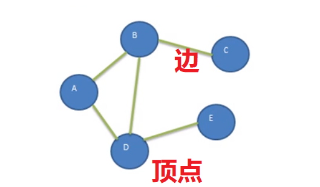
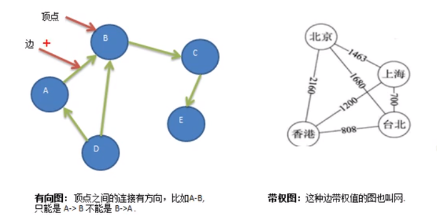
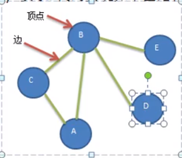
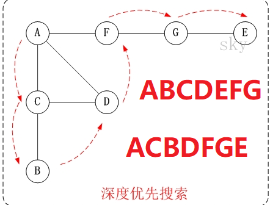
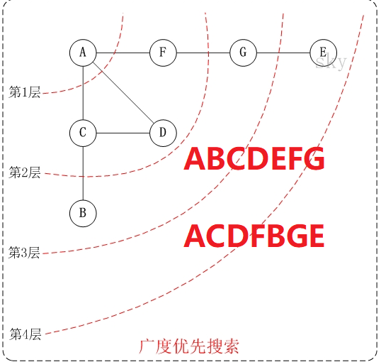

# Table of Contents

* [为什么要有图？](#为什么要有图)
* [基本定义](#基本定义)
* [表示方式](#表示方式)
  * [邻接矩阵表示法](#邻接矩阵表示法)
  * [邻接表表示法](#邻接表表示法)
* [代码](#代码)
  * [创建](#创建)
  * [遍历](#遍历)
    * [深度优先(DFS Depth First Serarch)](#深度优先dfs-depth-first-serarch)
    * [广度优先(BFS Breadth First Serarch)](#广度优先bfs-breadth-first-serarch)


# 为什么要有图？

+ 线性表局限一个直接前驱和一个直接后继
+ 树也只能表示一个直接前驱
+ 需要表示多对多的关系时，就需要用到了图。


# 基本定义


图是一种数据结构，其中节点可以具有零个或多个相邻元素。两个节点之间的连接称为边。结点也可以称为顶点。




+ 顶点 A、B、C、D、E
+ 边  A-B
+ 路径  `D到C可以是D->B->C 也可以是D->A->B->C`
+ 无向图 顶点之间没有方向 A->B 也可以是B->A
+ 有向图 
+ 带权图 也称网





# 表示方式

## 邻接矩阵表示法


邻接矩阵是表示图形中<font color=red>顶点之间相邻关系</font>的矩阵。

图的邻接矩阵(Adjacency Matrix)存储方式是用两个数组来表示图。一个一维数组存储图中顶点信息，一个二维数组(称为邻接矩阵)存储图中的边或弧的信息。


+ 无向图


+ 有向图


## 邻接表表示法

1. 邻接矩阵需要为每个顶点都分配N个边的空间，会造成空间损失。
2. 邻接表只关心存在的边。由数组+链表实现。


+ 无向表
  
+ 有向表
  

若是有向图，邻接表结构是类似的，但要注意的是有向图由于有方向的。

因此，有向图的邻接表分为<font color=red>出边表和入边表(又称逆邻接表)</font>，出边表的表节点存放的是从表头节点出发的有向边所指的尾节点；入边表的表节点存放的则是指向表头节点的某个顶点，如下图所示。


# 代码

## 创建



```java

    //顶点
    private ArrayList<String> vertexList;

    //图
    private int[][] edges;

    //边
    private int num;

    public static void main(String[] args) {

        int n = 5;

        Graph graph = new Graph(5);

        graph.inserList("A");
        graph.inserList("B");
        graph.inserList("C");
        graph.inserList("D");
        graph.inserList("E");


        graph.inserNum(0, 1, 1);
        graph.inserNum(0, 2, 1);
        graph.inserNum(1, 2, 1);
        graph.inserNum(1, 3, 1);
        graph.inserNum(1, 4, 1);


        graph.showGRaph();
    }


    /**
     * 初始化
     *
     * @param n
     */
    public Graph(int n) {
        edges = new int[n][n];
        vertexList = new ArrayList<>(n);
        num = 0;
    }

    public void inserList(String vertex) {
        vertexList.add(vertex);
    }


    public int getNumOfVertex() {
        return vertexList.size();
    }

    public void showGRaph() {

        for (int[] ints : edges) {
            System.out.println(Arrays.toString(ints));
        }

    }


    public void inserNum(int v1, int v2, int weight) {
        edges[v1][v2] = weight;
        edges[v2][v1] = weight;
        num++;
    }

[0, 1, 1, 0, 0]
[1, 0, 1, 1, 1]
[1, 1, 0, 0, 0]
[0, 1, 0, 0, 0]
[0, 1, 0, 0, 0]
```


## 遍历

所为图的遍历，即是对节点的访问。一个图有这么多节点，一般有2中访问策略：`深度优先遍历`和`广度优先遍历`


### 深度优先(DFS Depth First Serarch)


它的思想: 假设初始状态是图中所有顶点均未被访问，则从某个顶点v出发，首先访问该顶点，然后依次从它的各个未被访问的邻接点出发深度优先搜索遍历图，直至图中所有和v有路径相通的顶点都被访问到。 若此时尚有其他顶点未被访问到，则另选一个未被访问的顶点作起始点，重复上述过程，直至图中所有顶点都被访问到为止。




```JAVA
     public void dfs(){
        for(int i=0;i<=vertexList.size()-1;i++ ){
            if(!isVisited[i]){
                dfs(i);
            }
        }
    }

    public void dfs(int i) {
        System.out.print(vertexList.get(i) + "->");
        isVisited[i] = true;
        //获取第一个节点下标 A->c
        int index = getIndex(i);
        while (index != -1) {
            if (!isVisited[index]) {
                dfs(index);
            }
            //获取当前节点的下一个邻接节点的下一个邻接节点 A->c->B
            index = getNextIndex(i, index);
        }
    }
```


### 广度优先(BFS Breadth First Serarch)

类似一个分层搜索的过程，需要使用一个队列保持访问过的节点的顺序，以便按照这个顺序来访问这些节点的邻接节点。

类似于二叉树的层次遍历。




```java
  public void bfs() {
        for (int i = 0; i <= vertexList.size() - 1; i++) {
            if (!isVisited[i]) {
                bfs(i);
            }
        }
    }

    public void bfs(int i) {

        LinkedList<Integer> queue = new LinkedList<>();
        System.out.print(vertexList.get(i) + "->");
        isVisited[i] = true;

        queue.addLast(i);
        while (!queue.isEmpty()) {
            Integer pop = queue.pop();

            //找到当前节点的第一个邻接节点
            int index = getIndex(pop);

            while (-1 != index) {
                if (!isVisited[index]) {
                    System.out.print(vertexList.get(index) + "->");
                    isVisited[index] = true;
                    queue.addLast(index);
                }
                //找到当前节点的第一个邻接节点的邻接节点
                index = getNextIndex(pop, index);
            }
        }
    }
```

