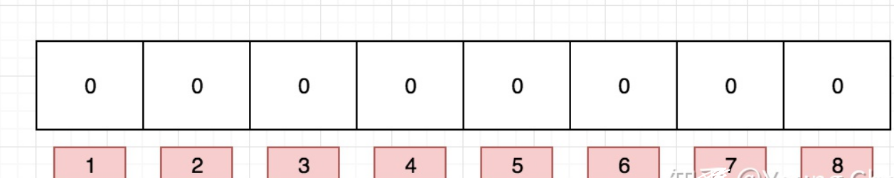
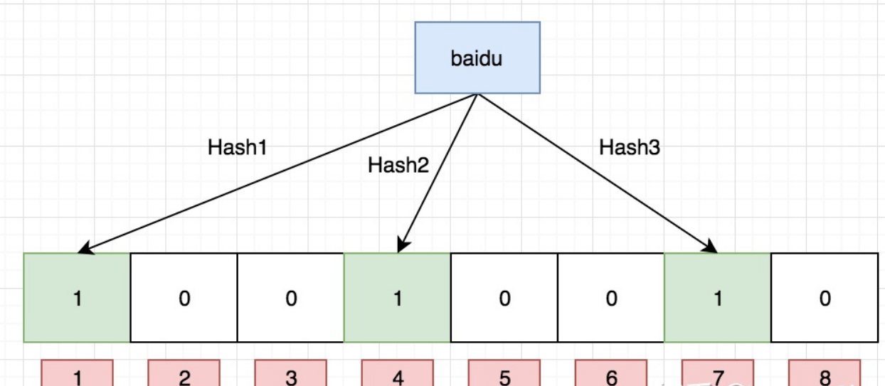
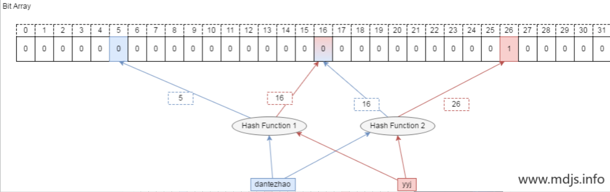
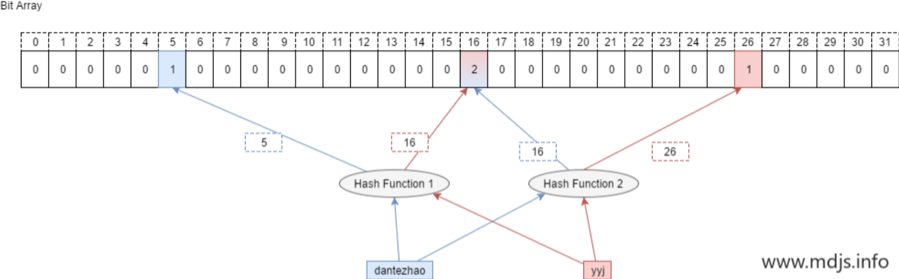
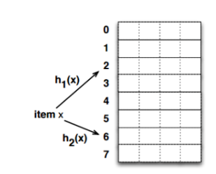

# Table of Contents

* [常规做法](#常规做法)
* [**什么是布隆过滤器**](#什么是布隆过滤器)
* [布隆过滤器数据结构](#布隆过滤器数据结构)
* [Counting Bloom Filter (CBF)](#counting-bloom-filter-cbf)
  * [BF为什么不支持删除](#bf为什么不支持删除)
  * [CBF](#cbf)
  * [CBF缺点](#cbf缺点)
* [布谷鸟哈希](#布谷鸟哈希)
  * [问题](#问题)
* [布谷鸟过滤](#布谷鸟过滤)
* [参考资料](#参考资料)


学习前提[BitMap](BitMap.md)


> 如何判断一个元素是否存在？


# 常规做法

一般都是 HashMap，确实可以将值映射到 HashMap 的 Key，然后可以在 O(1) 的时间复杂度内返回结果，效率奇高。但是 HashMap 的实现也有缺点，例如存储容量占比高，考虑到负载因子的存在，通常空间是不能被用满的，而一旦你的值很多例如上亿的时候，那 HashMap 占据的内存大小就变得很可观了。


# **什么是布隆过滤器**

本质上布隆过滤器是一种数据结构，比较巧妙的概率型数据结构（probabilistic data structure），特点是高效地插入和查询，可以用来告诉你 **“某样东西一定不存在或者可能存在”**。


> **某样东西一定不存在或者可能存在** 多读几遍！
>
> 一定不存在：没有映射数据
>
> 可能存在：hash值可能相等。


# 布隆过滤器数据结构

> 其实就是对BitMap的应用。

布隆过滤器是一个 bit 向量或者说 bit 数组，长这样：



如果我们要映射一个值到布隆过滤器中，我们需要使用**多个不同的哈希函数**生成**多个哈希值，**并对每个生成的哈希值指向的 bit 位置 1，例如针对值 “baidu” 和三个不同的哈希函数分别生成了哈希值 1、4、7，则上图转变为：




说到这里，其实就明白了，布隆过滤器的原理。

> 对数据进行hash求值，映射到BitMap中，可以判断数据一定不存在或可能存在。


# Counting Bloom Filter (CBF)

标准的 Bloom Filter 是一种比较简单的数据结构，只支持插入和查找两种操作。在所要表达的集合是静态集合的时候，标准 Bloom Filter 可以很好地工作，但是如果要表达的集合经常变动，标准Bloom Filter的弊端就显现出来了，因为它不支持删除操作。


## BF为什么不支持删除

> 说白了就是，hash可能相同，会误删除。



问题来了！现在，先假设 yyj 本身是属于集合的元素，如果需要查询 yyj 是否在集合中，通过哈希函数计算后，我们会去判断第 16 和 第 26 位是否为 1， 这时候就得到了第 16 位为 0 的结果，即 yyj 不属于集合。 显然这里是误判的。


## CBF

> 主要区别原来：将**布隆**过滤器的bitmap更换成数组,当数组某位置被映射一次时就+1,当删除时就-1,这样就避免了普通**布隆**过滤器删除数据后需要重新计算其余数据包Hash的问题,但是依旧没法避免误判。

Counting Bloom Filter 的出现，解决了上述问题，它将标准 Bloom Filter 位数组的每一位扩展为一个小的计数器（Counter），在插入元素时给对应的 k （k 为哈希函数个数）个 Counter 的值分别加 1，删除元素时给对应的 k 个 Counter 的值分别减 1。Counting Bloom Filter 通过多占用几倍的存储空间的代价， 给 Bloom Filter 增加了删除操作。基本原理是不是很简单？看下图就能明白它和 Bloom Filter 的区别在哪。




## CBF缺点

counter 的引入就会带来很大的资源浪费


> 为啥要取名布谷鸟呢?
>
> 有个成语，「鸠占鹊巢」,布谷鸟也是,布谷鸟从来不自己筑巢。它将自己的蛋产在别人的巢里，让别人来帮忙孵化。待小布谷鸟破壳而出之后，因为布谷鸟的体型相对较大，它又将养母的其它孩子（还是蛋）从巢里挤走 —— 从高空摔下夭折了。

# 布谷鸟哈希

最简单的布谷鸟哈希结构是一维数组结构，会有两个 hash 算法将新来的元素映射到数组的两个位置。如果两个位置中有一个位置为空，那么就可以将元素直接放进去。但是如果这两个位置都满了，它就不得不「鸠占鹊巢」，随机踢走一个，然后自己霸占了这个位置。

```java
p1 = hash1(x) % l
p2 = hash2(x) % l
```

不同于布谷鸟的是，布谷鸟哈希算法会帮这些受害者（被挤走的蛋）寻找其它的窝。因为每一个元素都可以放在两个位置，只要任意一个有空位置，就可以塞进去。所以这个伤心的被挤走的蛋会看看自己的另一个位置有没有空，如果空了，自己挪过去也就皆大欢喜了。但是如果这个位置也被别人占了呢？好，那么它会再来一次「鸠占鹊巢」，将受害者的角色转嫁给别人。然后这个新的受害者还会重复这个过程直到所有的蛋都找到了自己的巢为止。


## 问题

但是会遇到一个问题，那就是如果数组太拥挤了，连续踢来踢去几百次还没有停下来，这时候会严重影响插入效率。这时候布谷鸟哈希会设置一个阈值，当连续占巢行为超出了某个阈值，就认为这个数组已经几乎满了。这时候就需要对它进行扩容，重新放置所有元素。

还会有另一个问题，那就是可能会存在挤兑循环。比如两个不同的元素，hash 之后的两个位置正好相同，这时候它们一人一个位置没有问题。但是这时候来了第三个元素，它 hash 之后的位置也和它们一样，很明显，这时候会出现挤兑的循环。不过让三个不同的元素经过两次 hash 后位置还一样，这样的概率并不是很高，除非你的 hash 算法太挫了。

布谷鸟哈希算法对待这种挤兑循环的态度就是认为数组太拥挤了，需要扩容（实际上并不是这样）。

**优化**

上面的布谷鸟哈希算法的平均空间利用率并不高，大概只有 50%。到了这个百分比，就会很快出现连续挤兑次数超出阈值。这样的哈希算法价值并不明显，所以需要对它进行改良。

+ 改良的方案之一是增加 hash 函数，让每个元素不止有两个巢，而是三个巢、四个巢。这样可以大大降低碰撞的概率，将空间利用率提高到 95%左右。

+ 另一个改良方案是在数组的每个位置上挂上多个座位，这样即使两个元素被 hash 在了同一个位置，也不必立即「鸠占鹊巢」，因为这里有多个座位，你可以随意坐一个。除非这多个座位都被占了，才需要进行挤兑。很明显这也会显著降低挤兑次数。这种方案的空间利用率只有 85%左右，但是查询效率会很高，同一个位置上的多个座位在内存空间上是连续的，可以有效利用 CPU 高速缓存。

所以更加高效的方案是将上面的两个改良方案融合起来，比如使用 4 个 hash 函数，每个位置上放 2 个座位。这样既可以得到时间效率，又可以得到空间效率。这样的组合甚至可以将空间利用率提到高 99%，这是非常了不起的空间效率。




# 布谷鸟过滤

布谷鸟[过滤器](https://mp.weixin.qq.com/s?__biz=MzU2NjIzNDk5NQ==&mid=2247487217&idx=1&sn=a6428305479760448199d89eecc343f3&scene=21#wechat_redirect)和布谷鸟哈希结构一样，它也是一维数组，但是不同于布谷鸟哈希的是，布谷鸟哈希会存储整个元素，而布谷鸟[过滤器](https://mp.weixin.qq.com/s?__biz=MzU2NjIzNDk5NQ==&mid=2247487217&idx=1&sn=a6428305479760448199d89eecc343f3&scene=21#wechat_redirect)中只会存储元素的指纹信息（几个bit，类似于**布隆**过滤器）。这里[过滤器](https://mp.weixin.qq.com/s?__biz=MzU2NjIzNDk5NQ==&mid=2247487217&idx=1&sn=a6428305479760448199d89eecc343f3&scene=21#wechat_redirect)牺牲了数据的精确性换取了空间效率。正是因为存储的是元素的指纹信息，所以会存在误判率，这点和**布隆**过滤器如出一辙。


# 参考资料

https://mp.weixin.qq.com/s/1IceHYELoSD7PtFKN0u9UA
