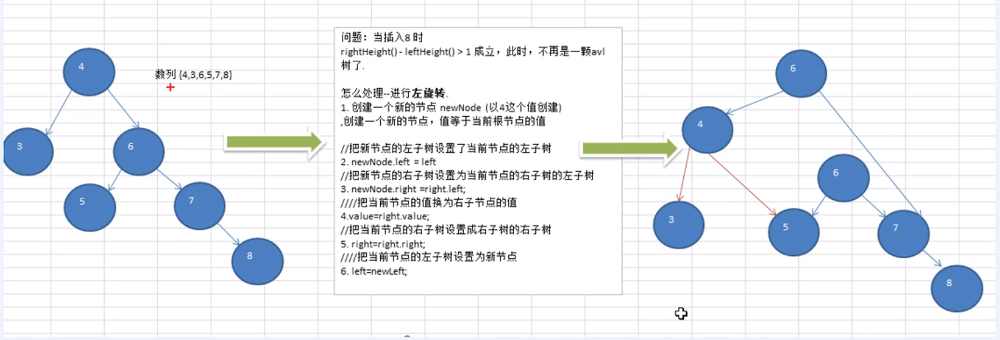
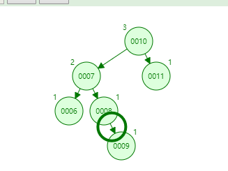

# Table of Contents

* [高度求解](#高度求解)
* [左旋](#左旋)
* [右旋](#右旋)
* [双旋](#双旋)
  * [LR](#lr)
  * [RL](#rl)


前面的BST也发现过，BST可能会退化成链表,查询速度明显降低。


动画效果请参考 [AVL Tree](https://www.cs.usfca.edu/~galles/visualization/AVLtree.html)

# 高度求解

```java
//这句代码NB了 重点后面+1
 public int height(AVLNode<Integer> node){
        return Math.max(node.left==null?0:height(node.left),node.right==null?0:height(node.right))+1;
    }
```


# 左旋

{4,3,6,5,7,8}

左旋其实就就是右边字数的高度长了，需要将根节点往右移动。


就跟我们平常手中拿的绳子一样，那边长了，就要往那边移动下。




对于上面这张图，对于4来说，需要将6变为根节点，那么6的左节点，就是4的右节点。


```java
AVLNode<Integer> node = new AVLNode<Integer>(root.key);
node.left = root.left;
node.right = root.right.left;//根节点右子树的左字树一定比 左边大
root.key = root.right.key; //根节点的值 右移动一位
root.right = root.right.right;
root.left = node; 
mRoot = (AVLNode<T>) root;
```

# 右旋


```java
AVLNode<Integer> node = new AVLNode<Integer>(root.key);
node.right = root.right;
node.left = root.left.right;
root.key = root.left.key;
root.left = root.left.left;
root.right = node;
mRoot = (AVLNode<T>) root;
```


# 双旋


## LR

有些情况，单旋转不能完成AVL的平衡，比如`arr={10,11,7,6,8,9}`




第一次旋转是围绕"k1"进行的"RR旋转"，第二次是围绕"k3"进行的"LL旋转"。


```java
if ((cur.leftHeight() - cur.rightHeight()) > 1) {

	//当前节点的左子树的右子树的高度>当前节点的左子树的高度  先左旋 在右旋
    if (null != getMRoot().left && getMRoot().left.right.rightHeight() > getMRoot().left.leftHeight()) {
        leftRotate((AVLNode<Integer>) getMRoot().left);
    }
    rightRotate((AVLNode<Integer>) mRoot);

}
```


## RL


第一次旋转是围绕"k3"进行的"LL旋转"，第二次是围绕"k1"进行的"RR旋转"。


就是先对不平衡的树进行依次avl，在对外面进行一次avl
