# Table of Contents

* [数据结构分类](#数据结构分类)
* [数组](#数组)
  * [稀疏数组](#稀疏数组)
* [链表](#链表)
  * [单链表](#单链表)
  * [单链表面试题](#单链表面试题)
  * [双链表](#双链表)
  * [单向环形链表](#单向环形链表)
* [栈](#栈)
  * [数组模拟栈](#数组模拟栈)
  * [链表模拟栈](#链表模拟栈)
  * [栈怎么实现综合计算器](#栈怎么实现综合计算器)
  * [前缀、中缀、后缀(逆波兰表达式)](#前缀中缀后缀逆波兰表达式)
  * [中缀转后缀](#中缀转后缀)
* [队列](#队列)
  * [数组模拟队列](#数组模拟队列)
  * [链表模拟队列](#链表模拟队列)
* [递归](#递归)
  * [递归能解决问题的规则](#递归能解决问题的规则)
  * [迷宫问题](#迷宫问题)
  * [八皇后问题](#八皇后问题)


# 数据结构分类

+ 线性结构

    + 数据元素之间存在一对一的线性关系
    + 顺序存储结构和链式存储结构
        + 顺序存储的线性表称为顺序表，顺序表中的元素是连续的
        + 链式存储的线性表称为链表，链表中存储的元素不一定是连续的，元素节点中存放数据元素以及相邻元素的地址信息。

    + 常见线性结构：数组、队列、链表、栈

+ 非线性结构

    + 二维数组、多维数组、广义表、数结构、图结构


# 数组

## 稀疏数组


|  0   |  1   |  0   |  0   |
| :--: | :--: | :--: | :--: |
|  0   |  1   |  0   |  0   |
|  0   |  0   |  2   |  0   |
|  0   |  1   |  0   |  0   |
|  0   |  0   |  2   |  0   |

这是一个5行4列的数组，如果有`二维数组`来表示，会发线数组很多元素都是为0 或者理解为相同元素，这个时候我们可以用稀疏数组来定义

+ 当一个数组中大部分元素为0，或者为同一个值的数组。可以用稀疏数组来保存该数组
    + 记录数组一共**有几行几列**，**有多少个不同的值**
    + 把具有不同值的元素的行列以及值记录在一个小规模数组中，从而缩小程序的规模


| 行   | 列   | 值   |
| ---- | ---- | ---- |
| 5    | 4    | 5    |
| 0    | 1    | 1    |
| 1    | 1    | 1    |
| 2    | 2    | 2    |
| 3    | 1    | 1    |
| 4    | 2    | 2    |


原来是5X4 现在是6X3 。**行列数越大、数组中相同元素越多，越能体现稀缺数组的压缩性**。

+ 二维数组转稀疏数组
    1. 遍历二维数组得到有效值，以及有效值个数sum
    2. 根据有效值个数可以得到 稀疏数组 [sum+1] [3]
    3. 将二维数组有效数组存入 稀疏数组

+ 稀疏数组转二维数组
    1. 读取第一行的数据，创建原始二维数组的行和列
    2. 读取稀疏数组数据，复制给二维数组对应的值
    3. 其他元素赋值为0

# 链表 

## 单链表


链表是一个有序的列表 

<div align=left>
	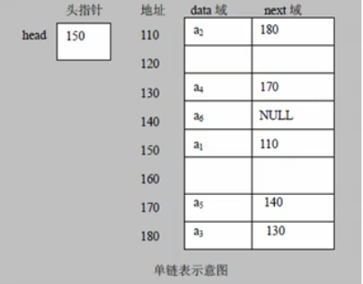
</div>

+ 链表是以节点来存储的
+ 每个节点包含data域、next域
  + data:存放具体的数据
  + next:指向下一个节点

+ 链表是有序的，不一定是连续存放的
+ 链表有带头节点的链表和没有头节点的 根据实际情况来看

<div align=left>
	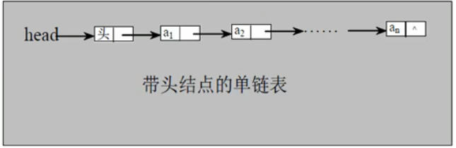
</div>


+ 创建以及删除添加，都是需要遍历去做的，而且只能从头到尾

## 单链表面试题

+ 求单链表中有效节点的个数。
  这个就很简单了，直接遍历求出有值的节点

+ 查找单链表中倒数第k个节点
  有效长度-倒数K

+ 单链表的反转
  第一反应，正着遍历，然后赋值新链表头节点的前端，但是链表过长效率就很低了

  <details>
  <summary>点击查看详细内容</summary>
  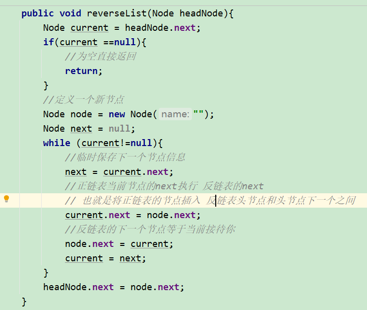</img>
  </details>

+ 从尾到头打印单链表（百度面试题）
  + 先反转，在遍历（会破坏原来链表的结构 不太建议）
  + 使用栈,利用栈先进后出。


## 双链表

为什么要使用双向链表，解决了单链表的什么问题？

+ 单链表查找方向只能是一个
+ 单链表不能自我删除，只能靠辅助节点


<div align=left>
	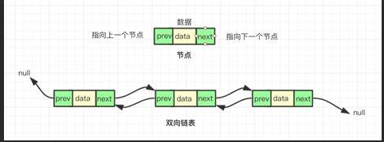
</div>


##  单向环形链表


<div align=left>
	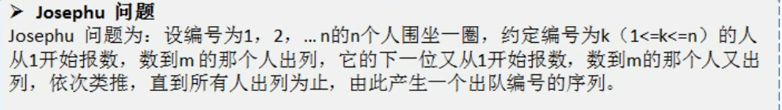
</div>

思路：

+ 构建单向环形链表，first指向第一个
+ 遍历环形链表，fitst.next=first遍历结束，知道tail节点
+ 遍历k-1，first指向k
+ 遍历m-1，first指向m
+ 移除first。first=first.next tail.next=first


# 栈

+ 栈的英文(stack)

+ 栈是先入后出(FILO)的有序列表

+ 栈是限制元素的`插入`和`删除`只能在线性表的同一端进行。允许插入的一端称为栈顶，固定的一端称为栈底


<div align=left>
	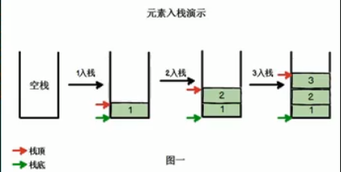
</div>
<div align=left>
	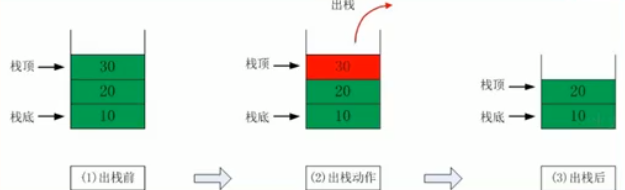
</div>


## 数组模拟栈

知道了栈的定义，剩下就是怎么实现了


+ 定义一个数组，以及一个栈顶top
+ 入栈：top++ stack[top]=data
+ 出栈：top-- stack[top]


## 链表模拟栈

栈用头插法就好了

+ 入栈：进入元素在head的下一个
+ 出栈：tail

  


## 栈怎么实现综合计算器

表达式:$$7*2*2-5+1-5+3-4$$

思路：定义一个数栈（存放数字）,一个符号栈(存放运算符)

1. 注意表达式的优先级
2. 注意连续数字以及小数问题

## 前缀、中缀、后缀(逆波兰表达式)

+ 前缀表达式

  前缀表达式又成波兰式，前缀表达式的运算符位于操作数之前

  $$(3+4)*5-6$$对应的前缀表达式就是$$ -*+3456$$,运算符并不是按出现先后来排列的

+ 中缀表达式

  就是我们熟悉的数学公式$$(3+4)*5-6$$，但是计算机并不方便计算，一般是转换为后缀表达式

+ 后缀表达式

  后缀表达式又成逆波兰式，后缀表达式的运算符位于操作数之后

  $$(3+4)*5-6$$的逆波兰表达式$$3     4+5*6-$$

<div align=left>
	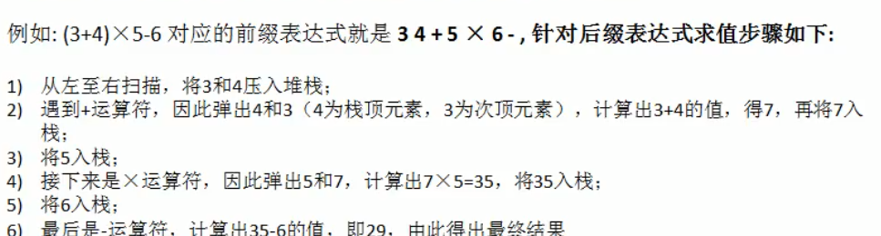
</div>


## 中缀转后缀

```java
从左到右开始扫描中缀表达式
遇到数字， 直接输出
遇到运算符
a.若为“(” 直接入栈
b.若为“)” 将符号栈中的元素依次出栈并输出, 直到 “(“, “(“只出栈, 不输出
c.若为其他符号, 将符号栈中的元素依次出栈并输出, 直到遇到比当前符号优先级更低的符号或者”(“。 将当前符号入栈。
扫描完后, 将栈中剩余符号依次输出
```

$$((a+(b*c))+(((d*e)+f)*g))$$ ->$$abc*+de*f+g*+$$

https://www.cnblogs.com/wkfvawl/p/12864789.html


# 队列

+ 队列是一个有序列表，可以用数组或者链表来实现
+ 遵守先进先出

## 数组模拟队列

<div align=left>
	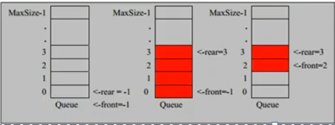
</div>

```java
final Object[] items;

//队列第一个元素的前一个
int head;

//数组最后一个元素
int tail;
```


如果不做特殊处理，我们会发现，定义的数组只能用一次。

为了充分利用数组，我们可以将数组看作是一个`环形数组`

```java
假设数组`maxSize`=8。取模是为了重新计算下标

如果对头为0 队尾(队列中最后一个元素的下一个)为7， (7+1) %8=0。队列已满

如果对头为0 队尾(队列中最后一个元素)为7   (7+1)%8=0 但是你无法判断队列时满还是空

- 对头：队列中第一个元素
- 队尾：队列中最后一个元素的下一个
- 队列满：**(队尾+1) % 数组长度 = 队头
- 队列空**：** 队头指针 = 队尾指针
- 注意：空白位置会随着对头移动而移动
- 数组长度式是大于队列长度的

在不添加其他字段的情况下，这样是比较高效判断队列是满还是空。

```


https://www.jianshu.com/p/40812439f412


ArrayBlockingQueue的实现方式不太一样

```java
	/** 队列中存放的值 */
    final Object[] items;

    /** 值的索引，这是取出位置的索引*/
    int takeIndex;

    /** 值的索引，这是插入位置的索引*/
    int putIndex;

    /** 队列中有多少个元素 */
    int count;

```


多了一个字段判断队列中元素是否为空或者满。（时间复杂）

计算下标时，也没有取模，达到最后一个时，直接取0。反复循环。

## 链表模拟队列

这个就比较好弄了,单链表 双链表都可以实现队列

# 递归

recusion
简单来说：递归就是自己调用自己，每次传入不同的变量，递归有助于编程者解决复杂的问题，同时可以让代码变得简洁。


<details>
<summary>点击查看详细内容</summary>
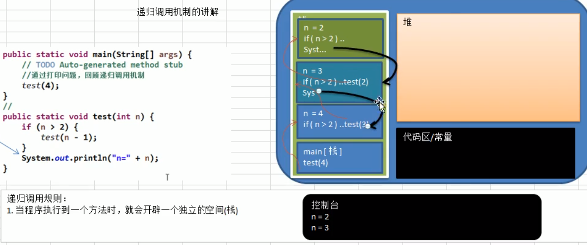</img>
</details>


## 递归能解决问题的规则


+ 递归可以解决的问题
  + 8皇后、阶乘、迷宫。
  + 快排、归并、二分、分治。
  + 栈可以解决的问题。

+ 递归遵守的规则
  + 执行一个方法时，就创建一个新的受保护的独立空间(栈空间)。
  + 方法的局部变量是独立的，不会相互影响。
  + 递归必须有终止条件。
  + 遵守谁调用，就将结果返回给谁。

##  迷宫问题

<div align=left>
	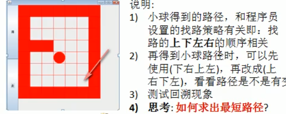
</div>

<details align=left>
<summary>点击查看详细内容</summary>
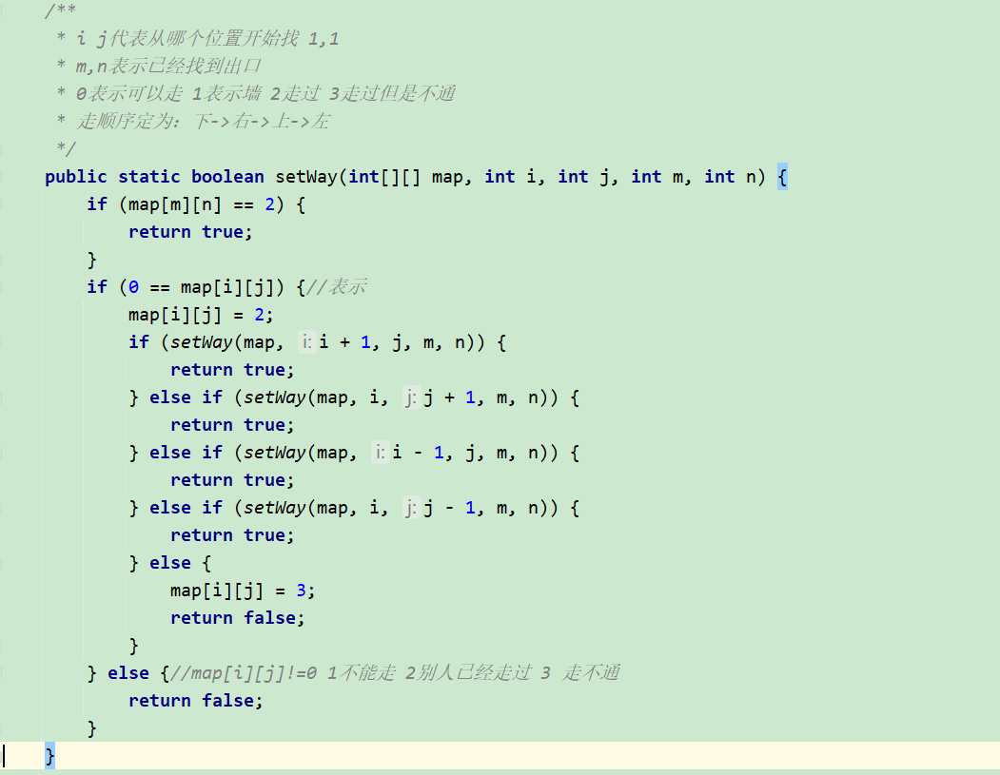</img>
</details>
+怎么求出最短路径
 在不利用算法的情况下，出口实在右下方，可以改变走动策略：下->右

 或者通过策略的改变，穷举。可以得到最短路径

 

## 八皇后问题


在8*8的格子上，任意2个皇后不能处于同一行、同一列、同一斜线上

**这玩意不好理解**


思路：

1. 第一个皇后放在第一行第一列
2. 第二个皇后放在第二行第一列，判断是否ok，不ok就把第二列、第三列、找到一个合适的为止
3. 继续第三列、第四列。。。
4. 得到一个正确解，在栈退回到上一个栈时，就会开始回溯，会将第一个皇后。放在第一列的正确解上
5. 放在第一行的第二列，重复1234


```java
public class EightQueens {

    int max = 8;
    //用来存放皇后 下标：行 值：列 (精华)
    int[] arr = new int[max];

    public static int count = 0;

    public static void main(String[] args) {

        EightQueens eightQueens = new EightQueens();
        eightQueens.setArr(0);
        System.out.println("解法" + count);
    }

    //打印皇后的位置
    public void list() {
        count++;
        for (int i : arr) {
            System.out.print(i + "");
        }
        System.out.println();
    }

    //判断当前皇后和之前皇后是否冲突

    public boolean judge(int n) {

        //一维数组本身就避免了同一行的情况
        for (int i = 0; i < n; i++) {
            if (
                    arr[i] == arr[n] //列是否相等
                            || Math.abs(n - i) == Math.abs(arr[n] - arr[i])//行差=列差
            ) {
                return false;
            }
        }
        return true;
    }


    public void setArr(int n) {
        if (n == max) {//n=8 8个皇后已经放好
            list();
            return;
        }
        for (int i = 0; i < max; i++) {
            //先将皇后放在 改行的第一列
            arr[n] = i;
            if (judge(n)) {//不冲突 下一个皇后
                setArr(n + 1);
            }
        }

    }

}
```

