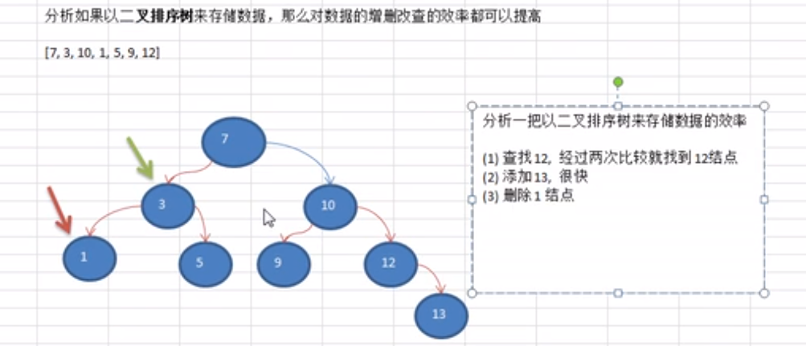
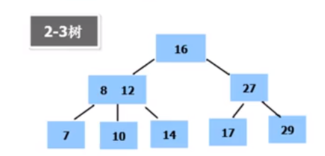
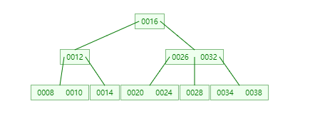
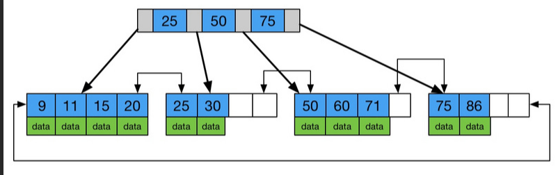

# Table of Contents

* [其他数据结构优缺点](#其他数据结构优缺点)
* [树](#树)
* [树的相关概念](#树的相关概念)
* [二叉树](#二叉树)
  * [斜树](#斜树)
  * [满二叉树](#满二叉树)
  * [完全二叉树](#完全二叉树)
* [顺序存储二叉树](#顺序存储二叉树)
* [二叉查找树-BST](#二叉查找树-bst)
* [平衡二叉树](#平衡二叉树)
* [红黑树](#红黑树)
* [哈佛曼树](#哈佛曼树)
* [多路查找树](#多路查找树)
  * [多叉树](#多叉树)
  * [2-3树](#2-3树)
  * [B树](#b树)
  * [B+树](#b树-1)
  * [B*树](#b树-2)
* [总结](#总结)

终于开始学习`树`了，学习之前先了解下，为什么要学习`树`？

[树演示网站](https://www.cs.usfca.edu/~galles/visualization/BST.html)

# 其他数据结构优缺点

+ 数组查询快，插入慢  [ArrayList](../../D.java/collection/ArrayList.md)

+ 链表插入快，查找慢

+ 通过散列函数和数组的随机访问，实现插入、删除、查找的**时间复杂度都是 O(1)**，是一种非常高效的数据结构。支持动态数据。当然散列函数、散列冲突、加载因子
  的选择直接决定了哈希表的性能。但哈希表的最大缺点是不支持顺序访问，这也是工程中经常将哈希表和链表一起使用的原因。[HashMap](../../D.java/collection/HashMap.md)

+ 树可以提高数据的存储、读取效率，比如利用二叉排序树，既可以保证数据的检索速度，也可以保证数据的插入、修改、删除

	

# 树

树是一种数据结构，它是n(n>=0)个节点的有限集。n=0时称为空树。n>0时，有限集的元素构成一个具有层次感的数据结构。

	

区别于线性表一对一的元素关系，树中的节点是一对多的关系。树具有以下特点:

- n>0时，根节点是唯一的，不可能存在多个根节点。
- 每个节点有零个至多个子节点；除了根节点外，每个节点有且仅有一个父节点。根节点没有父节点。

# 树的相关概念

树有许多相关的术语与概念，在学习树的结构之前，我们要熟悉这些概念。

- `子树`: 除了根节点外，每个子节点都可以分为多个不相交的子树
- `孩子与双亲`: 若一个结点有子树，那么该结点称为子树根的"双亲"，子树的根是该结点的"孩子"。在图一中，B、H是A的孩子，A是B、H的双亲。
- `兄弟`: 具有相同双亲的节点互为兄弟，例如B与H互为兄弟。
- `节点的度`:  一个节点拥有子树的数目。例如A的度为2，B的度为1，C的度为3.
- `叶子节点`:  没有子树，也即是度为0的节点。
- `分支节点`: 除了叶子节点之外的节点，也即是度不为0的节点。
- `内部节点`: 除了根节点之外的分支节点。
- `层次`: 根节点为第一层，其余节点的层次等于其双亲节点的层次加1.
- `树的高度`: 也称为树的深度，树中节点的最大层次。
- `有序树`: 树中节点各子树之间的次序是重要的，不可以随意交换位置。
- `无序树`: 树种节点各子树之间的次序是不重要的。可以随意交换位置。
- `森林`: 0或多棵互不相交的树的集合。例如图二中的两棵树为森林。

# 二叉树

 [二叉树使用](二叉树.md)

**最多**有两棵子树的树被称为二叉树

	

## 斜树

所有节点都只有左/右子树的二叉树叫做左/右斜树。

	

## 满二叉树

二叉树中所有非叶子结点的度都是2，且叶子结点都在同一层次上

也可以理解 所有的叶子节点都在最后一层

	

## 完全二叉树

如果一个二叉树与满二叉树前m个节点的结构相同，这样的二叉树被称为完全二叉树

	

# 顺序存储二叉树

+  顺序二叉树通常只考虑完全二叉树
+ 第n个元素的左子节点为$$2*n+1$$
+ 第n个元素的右子节点为$$2*n+2$$
+ 第n个元素的父节点为$(n-1)/2$$$
+ n表示二叉树的第几个元素（按0开始编号）

# 二叉查找树-BST

二叉查找树(Binary Search Tree)是指一棵空树或者具有下列性质的二叉树:

- 若任意节点的左子树不空，则左子树上所有节点的值均小于它的根节点的值；
- 若任意节点的右子树不空，则右子树上所有节点的值均大于它的根节点的值；
- 任意节点的左、右子树也分别为二叉查找树；
- 没有键值相等的节点。
- 如果有相同的值，可以将该节点放在左子或右子。

二叉查找树相比于其他数据结构的优势在于查找、插入的时间复杂度较低为 O ( log ⁡ n ) 。

二叉查找树是基础性数据结构，用于构建更为抽象的数据结构，如集合、多重集、关联数组等。

[二叉查找树使用](二叉查找树.md)

BST的退化链表延申出的解决方案->AVl

# 平衡二叉树

 最小二叉平衡树的节点的公式如下 F(n)=F(n-1)+F(n-2)+1 这个类似于一个递归的数列

F(n-1)是左子树的节点数量，F(n-2)是右子树的节点数量。

AVL树是高度平衡的二叉树。它的特点是: AVL树中任何节点的两个子树的高度最大差别为1。

上面的两张图片，左边的是AVL树，它的任何节点的两个子树的高度差别都<=1；而右边的不是AVL树，因为7的两颗子树的高度相差为2(以2为根节点的树的高度是3，而以8为根节点的树的高度是1)。

平衡二叉树的实现方式：红黑树、AVL、替罪羊树、Treap、伸展树等。

动画效果请参考 [AVL Tree](https://www.cs.usfca.edu/~galles/visualization/AVLtree.html)

[平衡二叉树](平衡二叉树.md)

# 红黑树

可以先学习B树后，再回头看这个

其实平衡二叉树最大的作用就是查找,AVL树的查找、插入和删除在平均和最坏情况下都是O(logn)。AVL树的效率就是高在这个地方。如果在AVL树中插入或删除节点后，使得高度之差大于1。此时，AVL树的平衡状态就被破坏，它就不再是一棵二叉树；为了让它重新维持在一个平衡状态，就需要对其进行旋转处理, 那么创建一颗平衡二叉树的成本其实不小. 这个时候就有人开始思考，并且提出了红黑树的理论，那么红黑树到底比AVL树好在哪里?

初学时候的一些问题

1.为什么要定义红黑赋值 节点，有什么含义吗

红黑树也是一种自平衡的二叉查找树。

- 每个结点要么是红的要么是黑的。(红或黑)
- 根结点是黑的。  (根黑)
- 叶子节点都是黑的  (叶黑)
- 如果一个结点是红的，那么它的两个儿子都是黑的。  (红子黑 红父黑)
- 从任一节点到叶子节点的所有路径都包含相同数目的black节点

[红黑树查找使用](红黑树.md)

[红黑树使用-TreeMap&&TreeSet](../../D.java/collection/TreeMap&&TreeSet.md)

动画效果请参考 [RedBlackTree]( https://www.cs.usfca.edu/~galles/visualization/RedBlack.html)

**为什么添加删除后，满足红黑树的性质，就能保证平衡:**

**红黑树与AVL树的比较:** 

1. AVL树的时间复杂度虽然优于红黑树，但是对于现在的计算机，cpu太快，可以忽略性能差异

2. 红黑树的插入删除比AVL树更便于控制操作 

3. 红黑树整体性能略优于AVL树(红黑树旋转情况少于AVL树)

# 哈佛曼树

# 多路查找树

二叉树操作效率高，但是也存在问题

1. 构建二叉树时，需要多次I/O操作
2. 海量节点，二叉树高度很大，会降低操作速度

## 多叉树

如果允许每个节点可以有更多的数据项和更多的子节点，就是多叉树，可以重新组织节点，减少树的高度。

## 2-3树

+ 所有叶子节点都在同一层(只要是B树都满足这个条件)
+ 有2个子节点的节点叫二节点，要么有2个 要么没有
+ 有3个子节点的节点叫三节点 同上
+ 2-3是由二节点和三节点构成的树

`arr=[16,24,12,32,14,26,34,10,8,28,38,20]`

插入原则：

1. 先满足上面三个原则，不满足，先向上拆，上层满，拆本层，然后还要满足上面三个条件
2. 满足BST

[演示地址](https://www.cs.usfca.edu/~galles/visualization/BTree.html)

## B树

**B树 (B-tree)  B 即Balanced 是一种平衡的多路查找树，2-3 树和 2-3-4 树都是 B 树的特例。节点最大的孩子数目称为 B 树的阶(order)**，因此，2-3 树是 3 阶 B 树，2-3-4 树是 4 阶 B 树

+ B树的阶：节点最多的字节点个数，2-3的阶是3；2-3-4的阶是4

+ 关键字集合分布在整棵树中，即叶子节点和非叶子节点都存放数据。

##  B+树

B+ 树是一种树数据结构，通常用于关系型数据库(如Mysql)和操作系统的文件系统中。B+ 树的特点是能够保持数据稳定有序，其插入与修改拥有较稳定的对数时间复杂度。B+ 树元素自底向上插入，这与二叉树恰好相反。

+ 所有数据都放在叶子节点
+ B树+叶子有序链表(链表中的关键字是有序的)
+ B+树的非叶子节点不保存数据，只保存子树的临界值(最大或者最小)

+ 叶子节点是有序链表，`0,1,5,9,12,18,25,16,23,58`

对于链表18，最原始的就是遍历查找，时间复杂度高，于是就提出了B+树的概念。先分割临界值，抽取。

+ 为什么叶子节点要有指针连接起来

先确定10的位置，再确定30的位置，最后从10的位置遍历到30的位置

+ 从树的角度去理解索引

+ 一个叶子节点就是一页也就是磁盘页的大小，充分利用磁盘的预读，一个data就是一行数据

  

## B*树

是B+树的变体，在B+树的非根和非叶子结点再增加指向兄弟的指针, 在B+树基础上，为非叶子结点也增加链表指针，将结点的最低利用率从1/2提高到2/3。

# 总结

