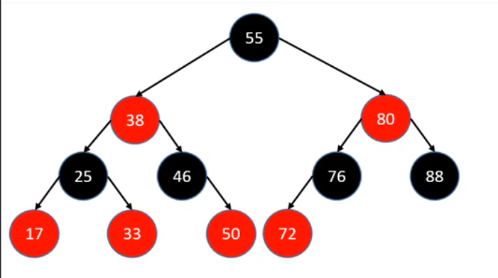
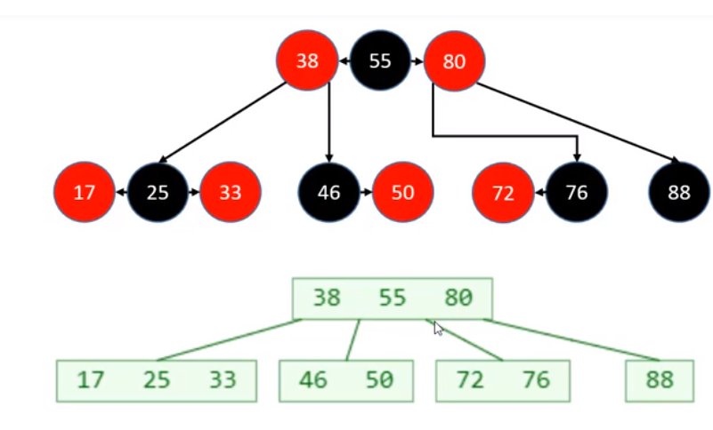
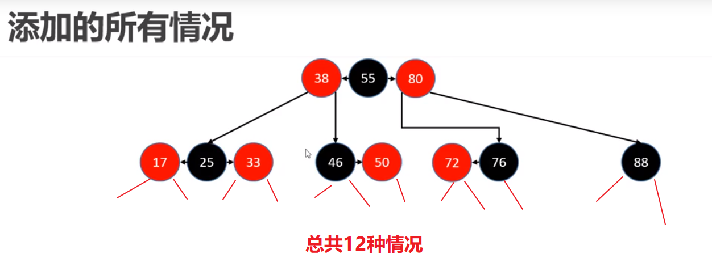
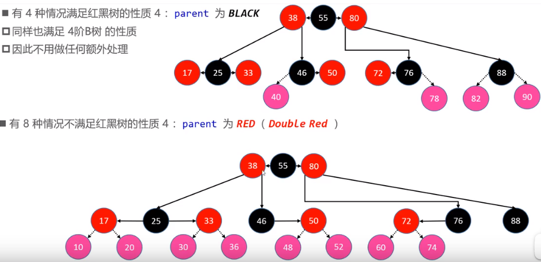
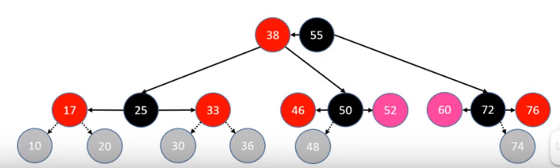

# Table of Contents

* [等价变换](#等价变换)
* [添加](#添加)
  * [判断条件：uncle不是RED](#判断条件uncle不是red)

https://www.bilibili.com/video/BV1HJ411z7ZU?p=105

学红黑树，心中要有B树。

# 等价变换

​				

+ 红黑树逻辑上是等价2-3-4树的。
+ black和red节点想成一个B树节点。
+ 红黑树的black节点个数与4阶B树节点总个数相等。

# 添加

+ B树中，新元素必定添加到叶子节点中
+ 4阶B树满足$$1<=x<=3$$
+ 建议新加的元素是红色，这样能满足红黑树的性质（1235 4不一定）
+ 如果是根节点 直接黑色
  

B树的节点：一黑2红构成

## 判断条件：uncle不是RED

1. 对于52和60

   + 50变黑，46变红，38指向50，进行左旋
   + 72变黑，76变红，80指向72，进行右旋

   
   
