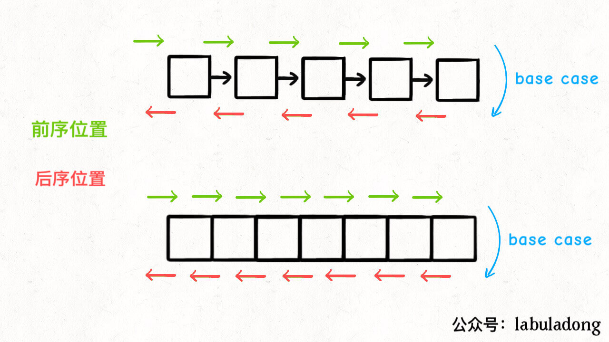

单链表和数组的遍历可以是迭代的，也可以是递归的，二叉树这种结构无非就是二叉链表，不过没办法简单改写成迭代形式，所以一般说二叉树的遍历框架都是指递归的形式。

你也注意到了，只要是递归形式的遍历，都会有一个前序和后序位置，分别在递归之前和之后。

所谓前序位置，就是刚进入一个节点（元素）的时候，后序位置就是即将离开一个节点（元素）的时候。

**你把代码写在不同位置，代码执行的时机也不同**：



比如说，如果让你**倒序打印**一条单链表上所有节点的值，你怎么搞？

实现方式当然有很多，但如果你对递归的理解足够透彻，可以利用后序位置：

```java
/* 递归遍历单链表，倒序打印链表元素 */
void traverse(ListNode head) {
    if (head == null) {
        return;
    }
    traverse(head.next);
    // 后序位置
    print(head.val);
}
```

结合上面那张图，你应该知道为什么这段代码能够倒序打印单链表了吧，**本质上是利用递归的堆栈帮你实现了倒序遍历的效果。**

那么说回二叉树也是一样的，只不过多了一个中序位置罢了。

这里我强调一个初学者经常犯的错误：因为教科书里只会问你前中后序遍历结果分别是什么，所以对于一个只上过大学数据结构课程的人来说，他大概以为二叉树的前中后序只不过对应三种顺序不同的 `List` 列表。

但是我想说，**前中后序是遍历二叉树过程中处理每一个节点的三个特殊时间点**，绝不仅仅是三个顺序不同的 List：

> 前序位置的代码在刚刚进入一个二叉树节点的时候执行；
>
> 后序位置的代码在将要离开一个二叉树节点的时候执行；
>
> 中序位置的代码在一个二叉树节点左子树都遍历完，即将开始遍历右子树的时候执行。

