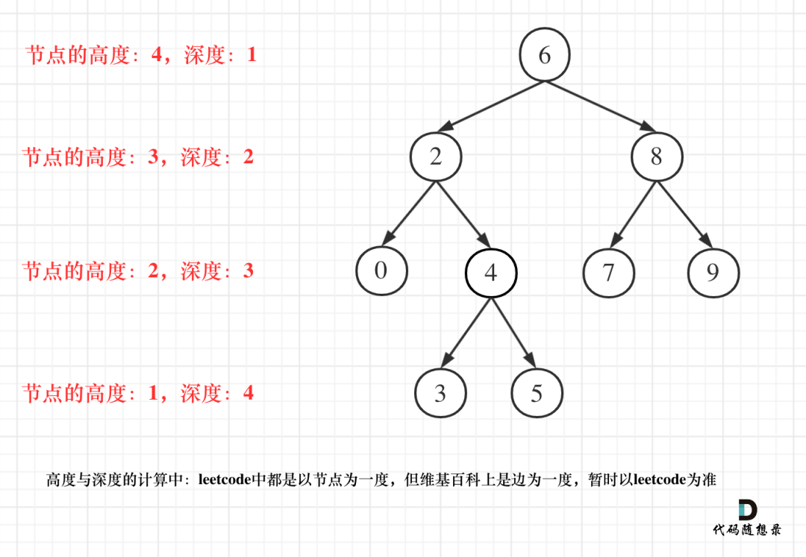

# Table of Contents

* [高度 深度](#高度-深度)
* [[104]二叉树的最大深度](#104二叉树的最大深度)
  * [从上到下解法](#从上到下解法)
  * [从下到上解法](#从下到上解法)
* [[662] 二叉树最大宽度](#662-二叉树最大宽度)


# 高度 深度

首先了解下概念

- 二叉树节点的深度：指从**根节点**到该节点的最长简单路径边的条数。
- 二叉树节点的高度：指从**该节点**到叶子节点的最长简单路径边的条数。




注意！！：理论上高度的【**数值**】是等于深度的


我们来看下高度和深度分别怎么求


1. 求当前节点**高度**，是需要从下到上，所以需要使用**后序遍历。**
2. 求当前结点**深度**， 是需要从上到下， 所以需要**前序遍历** 


# [104]二叉树的最大深度 

[https://leetcode-cn.com/problems/maximum-depth-of-binary-tree/](https://leetcode-cn.com/problems/maximum-depth-of-binary-tree/)


## 从上到下解法

1. 使用层次遍历

## 从下到上解法

注意！！：理论上高度的【**数值**】是等于深度的

```java
    public int maxDepth(TreeNode root) {
        if(null==root){
            return 0;
        }
        return 1+Math.max(maxDepth(root.left),maxDepth(root.right));
    }
```


# [662] 二叉树最大宽度

首先明白一个性质

根节点：n

左节点：2*n

右节点：2*n+1

我们需要计算出每层最右节点和最左节点的数值：Math.max(max,last-first+1)

我们可以使用层次遍历来解决这个问题

```java
public int widthOfBinaryTree(TreeNode root) {

        if(null==root){
            return 0;
        }
		// 注意这是双端队列Deque 不是Queue
        Deque<TreeNode> queue= new ArrayDeque<>();
        root.val=0;
        queue.offer(root);
        int max=0;
        while(!queue.isEmpty()){

        	
            int size = queue.size();
            max = Math.max(max,queue.getLast().val - queue.getFirst().val+1);
            for (int i = 0; i < size; i++) {
                TreeNode node = queue.pop();
                if (node.left != null){
                    node.left.val = 2*node.val;
                    queue.add(node.left);
                }
                if (node.right != null){
                    node.right.val = 2*node.val+1;
                    queue.add(node.right);
                }
            }


        }

        return max;

    }
```

