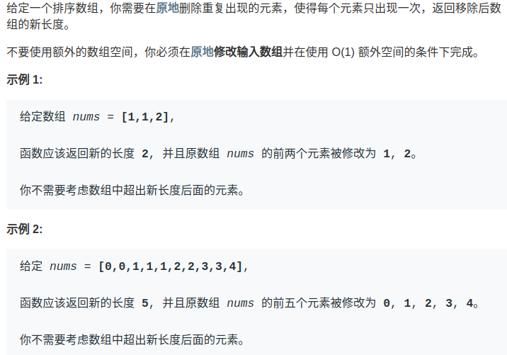
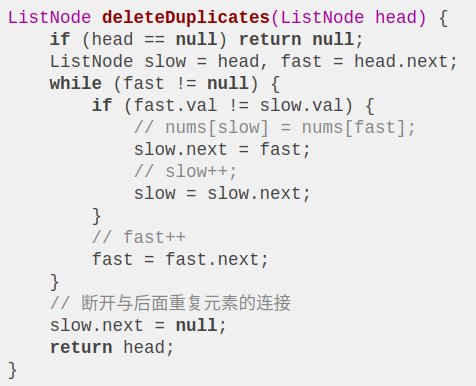
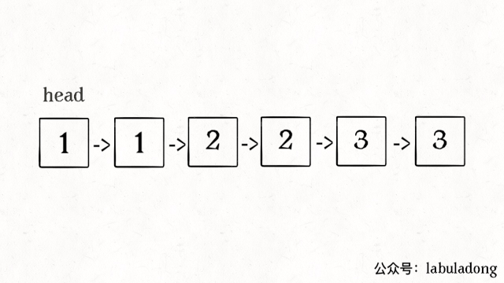

# Table of Contents

* [参考资料](#参考资料)


如何对有序数组去重？

我们知道对于数组来说，在尾部插入、删除元素是比较高效的，时间复杂度是 O(1)，但是如果在中间或者开头插入、删除元素，就会涉及数据的搬移，时间复杂度为 O(N)，效率较低。

所以对于一般处理数组的算法问题，**我们要尽可能只对数组尾部的元素进行操作，以避免额外的时间复杂度。**

这篇文章讲讲如何对一个有序数组去重，先看下题目：




额外空间的就不用说了：直接HashMap去重就好了。

但是题目要求的不使用额外空间


显然，由于数组已经排序，所以重复的元素一定连在一起，找出它们并不难，**但如果毎找到一个重复元素就立即删除它，就是在数组中间进行删除操作**，整个时间复杂度是会达到 O(N^2)。而且题目要求我们原地修改，也就是说不能用辅助数组，空间复杂度得是 O(1)。

其实，对于数组相关的算法问题，有一个通用的技巧：**要尽量避免在中间删除元素，那我就先想办法把这个元素换到最后去。**


这样的话，最终待删除的元素都拖在数组尾部，一个一个 pop 掉就行了，每次操作的时间复杂度也就降低到 O(1) 了。

我们让慢指针`slow`走左后面，快指针`fast`走在前面探路，找到一个不重复的元素就告诉`slow`并让`slow`前进一步。

这样当`fast`指针遍历完整个数组`nums`后，**`nums[0..slow]`就是不重复元素，之后的所有元素都是重复元素**。

```jav
 public int removeDuplicates(int[] nums) {
        // 这里为什么不是 length-1 因为还有长度为1的情况
        int length = nums.length;
        int slow = 0;
        int fast = 1;
        while (fast<length){
            if(nums[slow]!=nums[fast]){
                slow++;
                nums[slow] = nums[fast];
            }
            fast++;
        }
        return slow+1;

    }
```


看下算法执行的过程：


再简单扩展一下，如果给你一个有序链表，如何去重呢？其实和数组是一模一样的，唯一的区别是把数组赋值操作变成操作指针而已：



对于链表去重，算法执行的过程是这样的：




# 参考资料

https://mp.weixin.qq.com/s?__biz=MzAxODQxMDM0Mw==&mid=2247484478&idx=1&sn=685308e10c32ee5ad3508a5789633b3a&chksm=9bd7fa36aca07320ecbae4a53ed44ff6acc95c69027aa917f5e10b93dedca86119e81c7bad26&scene=21#wechat_redirect
