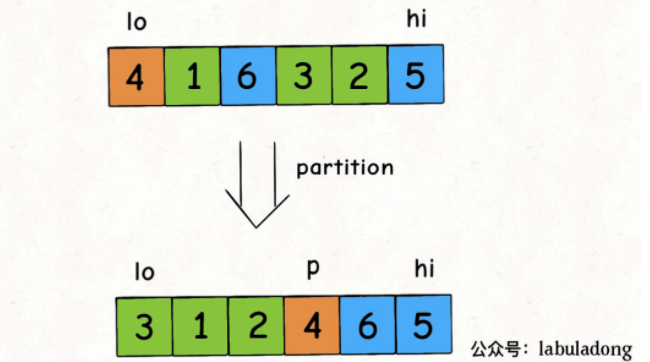

# Table of Contents

* [参考资料](#参考资料)
* [常规解法](#常规解法)
* [优先队列](#优先队列)
* [快速选择](#快速选择)


# 参考资料

[https://mp.weixin.qq.com/s/TRO3FOKT90Mpvn3hQWVBAQ](https://mp.weixin.qq.com/s/TRO3FOKT90Mpvn3hQWVBAQ)

快速选择算法是一个非常经典的算法，和快速排序算法是亲兄弟。


力扣第 215 题「数组中的第 K 个最大元素」就是一道类似的题目，函数签名如下：

```
int findKthLargest(int[] nums, int k);
```

题目的意思相当于是把`nums`数组降序排列，然后返回第`k`个元素。


# 常规解法

```java
    public int findKthLargest(int[] nums, int k) {
        int len = nums.length;
        Arrays.sort(nums);
        return nums[len - k];
    }
```


# 优先队列

放入最小堆，如果元素超过K个，就移除多余元素，而堆顶元素是堆中最小的元素，也就是「第`k`个最大的元素」。

```java
int findKthLargest(int[] nums, int k) {
    // 小顶堆，堆顶是最小元素
    PriorityQueue<Integer> 
        pq = new PriorityQueue<>();
    for (int e : nums) {
        // 每个元素都要过一遍二叉堆
        pq.offer(e);
        // 堆中元素多于 k 个时，删除堆顶元素
        if (pq.size() > k) {
            pq.poll();
        }
    }
    // pq 中剩下的是 nums 中 k 个最大元素，
    // 堆顶是最小的那个，即第 k 个最大元素
    return pq.peek();
}
```


# 快速选择

**快速选择算法比较巧妙，时间复杂度更低，是快速排序的简化版，一定要熟悉思路**。

我们先从快速排序讲起。

快速排序的逻辑是，若要对`nums[lo..hi]`进行排序，我们先找一个分界点`p`，通过交换元素使得`nums[lo..p-1]`都小于等于`nums[p]`，且`nums[p+1..hi]`都大于`nums[p]`，然后递归地去`nums[lo..p-1]`和`nums[p+1..hi]`中寻找新的分界点，最后整个数组就被排序了。

快速排序的代码如下：

```
/* 快速排序主函数 */
void sort(int[] nums) {
    // 一般要在这用洗牌算法将 nums 数组打乱，
    // 以保证较高的效率，我们暂时省略这个细节
    sort(nums, 0, nums.length - 1);
}

/* 快速排序核心逻辑 */
void sort(int[] nums, int lo, int hi) {
    if (lo >= hi) return;
    // 通过交换元素构建分界点索引 p
    int p = partition(nums, lo, hi);
    // 现在 nums[lo..p-1] 都小于 nums[p]，
    // 且 nums[p+1..hi] 都大于 nums[p]
    sort(nums, lo, p - 1);
    sort(nums, p + 1, hi);
}
```

关键就在于这个分界点索引`p`的确定，我们画个图看下`partition`函数有什么功效：



**索引`p`左侧的元素都比`nums[p]`小，右侧的元素都比`nums[p]`大，意味着这个元素已经放到了正确的位置上**，回顾快速排序的逻辑，递归调用会把`nums[p]`之外的元素也都放到正确的位置上，从而实现整个数组排序，这就是快速排序的核心逻辑。

注意这段代码：

```
int p = partition(nums, lo, hi);
```

我们刚说了，`partition`函数会将`nums[p]`排到正确的位置，使得`nums[lo..p-1] < nums[p] < nums[p+1..hi]`。

**那么我们可以把`p`和`k`进行比较，如果`p < k`说明第`k`大的元素在`nums[p+1..hi]`中，如果`p > k`说明第`k`大的元素在`nums[lo..p-1]`中**。

所以我们可以复用`partition`函数来实现这道题目，不过在这之前还是要做一下索引转化：

题目要求的是「第`k`个最大元素」，这个元素其实就是`nums`升序排序后「索引」为`len(nums) - k`的这个元素。

这样就可以写出解法代码：

```
int findKthLargest(int[] nums, int k) {
    int lo = 0, hi = nums.length - 1;
    // 索引转化
    k = nums.length - k;
    while (lo <= hi) {
        // 在 nums[lo..hi] 中选一个分界点
        int p = partition(nums, lo, hi);
        if (p < k) {
            // 第 k 大的元素在 nums[p+1..hi] 中
            lo = p + 1;
        } else if (p > k) {
            // 第 k 大的元素在 nums[lo..p-1] 中
            hi = p - 1;
        } else {
            // 找到第 k 大元素
            return nums[p];
        }
    }
    return -1;
}
```

