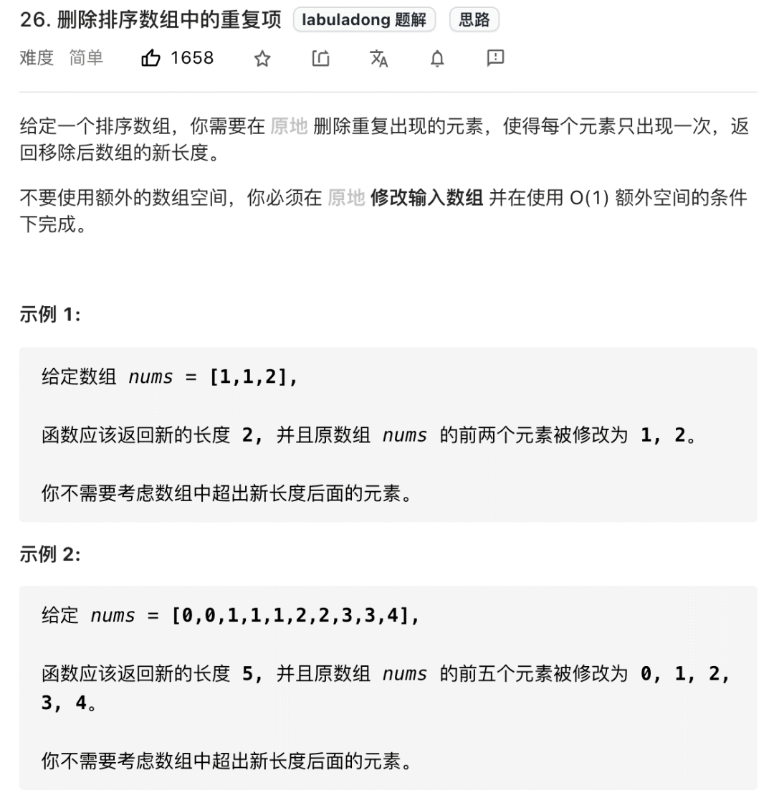
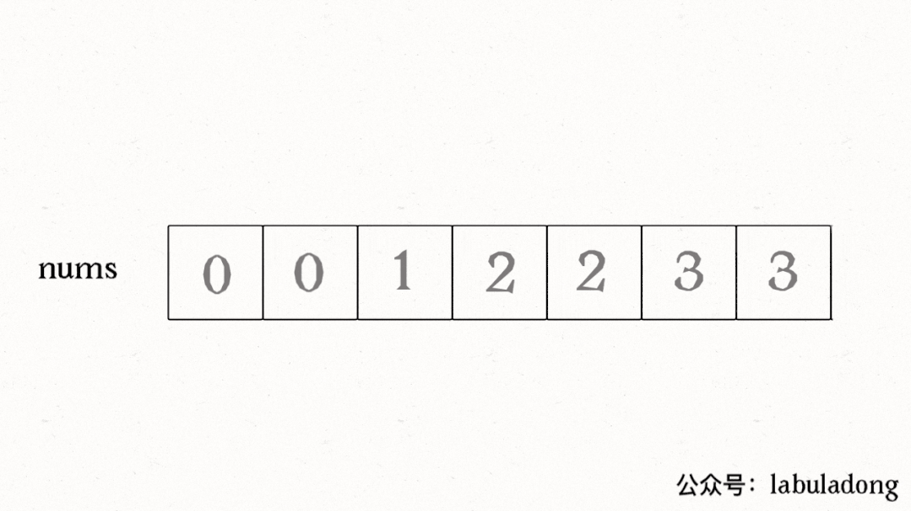
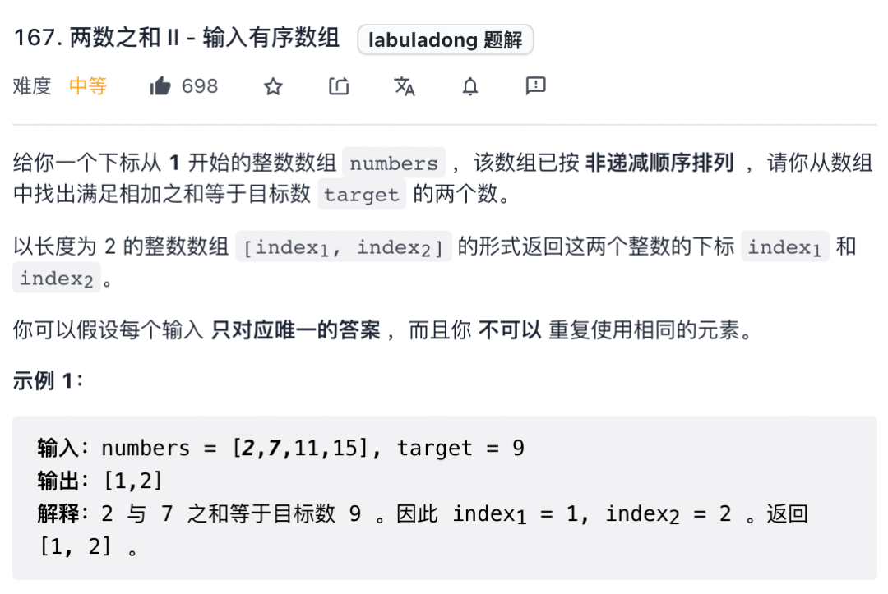
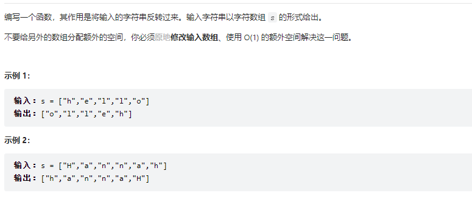

# Table of Contents

* [快慢指针](#快慢指针)
  * [[26. 删除有序数组中的重复项](https://leetcode-cn.com/problems/remove-duplicates-from-sorted-array/)](#26-删除有序数组中的重复项httpsleetcode-cncomproblemsremove-duplicates-from-sorted-array)
  * [[83. 删除排序链表中的重复元素](https://leetcode-cn.com/problems/remove-duplicates-from-sorted-list/)](#83-删除排序链表中的重复元素httpsleetcode-cncomproblemsremove-duplicates-from-sorted-list)
  * [[27. 移除元素](https://leetcode-cn.com/problems/remove-element/)](#27-移除元素httpsleetcode-cncomproblemsremove-element)
  * [[283. 移动零](https://leetcode-cn.com/problems/move-zeroes/)](#283-移动零httpsleetcode-cncomproblemsmove-zeroes)
* [左右指针](#左右指针)
  * [**二分查找**](#二分查找)
  * [[167. 两数之和 II - 输入有序数组](https://leetcode-cn.com/problems/two-sum-ii-input-array-is-sorted/)](#167-两数之和-ii---输入有序数组httpsleetcode-cncomproblemstwo-sum-ii-input-array-is-sorted)
  * [[344. 反转字符串](https://leetcode-cn.com/problems/reverse-string/)](#344-反转字符串httpsleetcode-cncomproblemsreverse-string)
  * [**回文串判断**](#回文串判断)
  * [[5. 最长回文子串](https://leetcode-cn.com/problems/longest-palindromic-substring/)](#5-最长回文子串httpsleetcode-cncomproblemslongest-palindromic-substring)
* [参考资料](#参考资料)


双指针技巧在处理数组和链表相关问题时经常用到，主要分为两类：**左右指针**和**快慢指针**。

+ 所谓左右指针，就是两个指针相向而行或者相背而行；
+ 而所谓快慢指针，就是两个指针同向而行，一快一慢。

对于单链表来说，大部分技巧都属于快慢指针，前文 [单链表的六大解题套路](https://mp.weixin.qq.com/s?__biz=MzAxODQxMDM0Mw==&mid=2247492022&idx=1&sn=35f6cb8ab60794f8f52338fab3e5cda5&scene=21#wechat_redirect) 都涵盖了，比如链表环判断，倒数第`K`个链表节点等问题，它们都是通过一个`fast`快指针和一个`slow`慢指针配合完成任务。

在数组中并没有真正意义上的指针，但我们可以把索引当做数组中的指针，这样也可以在数组中施展双指针技巧


# 快慢指针

## [26. 删除有序数组中的重复项](https://leetcode-cn.com/problems/remove-duplicates-from-sorted-array/)




```java
int removeDuplicates(int[] nums) {
    if (nums.length == 0) {
        return 0;
    }
    int slow = 0, fast = 0;
    while (fast < nums.length) {
        if (nums[fast] != nums[slow]) {
            slow++;
            // 维护 nums[0..slow] 无重复
            nums[slow] = nums[fast];
        }
        fast++;
    }
    // 数组长度为索引 + 1
    return slow + 1;
}
```



## [83. 删除排序链表中的重复元素](https://leetcode-cn.com/problems/remove-duplicates-from-sorted-list/)

```
public ListNode deleteDuplicates(ListNode head) {

    if (null == head) {
        return null;
    }
    ListNode slow = head;
    ListNode fast = head;

    while (fast != null) {

        if (slow.val != fast.val) {

            slow = slow.next;
            slow.val = fast.val;
        }

        fast = fast.next;
    }
    slow.next = null;
    return head;
}
```


## [27. 移除元素](https://leetcode-cn.com/problems/remove-element/)


```java
 public int removeElement(int[] nums, int val) {
        if (null == nums) {
            return 0;
        }
        int slow = 0;
        int fast = 0;
        while (fast <= nums.length - 1) {
            //注意这里是fast先去探路
            if (nums[fast] != val) {
                nums[slow++] = nums[fast];
            }
            fast++;
        }
        return slow;
    }
```


注意这里和有序数组去重的解法有一个细节差异，我们这里是先给nums[slow]赋值然后再给slow++，这样可以保证nums[0..slow-1]是不包含值为val的元素的，最后的结果数组长度就是slow。

如果是先slow++,再给nums[slow]赋值,那么就是[1,Slow]了。


## [283. 移动零](https://leetcode-cn.com/problems/move-zeroes/)

题目让我们将所有 0 移到最后，其实就相当于移除`nums`中的所有 0，然后再把后面的元素都赋值为 0 即可。


```java
void moveZeroes(int[] nums) {
    // 去除 nums 中的所有 0，返回不含 0 的数组长度
    int p = removeElement(nums, 0);
    // 将 nums[p..] 的元素赋值为 0
    for (; p < nums.length; p++) {
        nums[p] = 0;
    }
}

// 见上文代码实现
int removeElement(int[] nums, int val);
```


# 左右指针


## **二分查找**

[二分查找](二分查找.md)


## [167. 两数之和 II - 输入有序数组](https://leetcode-cn.com/problems/two-sum-ii-input-array-is-sorted/)



这个题目比较坑的点是，题目要求从1开始，但实际上数据是0，如果你right定义length 会数组越界的。

```java
int[] twoSum(int[] nums, int target) {
    // 一左一右两个指针相向而行
    int left = 0, right = nums.length - 1;
    while (left < right) {
        int sum = nums[left] + nums[right];
        if (sum == target) {
            // 题目要求的索引是从 1 开始的
            return new int[]{left + 1, right + 1};
        } else if (sum < target) {
            left++; // 让 sum 大一点
        } else if (sum > target) {
            right--; // 让 sum 小一点
        }
    }
    return new int[]{-1, -1};
}
```


## [344. 反转字符串](https://leetcode-cn.com/problems/reverse-string/)



```java
void reverseString(char[] s) {
    // 一左一右两个指针相向而行
    int left = 0, right = s.length - 1;
    while (left < right) {
        // 交换 s[left] 和 s[right]
        char temp = s[left];
        s[left] = s[right];
        s[right] = temp;
        left++;
        right--;
    }
}
```


## **回文串判断**

首先明确一下，回文串就是正着读和反着读都一样的字符串。

比如说字符串`aba`和`abba`都是回文串，因为它们对称，反过来还是和本身一样；反之，字符串`abac`就不是回文串。

现在你应该能感觉到回文串问题和左右指针肯定有密切的联系，比如让你判断一个字符串是不是回文串，你可以写出下面这段代码：

```java
boolean isPalindrome(String s) {
    // 一左一右两个指针相向而行
    int left = 0, right = s.length() - 1;
    while (left < right) {
        if (s.charAt(left) != s.charAt(right)) {
            return false;
        }
        left++;
        right--;
    }
    return true;
}
```

那接下来我提升一点难度，给你一个字符串，让你用双指针技巧从中找出最长的回文串，你会做吗？


## [5. 最长回文子串](https://leetcode-cn.com/problems/longest-palindromic-substring/)


这题主要注意奇数 偶数的情况。

```java
 public String longestPalindrome(String s) {
        String res = "";
        for (int i = 0; i < s.length(); i++) {
            //当前元素一 i为中心的回文串
            String s1 = palindrome(s, i, i);
            //当前元素一 i i+1为中心的回文串
            String s2 = palindrome(s, i, i +1);
            res = s1.length() > res.length() ? s1 : res;
            res = s2.length() > res.length() ? s2 : res;
        }
        return res;
    }

    public String palindrome(String s, int left, int right) {
        while (left >=0 0 && right < s.length() && s.charAt(left) == s.charAt(right)) {
            right++;
            left--;
        }
        return s.substring(left + 1, right);
    }
```


# 参考资料

https://mp.weixin.qq.com/s/Z-oYzx9O1pjiym6HtKqGIQ
