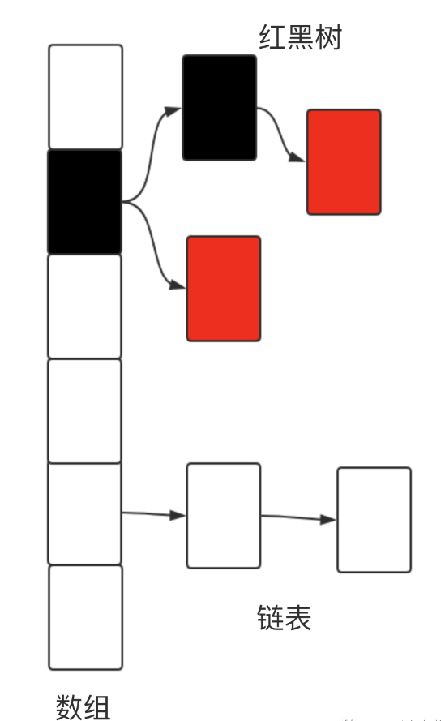
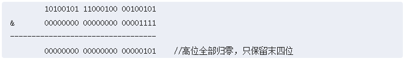
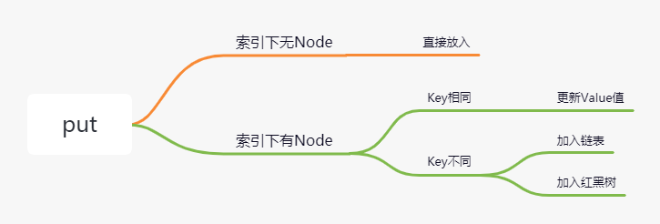
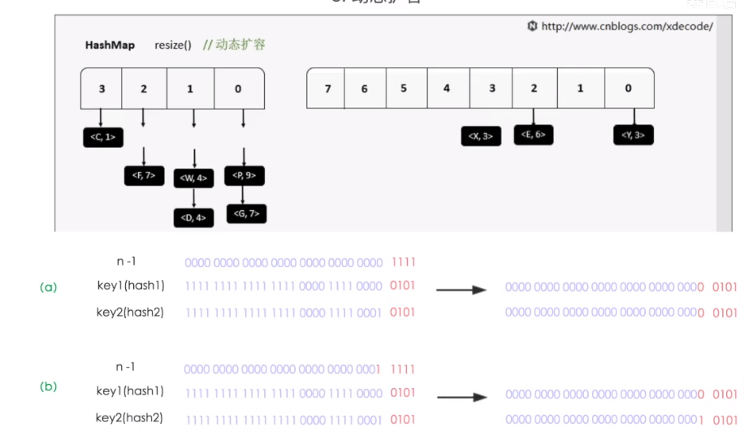
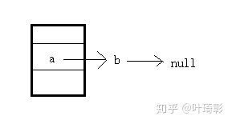
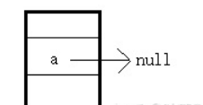
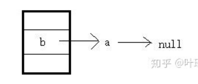
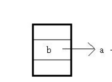

# Table of Contents

* [HashMap数据结构](#hashmap数据结构)
* [PUT](#put)
  * [数组创建](#数组创建)
  * [Node节点位置确定](#node节点位置确定)
  * [数组大小为什么是2的N次幂](#数组大小为什么是2的n次幂)
  * [放入Node节点](#放入node节点)
  * [为什么会转化红黑树](#为什么会转化红黑树)
  * [数组扩容](#数组扩容)
    * [加载因子](#加载因子)
    * [扩容过程](#扩容过程)
* [其他知识点](#其他知识点)
* [考点](#考点)
  * [HashMap是否线程安全？](#hashmap是否线程安全)


了解HashMap之间需要了解

+ [计算机运算基本知识](../../B.计算机网络/计算机基础知识.md)
+ [哈希表](../../C.数据结构与算法/dataStructures/hash表.md)
+ 数组、链表、以及BRT等基础数据结构


#  HashMap数据结构


数组+链表+红黑树




```java

/**
     * The table, initialized on first use, and resized as
     * necessary. When allocated, length is always a power of two.
     * (We also tolerate length zero in some operations to allow
     * bootstrapping mechanics that are currently not needed.)
     */
transient Node<K,V>[] table;

static class Node<K,V> implements Map.Entry<K,V> {
        final int hash;
        final K key;
        V value;
        Node<K,V> next;
    ...
}

static final class TreeNode<K,V> extends LinkedHashMap.Entry<K,V> {
    TreeNode<K,V> parent;  // red-black tree links
    TreeNode<K,V> left;
    TreeNode<K,V> right;
    TreeNode<K,V> prev;    // needed to unlink next upon deletion
    boolean red;
    ...
}
```


# PUT

## 数组创建

最开始肯定是没有数据的，所以要先创建数组，然后基于数组下标创建链表或者红黑树。

```java
if ((tab = table) == null || (n = tab.length) == 0)
            n = (tab = resize()).length;
```

可以看到关键性代码是`resize()`

```java
//再次判断数组是否为null，如果为null，则oldCap赋值为0
int oldCap = (oldTab == null) ? 0 : oldTab.length;
//此时oldCap的判断会走这段逻辑
else {               // zero initial threshold signifies using defaults
    //将DEFAULT_INITIAL_CAPACITY赋值给变量newCap
     //DEFAULT_INITIAL_CAPACITY值为16，指的是数组的默认大小，后面会具体说这个大小
    newCap = DEFAULT_INITIAL_CAPACITY;
    //DEFAULT_LOAD_FACTOR * DEFAULT_INITIAL_CAPACITY===>16*0.75=12
    //DEFAULT_LOAD_FACTOR值为0.75，得到的结果12是扩容的标准，这个值后面也会说
    newThr = (int)(DEFAULT_LOAD_FACTOR * DEFAULT_INITIAL_CAPACITY);
}
Node<K,V>[] newTab = (Node<K,V>[])new Node[newCap];
        table = newTab;
```


到此数组创建结束。


## Node节点位置确定


其实就是将当前key与数组大小取模，那么源码是怎么实现的了？

```java
//n是数组的长度 16 
if ((p = tab[i = (n - 1) & hash]) == null)
    tab[i] = newNode(hash, key, value, null);


(n - 1) & hash

```



为什么HashMap的数组长度要取2的整次幂。

因为这样（数组长度-1）正好相当于一个“低位掩码”。“与”操作的结果就是散列值的高位全部归零，只保留低位值，用来做数组下标访问。


可以看到`index=(n - 1) & hash`，起关键左右的是Hash

```java

static final int hash(Object key) {
    int h;
    return (key == null) ? 0 : (h = key.hashCode()) ^ (h >>> 16);
}

0101010101001100100101010010101010

01010101010011001

00101010010101010 ^

高低16位进行异或运算
```


采用哈希扰动，<font color=red>让本来无法参与取余的运算对低位产生扰动作用</font>，让hash更佳分散，降低Hash冲突

## 数组大小为什么是2的N次幂

n-1不是01111，如果是01110会怎样？

这时候hash的二进制结果最后一位无论是1还是0，index重复的可能性就会增加，

```java

1000&hash 只会有2种结果 0000和1000 增加重复性
```

所以必须保证n-1的结果是01111，换句话说必须保证n是10000这样的形式，也就是n[数组的大小]必须是2的N次幂。

## 放入Node节点 

放入Node节点，会有以下几种情况



+ 当前索引下无node节点，直接放入


  ```java
  
  if ((p = tab[i = (n - 1) & hash]) == null)
      //直接根据hash,key,value创建出一个Node节点放到数组下标对应的位置
      tab[i] = newNode(hash, key, value, null);
  ```

+ 当前索引下有Node节点，key相同，更新value值（这里可以引申出为什么重写equal方式时，必须重写hashCode）

  ```java
    if (p.hash == hash &&((k = p.key) == key || (key != null && key.equals(k))))
        e = p;
  ```

+ 当前索引下有Node节点，key不同

  + 加入链表，也会判断Key是否相等。

    ```java
    
    else {
        //循环遍历原来索引下链表，有可能原来已经是链表的数据结构了
        for (int binCount = 0; ; ++binCount) {
            if ((e = p.next) == null) {
                //要把新的节点放到链表的最末尾的节点才行
                //所以这边要一直循环遍历到链表节点的next为null，说明已经到了末尾了
                p.next = newNode(hash, key, value, null);
                //如果链表的长度超过某个值，就将链表转红黑树，这块后面会说
                if (binCount >= TREEIFY_THRESHOLD - 1) // -1 for 1st
                    treeifyBin(tab, hash);
                break;
            }
            //在链表put的过程中同样也是判断key值是否相同
            if (e.hash == hash &&
                ((k = e.key) == key || (key != null && key.equals(k))))
                break;
            p = e;
        }
    }
    ```

    

  + 加入红黑树

    ```java
    else if (p instanceof TreeNode)
        e = ((TreeNode<K,V>)p).putTreeVal(this, tab, hash, key, value);
    ```

  

## 为什么会转化红黑树

  是尤其数据结构决定的，数组可以O(1)定位数据，但是链表遍历是O(n),而红黑树的查询是O(logn)。


+ 链表转化红黑树 —>问题来了，为什么要<font color=red>节点超过8且数组长度超过64</font>就要变成红黑树，而不是10呢？

  ```java
   
  static final int TREEIFY_THRESHOLD = 8;
  //第八个元素的时候，其实已经是红黑树了，
  if (binCount >= TREEIFY_THRESHOLD - 1) // -1 for 1st
      treeifyBin(tab, hash);
  break;
  
   final void treeifyBin(Node<K,V>[] tab, int hash) {
       int n, index; Node<K,V> e;
       //这里还判断了 数组长度超过64
       if (tab == null || (n = tab.length) < MIN_TREEIFY_CAPACITY)
           resize();
  ```

  

+ 红黑树退化链表 这个是put的时候，是不会退化的，我们放到后面去看。


## 数组扩容


### 加载因子

当数据量达到一定的级别，原来的初始化16已经满足不了存储要求了，据就需要扩容了，那么如何扩容呢？


```java

/**
     * The load factor used when none specified in constructor.
     */
static final float DEFAULT_LOAD_FACTOR = 0.75f;
```

resize()方法中

```java
newThr = (int)(DEFAULT_LOAD_FACTOR * DEFAULT_INITIAL_CAPACITY);
newThr=0.75*16
```

那么为什么是` DEFAULT_LOAD_FACTOR = 0.75f`?

1. 如果加载因子比较大，发生频率就会低，Hash冲突就高，操作元素时间多。
2. 如果加载因子比较小，发生频率就会高，会造成空间浪费，会经常扩容。

 <font color=red>容量默认为2的次方，当加载因子为0.75时，容量和加载因子的乘积为整数</font>。 


还有一种说法是：<font color=red>泊淞分布</font>


### 扩容过程

扩容有2种


+ 初始化HashMap的时候

会根据传进来的值，找到附近2的n次幂。

+ Put时扩容，为原来的2倍。
```java
 if (++size > threshold)
     resize();

Node<K,V>[] newTab = (Node<K,V>[])new Node[newCap];
```

扩容后有一个问题，怎么将原来数组中的节点，迁移到新代码中？


+  数组索引下标下面没有元素 

  ```java
  
  if (e.next == null)
      newTab[e.hash & (newCap - 1)] = e;
  ```

+  数组索引下标下面有元素，且元素类型为红黑树 

  ```java
  else if (e instanceof TreeNode)
      //这里会涉及到树的退化 
      ((TreeNode<K,V>)e).split(this, newTab, j, oldCap);
  	//  lc <= UNTREEIFY_THRESHOLD  小于等于6 
  ```

  

+  数组索引下标下面有所愿，且元素类型为链表 

  ```java
  do {
      next = e.next;
      if ((e.hash & oldCap) == 0) {
          if (loTail == null)
              loHead = e;
          else
              loTail.next = e;
          loTail = e;
      }
      else {
          if (hiTail == null)
              hiHead = e;
          else
              hiTail.next = e;
          hiTail = e;
      }
  } while ((e = next) != null);
  if (loTail != null) {
      loTail.next = null;
      newTab[j] = loHead;
  }
  if (hiTail != null) {
      hiTail.next = null;
      newTab[j + oldCap] = hiHead;
  }
  ```


  按照正常思路，直接`hash&(n-1)`不就可以了？to young to simple

  ```java
(e.hash & oldCap) == 0

hash: 010010101001100101010101101010

oldCap: 10000 &

即hash的倒数第5位为0，result的结果=oldCap
不为0:newIndex=oldIndex+cap
  ```



所以要么不动，要么移动2的n次幂。


# 其他知识点

1. Transient作用->被 transient 修饰的变量不能被序列化


# 考点

## HashMap是否线程安全？

没有锁，都是线程不安全的，具体怎么体现？

1. PUT时候，如果计算出的索引值一样，线程B会覆盖线程A的数据。 1.7和1.8都会有，<font color=red>脏数据</font>
2. 1.7会出现死循环,使用了头插法
  
    ```java
    void transfer(Entry[] newTable, boolean rehash) {
            int newCapacity = newTable.length;
            for (Entry<K, V> e : table) {
                while (null != e) {
                    Entry<K, V> next = e.next;  // 第5行  关键步骤1
                    if (rehash) {
                        e.hash = null == e.key ? 0 : hash(e.key);
                    }
                    int i = indexFor(e.hash, newCapacity);
                    e.next = newTable[i];  //使用了头插法
                    newTable[i] = e;     //关键步骤3
                    e = next;            //关键步骤4
                }
            }
        }
    ```

举个例子：




对于线程A,第一次执行，e=A e.next=b。因为使用的是头插法，在新数组中。



对于线程B,实际上已经完成数组的扩容。



再回到线程A,第二次循环




> 主要就是可能有其他线程提前完成了操作，指针变了，导致取数据的时候 死循环。

## 为什么加载因子0.78  转化为数8

泊松分布 作者在注释中说了


## 对于null的问题，HashMap怎么处理的

HashMap 对于key是**null**值的存储 HashMap 允许插入键为 **null** 的键值对。

但是因为无法调用 **null** 的 hashCode () 方法，也就无法确定该键值对的桶下标，**只能通过强制指定一个桶下标来存放**。 

HashMap 使用第 0 个桶存放键为 **null** 的键值对。

