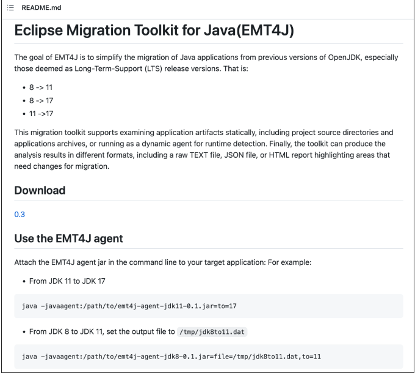
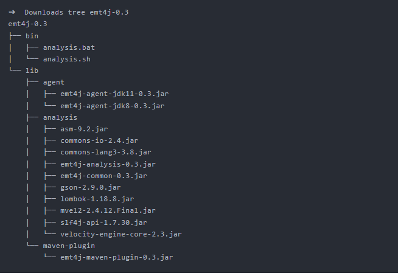
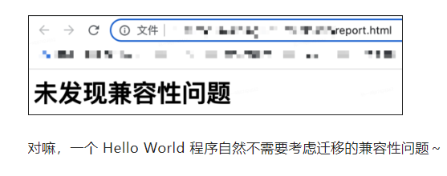
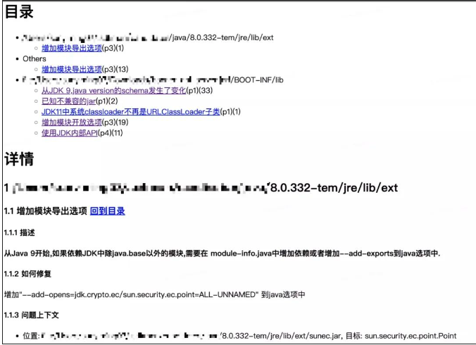
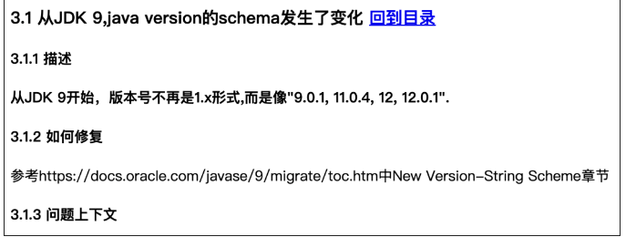
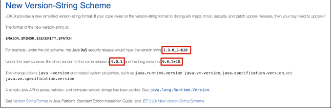
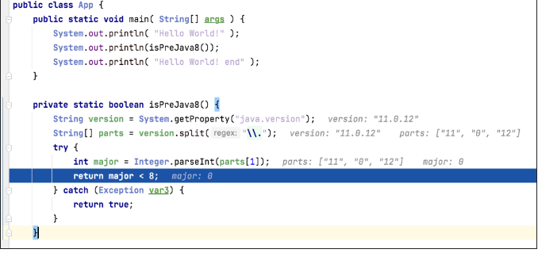
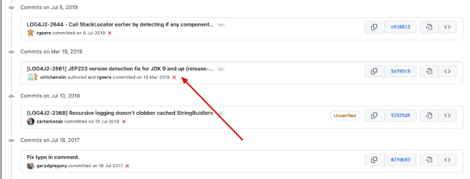

# Table of Contents

* [**它是什么**](#它是什么)
* [如何用](#如何用)
* [**拿一个复杂的项目举例**](#拿一个复杂的项目举例)
* [参考资料](#参考资料)


# **它是什么**


这款工具的名字叫做 EMT4J，即 Eclipse Migration Toolkit for Java，直译过来就是 Eclipse 基金会旗下的，用来迁移的，工具集，为 Java 准备的。

 

官网地址为：

https://projects.eclipse.org/projects/adoptium.emt4j


官网介绍它的方式非常亲民，直接来了个以 Tom 为主人公的小故事，大概说的是 Tom 准备把项目从 8 迁移到 11，非常痛苦，用上了 EMT4J 后就爽得飞起。

 

我非常喜欢这种方式，大家感兴趣可以读一读，没有什么难的词汇。

 

这款工具是阿里写的，捐赠给了 Eclipse 基金会，所以阿里云官方公众号推出过关于介绍它的推文

[https://mp.weixin.qq.com/s/9pKGVctSd-phrV4sKqqfxA](https://mp.weixin.qq.com/s?__biz=MzUxNjE3MTcwMg==&mid=2247487299&idx=1&sn=6265f65b7bdfb008b8be5a55f29851a6&scene=21#wechat_redirect)

 

不过官网和推文都包含很多宣传色彩，有很多杂乱信息，作为一枚呆萌的开发者，我还是更喜欢看简单粗暴的代码仓库：

https://github.com/adoptium/emt4j



仅仅一张截图，就包含了核心功能，下载地址，快速上手体验这三个开发者最关注的点。


# 如何用

击下载地址下载好 EMT4J 后，查看它的目录结构，发现非常简单明了直观。




如果只使用 javaagent 方式来分析项目，那么对于使用者来说只需要关注 agent 目录下的两个 jar 即可。

 

从 8 迁移到其他 JDK 就使用：

emt4j-agent-jdk8-0.3.jar


从 11 迁移到其他 JDK 就使用：

emt4j-agent-jdk11-0.3.jar

 

我们写一个简单的 Hello World 程序，并用 JDK8 编译。


```java
public class Hello {
    public static void main( String[] args ) {
        System.out.println( "Hello World!" );
    }
}
```

然后对其进行 8 到 11 的迁移分析。

```
java -javaagent:emt4j-agent-jdk8-0.3.jar=to=11 Hello
```

对输出结果可视化为 HTML 格式。

```
sh analysis.sh -o report.html emt4j-XXX.dat
```

打开这个 HTML 文件，发现输出的结果正符合我们预期




# **拿一个复杂的项目举例**

我们再尝试分析一个较为复杂的项目，依然进行刚刚那几步动作，这回输出的报告有点意思了。




我们就通过目录中的摘要，就可以看到这个项目从 8 迁移到 11 所需要考虑的全部问题了。比如从 JDK 9 java.version 的 schema 发生了变化，点进去。



 

在如何修复那里，给出了官方说明文档，我们继续点进去。



 

简单说就是 java.version 这个系统变量所输出的字符串格式发生了变化，你的程序要是依赖这个字符串做截取和判断啥的，就需要小心了。

 

比如报告中的问题上下文中，就给出了所有可能受之影响的方法，我们举个例子。

在大名鼎鼎的 log4j 中的 AbstractStringLayout 类中有个 isPreJava8 方法，用来判断是否是 Java 8 以前的版本。

```java
// log4j-core:2.10.0
private static boolean isPreJava8() {
    String version = System.getProperty("java.version");
    String[] parts = version.split("\\.");
    try {
        int major = Integer.parseInt(parts[1]);
        return major < 8;
    } catch (Exception var3) {
        return true;
    }
}
```

如果使用 Java 11 来运行这个方法，会得到 true，也就是认为 11 是 8 之前的版本，这显然是不对的，简单 debug 一下就知道错在哪了。

当然，我使用的版本是 log4j-core:2.10.0，我相信大名鼎鼎的 log4j 项目一定在之后的版本修复了这个问题。

 

果然，在某一次 commit 上就专门修复了这个问题。




修复的方式也很 low，就是判断第一个点前面如果是 1，就按照新的方式做判断，即把点后面的数字作为主版本。

嗯，那看来，把这个项目从 8 升级到 11，最稳妥的方式是连这个使用老版本的 log4j 三方依赖也同时升级了。

# 参考资料

[当老板让我从 Java8 升到 Java11 (qq.com)](https://mp.weixin.qq.com/s/u7bFOWXZDeydZjO9I9OdOw)

