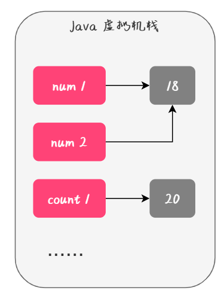
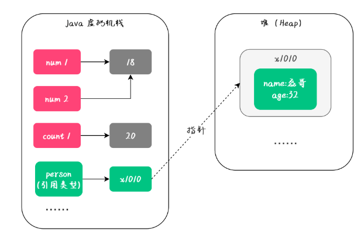

# Table of Contents

* [值类型](#值类型)
* [引用类型](#引用类型)
* [定义](#定义)
* [例子](#例子)
  * [基本数据类型](#基本数据类型)
  * [String](#string)
  * [对象](#对象)
* [参考资料](#参考资料)


说到值传递和引用传递我们不得不提到两个概念：值类型和引用类型。

# 值类型

通俗意义上来说，所谓的值类型指的就是 Java 中的 8 大基础数据类型：

- 整数型：byte、int、short、long
- 浮点型：float、double
- 字符类型：char
- 布尔类型：boolean


**从 JVM 层面来讲：所谓的值类型指的是在赋值时，直接在栈中（Java 虚拟机栈）生成值的类型**，如下图所示：



# 引用类型

引用类型是指除值类型之外的数据类型，比如：

- 类
- 接口
- 数组
- 字符串
- 包装类（Integer、Double...）


**从 JVM 的层面来讲，所谓的引用类型是指，在初始化时将引用生成栈上，而值生成在堆上的这些数据类型**，如下图所示：





# 定义

+ **值传递(pass by value)：**在调用函数时，将实际参数**复制**一份传递到函数中，这样在函数中对参数进行修改，就不会影响到原来的实际参数；

+ **引用传递(pass by reference):**在调用函数时，**将实际参数的地址直接传递到函数中**。这样在函数中对参数进行的修改，就会影响到实际参数；

> 可以这么理解，
>
> 值传递：只是传递了一个副本过去,副本的改变不会影响本身的结果。
>
> 引用传递：自己传了过去


# 例子

## 基本数据类型

```java
public class Hello {
    public static void main(String[] args) {
        Hello hello = new Hello();
        // 基本数据类型
        int i = 10;
        hello.pass(i);
        System.out.println("i = " + i);
    }
 
    public void pass(int pas) {
        pas = 20;
        System.out.println("pas = " + pas);
    }
}
pas = 20
i=10

```


## String

```java
public class Hello {
    public static void main(String[] args) {
        Hello hello = new Hello();
        // String类
        String s = "hello";
        hello.pass(s);
        System.out.println("s = " + s);
    }
 
    public void pass(String str) {
        str = "world";
        System.out.println("str = "+ str);
    }
}
str =world
s =hello
```


## 对象

```java
public class Hello {
    public static void main(String[] args) {
        Hello hello = new Hello();
        // 对象
        User user = new User();
        user.setName("wang");
        hello.pass(user);
        System.out.println("main:"+user.getName());
    }
 
    public void pass(User user) {
        user.setName("java");
        System.out.println("The name is :" + user.getName());
    }
}
The name is :java
main:java
```


# 参考资料

[Java 是值传递还是引用传递？ (qq.com)](https://mp.weixin.qq.com/s/zLJRTsjTm6QZf05i0iE6QQ)
