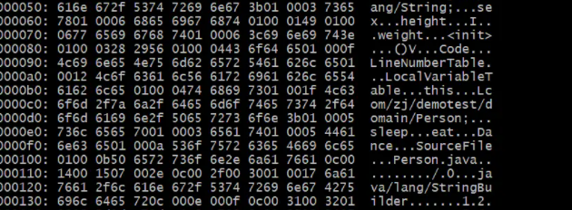
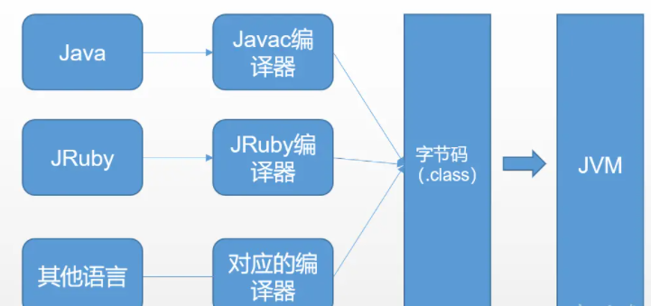
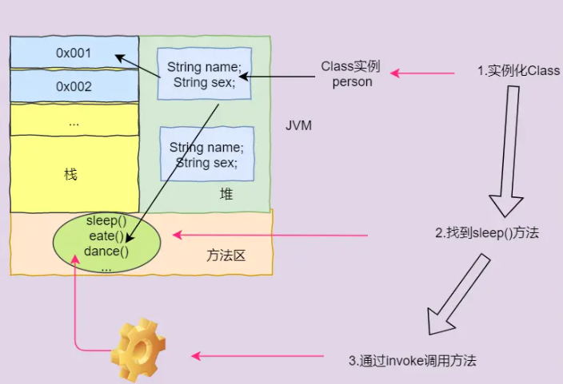

# Table of Contents

* [何为反射？](#何为反射)
* [.class文件](#class文件)
* [Class类](#class类)
* [反射使用](#反射使用)
  * [获取Class实例4种方式](#获取class实例4种方式)
  * [Class类常用的API](#class类常用的api)
  * [创建对象](#创建对象)
  * [访问属性](#访问属性)
  * [调用方法](#调用方法)
* [应用场景](#应用场景)


# 何为反射？

反射(Reflection)，是指Java程序具有**在运行期**`分析类以及修改其本身状态或行为的能力`。

> 通俗点说 就是 通过反射我们可以**动态地**获取一个类的所有属性和方法，还可以操作这些方法和属性。

# .class文件

首先我们得先了解一下 什么是.class文件 举个简单的例子，创建一个Person类：

```java
public class Person {
    /**
     * 状态 or 属性
     */
    String name;//姓名
    String sex;//性别
    int height;//身高
    int weight;//体重

    /**
     * 行为
     */
    public void sleep() {
        System.out.println(this.name + "--" + "睡觉");
    }

    public void eat() {
        System.out.println("吃饭");
    }

    public void Dance() {
        System.out.println("跳舞");
    }
}
```

我们执行javac命令，编译生成Person.class文件 然后我们通过vim 16进制 打开它



不同的操作系统，不同的 CPU 具有不同的指令集，JAVA能做到平台无关性，依靠的就是 Java 虚拟机。 .java源码是给人类读的，而**class字节码是给JVM虚拟机读的**，计算机只能识别 0 和
1组成的二进制文件，所以虚拟机就是我们编写的代码和计算机之间的桥梁。 虚拟机将我们编写的 .java 源程序文件编译为 字节码 格式的 .class
文件，字节码是各种虚拟机与所有平台统一使用的程序存储格式，class文件主要用于解决平台无关性的中间文件

> 跨平台



# Class类

我们来看下jdk的官方api文档对其的定义：

> Class类的类表示正在运行的Java应用程序中的类和接口。 枚举是一种类，一个注释是一种界面。 每个数组也属于一个反映为类对象的类，该对象由具有相同元素类型和维数的所有数组共享。 原始Java类型（ boolean ， byte ， char ， short ， int ， long ， float和double ），和关键字void也表示为类对象。 类没有公共构造函数。 相反， 类对象由Java虚拟机自动构建，因为加载了类，并且通过调用类加载器中的defineClass方法。。

**java万物皆是Class类**

我们来看下Class类的源码，源码太多了，挑了几个重点：

```java
public final class Class<T> implements java.io.Serializable,
        GenericDeclaration,
        Type,
        AnnotatedElement {
    private static final int ANNOTATION = 0x00002000;
    private static final int ENUM = 0x00004000;
    private static final int SYNTHETIC = 0x00001000;

    private static native void registerNatives();
```

我们可以发现Class也是类，是一种特殊的类，将我们定义普通类的共同的部分进行抽象，保存类的属性，方法，构造方法，类名、包名、父类，注解等和类相关的信息。 Class类的构造方法是private，**只有JVM能创建Class实例**
，我们开发人员 是无法创建Class实例的，JVM在构造Class对象时，需要传入一个**类加载器**。 **类也是可以用来存储数据的，Class类就像 普通类的模板 一样，用来保存“类所有相关信息”的类**。

因此，如果获取了Class实例（personClass ），我们就可以通过这个Class实例获取到该实例对应的**Person类**的所有信息。

# 反射使用

## 获取Class实例4种方式

+ 通过对象调用` getClass()` 方法来获取
+ `类名.class`
+ Class.forName("com.zj.demotest.domain.Person");
+ classLoader.loadClass("com.zj.demotest.domain.Person");

## Class类常用的API

日常开发的时候，我们一般使用反射是为了` 创建类实例（对象）、反射获取类的属性和调用类的方法`

| getName()                                      | 获得类的完整名字                                             |
| ---------------------------------------------- | ------------------------------------------------------------ |
| getFields()                                    | 获得类的public类型的属性                                     |
| getDeclaredFields()                            | 获得类的所有属性。包括**private 声明的和继承类**             |
| getMethods()                                   | 获得类的public类型的方法                                     |
| getDeclaredMethods()                           | 获得类的所有方法。包括**private 声明的和继承类**             |
| getMethod(String name, Class[] parameterTypes) | 获得类的特定方法，name参数指定方法的名字，parameterTypes 参数指定方法的参数类型。 |
| getConstructors()                              | 获得类的public类型的构造方法                                 |
| getConstructor(Class[] parameterTypes)         | 获得类的特定构造方法，parameterTypes 参数指定构造方法的参数类型 |
| newInstance()                                  | 通过类的不带参数的构造方法创建这个类的一个对象               |
| getSuperClass()                                | 用于返回表示该 Class 表示的任何类、接口、原始类型或任何 void 类型的**超类的Class(即父类)**。 |
| ...                                            | ...                                                          |

我们这边就不全部展开讲了，挑几个重点讲解一下

## 创建对象

+ 调用class对象的`newInstance()`方法

  ```java
  Class c1 = Class.forName("com.zj.demotest.domain.Person");
  Person p1 = (Person) c1.newInstance();
  p1.eat();
  ```

+ 使用指定构造方法`Constructor`来创建对象

  ```java
  Class c1 = Class.forName("com.zj.demotest.domain.Person");
  Constructor<Person> con =  c1.getDeclaredConstructor();
  con.setAccessible(true);//允许访问
  Person p1 = con.newInstance();
  p1.eat();
  ```

## 访问属性

| Field getField(name)         | 根据字段名获取某个public的field（包括父类）   |
| ---------------------------- | --------------------------------------------- |
| Field getDeclaredField(name) | 根据字段名获取当前类的某个field（不包括父类） |
| Field[] getFields()          | 获取所有public的field（包括父类）             |
| Field[] getDeclaredFields()  | 获取当前类的所有field（不包括父类）           |

```java
Object p=new Student("li hua");
        Class c=p.getClass();
        Field f=c.getDeclaredField("name");//获取属性
        f.setAccessible(true);//允许访问
        Object val=f.get(p);
        System.out.println(val);
```

## 调用方法

| Method getMethod(name, Class...)         | 获取某个public的Method（包括父类）   |
| ---------------------------------------- | ------------------------------------ |
| Method getDeclaredMethod(name, Class...) | 获取当前类的某个Method（不包括父类） |
| Method[] getMethods()                    | 获取所有public的Method（包括父类）   |
| Method[] getDeclaredMethods()            | 获取当前类的所有Method（不包括父类） |

```java
 //获取私有方法，需要传参：方法名和参数
Method h=Student.class.getDeclaredMethod("setName",String.class);

        h.setAccessible(true);

        Student s1=new Student();
        System.out.println(s1.name);
//传入目标对象，调用对应的方法
        h.invoke(s1,"xiao ming");
        System.out.println(s1.name);
```

我们发现获取方法getMethod()时，需要传参 **方法名和参数** 这是因为.class文件中通常有**不止一个方法**，获取方法getMethod()时,会去调用searchMethods方法循环遍历所有Method，然后根据 **
方法名和参数类型** 找到唯一符合的Method返回。



我们知道类的方法是在JVM的方法区中 ，当我们new
多个对象时，属性会另外开辟堆空间存放，而方法只有一份，不会额外消耗内存，方法就像一套指令模板，谁都可以传入数据交给它执行，然后得到对应执行结果。 `method.invoke(obj, args)`时传入目标对象，即可调用对应对象的方法

如果获取到的Method表示一个静态方法，调用静态方法时，**无需指定实例对象**，所以invoke方法传入的第一个参数永远为null, `method.invoke(null, args)`

那如果 方法重写了呢，**反射依旧遵循 多态 的原则**。

# 应用场景

+ 动态修改表名

+ 动态修改字段注解属性

  
