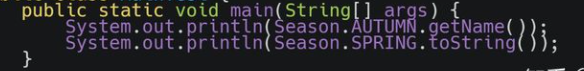

# Table of Contents

* [**扩展枚举值与自定义构造函数**(常用)](#扩展枚举值与自定义构造函数常用)
* [**关于覆盖enum类方法**](#关于覆盖enum类方法)
* [**枚举类中定义抽象方法**](#枚举类中定义抽象方法)
* [枚举的缺点](#枚举的缺点)


#  **扩展枚举值与自定义构造函数**(常用)

之前，我们讨论枚举类时，主要是针对最简单的枚举类型。每个枚举值只有一个字符串，如：


但是实际使用中，我们可能想给每个枚举值赋予更多的含义，例如，给每个季节一个中文说明和编码等。

即实现：


直接调用即可。




最常用的是在枚举中，定义一个方法，然后根据传入的值，去匹配相对应的枚举类型，并返回值。

```java
 EnumDemoFirst[] values = EnumDemoFirst.values(); 
然后遍历即可
```


# **关于覆盖enum类方法**

我们知道，枚举类最终继承了java.lang.Enum抽象类，那么我们能够覆盖java.lang.Enum抽象类中的方法么？

这个当然是可以的。其实在上面的代码中，笔者已经覆盖了java.lang.Enum抽象类中的toString()方法，并得出了自定义的输出。

# **枚举类中定义抽象方法**

既然编译器最终将每个枚举值声明为枚举类的实例，那我们能在枚举类中声明抽象方法让枚举值去实现么？

听起来有些不可思议，其实也是可以的。我们在枚举类Season中声明了一个抽象方法sayHello()。然后在创建枚举值时，就必须实现该抽象方法。最终的代码如下：


# 枚举的缺点 

使用枚举作为返回值**可能造成的问题其实大家都知道就是客户端和服务端版本不一致的话,会造成反序列化异常.**

如果客户端和服务端用的JDK不一样,那么class文件就不一样,就不能正常反序列化

> 你对外提供服务，你怎么知道客户端用哪个版本


枚举类，是抽象类，无法实例化，


但是！！我们一般定义枚举，是用具体的值，然后赋值到某个dto上，进行序列化，

也有将整个枚举类，作为dto的某个属性。


**最终结论：可以使用常量来代替枚举类。**
