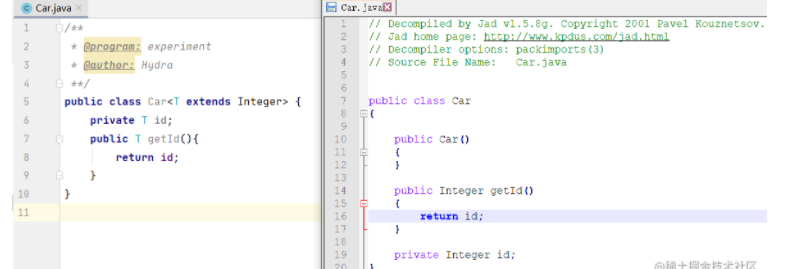
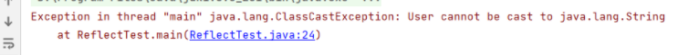

# Table of Contents

* [什么是泛型的类型擦除？](#什么是泛型的类型擦除)
* [类型擦除做了什么？](#类型擦除做了什么)
  * [无限制类型擦除](#无限制类型擦除)
  * [有限制类型擦除](#有限制类型擦除)
* [反射能获取泛型的类型吗？](#反射能获取泛型的类型吗)
* [能在指定类型的List中放入其他类型的对象吗？](#能在指定类型的list中放入其他类型的对象吗)
* [总结](#总结)
* [场景](#场景)
* [参考资料](#参考资料)


# 什么是泛型的类型擦除？

```java
public static void main(String[] args) {
    List<String> list1=new ArrayList<String>();
    List<Integer> list2=new ArrayList<Integer>();
    System.out.println(list1.getClass()==list2.getClass());
}

```

首先，我们知道`getClas`方法获取的是对象运行时的类（Class），那么这个问题也就可以转化为`ArrayList<String>`和`ArrayList<Integer>`的对象在运行时对应的Class是否相同？

我们直接揭晓答案，运行上面的代码，程序会打印`true`，说明虽然在代码中声明了具体的泛型，但是两个List对象对应的Class是一样的，对它们的类型进行打印，结果都是：

```java
class java.util.ArrayList
复制代码
```

也就是说，虽然`ArrayList<String>`和`ArrayList<Integer>`在编译时是不同的类型，但是在编译完成后都被编译器简化成了`ArrayList`，这一现象，被称为泛型的**类型擦除**(Type Erasure)。

> 1. 在编译阶段减少类型不一致的错误。
>
> 2. 泛型的本质是参数化类型

那么为什么要进行泛型的类型擦除呢？查阅的一些资料中，解释说类型擦除的主要目的是避免过多的创建类而造成的运行时的过度消耗。试想一下，如果用`List<A>`表示一个类型，再用`List<B>`表示另一个类型，以此类推，无疑会引起类型的数量爆炸。


# 类型擦除做了什么？
## 无限制类型擦除

当类定义中的类型参数没有任何限制时，在类型擦除后，会被直接替换为`Object`。


## 有限制类型擦除

当类定义中的类型参数存在限制时，在类型擦除中替换为类型参数的**[上界或者下界]**。

下面的代码中，经过擦除后`T`被替换成了`Integer`：




# 反射能获取泛型的类型吗？

我们来尝试一下使用反射来获取类型参数：

```java
System.out.println(Arrays.asList(list1.getClass().getTypeParameters()));

```

执行结果如下：

```java
[E]
```

同样，如果打印`Map`对象的参数类型：

```java
Map<String,Integer> map=new HashMap<>();
System.out.println(Arrays.asList(map.getClass().getTypeParameters()));

```

最终也只能够获取到：

```JAVA
[K, V]

```

可以看到通过`getTypeParameters`方法只能获取到泛型的参数占位符，**而不能获得代码中真正的泛型类型。**

# 能在指定类型的List中放入其他类型的对象吗？

```java
public class ReflectTest {
    static List<String> list = new ArrayList<>();

    public static void main(String[] args) {
        list.add("1");
        ReflectTest reflectTest =new ReflectTest();
        try {
            Field field = ReflectTest.class.getDeclaredField("list");
            field.setAccessible(true);
            List list=(List) field.get(reflectTest);
            //这行代码
            list.add(new User());
        } catch (Exception e) {
            e.printStackTrace();
        }        
    }
}

```

因为没有指定泛型,是可以放入对象的**,但是! 运行的时候会报错.**




# 总结

1. java中的泛型是一个**伪泛型**


# 场景

+ 泛型的类型擦除后，fastjson反序列化时如何还原？  https://juejin.cn/post/7163812411235893284


# 参考资料

https://juejin.cn/post/6999797611146248222
