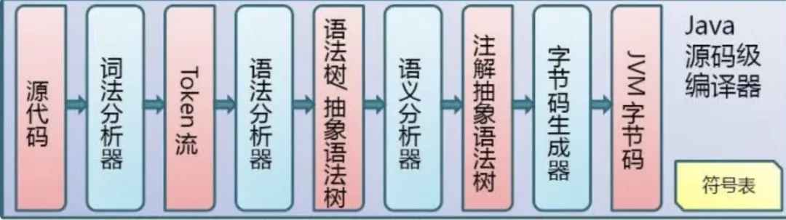

# Table of Contents

* [什么是注解？](#什么是注解)
* [注解分类](#注解分类)
* [注解如何被解析](#注解如何被解析)
* [注解使用](#注解使用)
  * [**Java自带的标准注解**](#java自带的标准注解)
  * [@Retention](#retention)
  * [以Lombok为列](#以lombok为列)
* [自定义注解](#自定义注解)
* [总结](#总结)


# 什么是注解？

官网描述如下：

**Java 注解用于为 Java 代码提供元数据。作为元数据，注解不直接影响你的代码执行，但也有一些类型的注解实际上可以用于这一目的。Java 注解是从 Java5 开始添加到 Java 的。**


> 个人理解：注解就是代码中的特殊标识，这些标识可以在【编译】【加载】【运行】时被读取，并进行相应的处理。


# 注解分类

一般常用的注解可以分为三类：

+ **Java自带的标准注解**
  包括@`Override`、`@Deprecated`、`@SuppressWarnings`等，使用这些注解后编译器就会进行检查。
+ `SuppressWarnings`： 当你的编码可能存在警告时，比如安全警告，可以用它来消除。
  + `@FunctionalInterface`: 告诉编译器检查这个接口，保证该接口只能包含一个抽象方法，否则就会编译出错。
  
+ **元注解**
  元注解是用于**定义注解的注解**，包括@Retention、@Target、@Inherited、@Documented、@Repeatable 等。
  元注解也是Java自带的标准注解，只不过用于修饰注解，比较特殊。

+ **自定义注解**
  用户可以根据自己的需求定义注解。


# 注解如何被解析




# 注解使用


## **Java自带的标准注解**

Java 自带的注解，就是 java.lang中定义的一套注解，以Override注解为例，使用方法如下：

```java
@Override         //在需要注解的方法上面@Override即可
protected void onCreate() {
      
}
```

常用的Java注解如下：

> 1、@Deprecated – 所标注内容不再被建议使用；
> 2、@Override – 只能标注方法，表示该方法覆盖父类中的方法；
> 3、@Documented --所标注内容可以出现在javadoc中；
> **4、@Inherited – 只能被用来标注“Annotation类型”，它所标注的Annotation具有继承性；**
>
> ​		一个被@Inherited注解了的注解修饰了一个父类，如果他的子类没有被其他注解修饰，则它的子类也继承了父类的注解。
>
> **5、@Retention – 只能被用来标注“Annotation类型”，而且它被用来指定Annotation的RetentionPolicy属性；**
> **6、@Target – 只能被用来标注“Annotation类型”，而且它被用来指定Annotation的ElementType属性；**
> 7、@SuppressWarnings – 所标注内容产生的警告，编译器会对这些警告保持静默；
> **8、@interface – 用于定义一个注解；**
>
> 9、@Target：表示这个注解可以修饰哪些地方(类 方法 成员变量等)

## @Retention

>  可以简单理解为设置注解的生命周期

+ SOURCE：注解仅存在于源码中
+ CLASS：注解会在class字节码文件中存在，但运行时无法获得
+ RUNTIME： 注解会在class字节码文件中存在，在运行时可以通过反射获取到.java文件被编译成class文件，再到class被jvm加载的过程。

## 以Lombok为列

```java
@Target({ElementType.FIELD, ElementType.TYPE})
@Retention(RetentionPolicy.SOURCE)
```
**如果想要在编译期间处理注解相关逻辑，需要实现`Processor`，**

一般来说只要`SOURCE` `CLASS`，就需要实现，因为这个2个级别，在文件被JVM加载的时候，就会被抹除。

```java
 public static class AnnotationProcessor extends AbstractProcessor {
     
 }
```


# 自定义注解

一般自定义注解是运行时通过反射获取的。

```java
@Retention(RetentionPolicy.RUNTIME)
@Target(ElementType.TYPE)
public @interface MyTestAnnotation {

}
```

**使用 @interface 定义注解时，意味着它实现了 java.lang.annotation.Annotation 接口，即该注解就是一个Annotation**

一般结合AOP来使用

# 总结


1. 注解时代码的特殊标记，可以在编译、类加载、运行时被读取。
2. `SOURCE``CLASS`需要继承`Abstract'Processor`
3. `RUNTIME`需要在运行时候，结合AOP一起使用。

