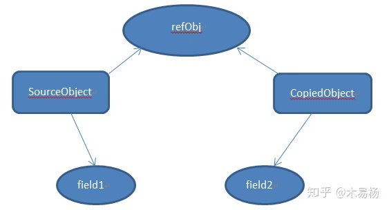
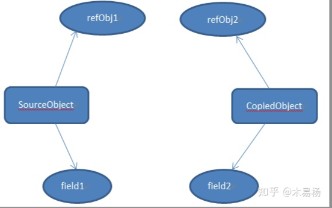

# Table of Contents

  * [浅拷贝](#浅拷贝)
* [深拷贝](#深拷贝)

## 浅拷贝

创建一个新对象，这个对象有着原始对象属性值的一份精确拷贝。如果属性是基本类型，拷贝的就是基本类型的值，如果属性是引用类型，拷贝的就是内存地址 ，所以如果其中一个对象改变了这个地址，就会影响到另一个对象。

# 深拷贝

深拷贝会拷贝所有的属性，并拷贝属性指向的动态分配的内存。当对象和它所引用的对象一起拷贝时即发生深拷贝。深拷贝相比于浅拷贝速度较慢并且花销较大。拷贝前后两个对象互不影响。

