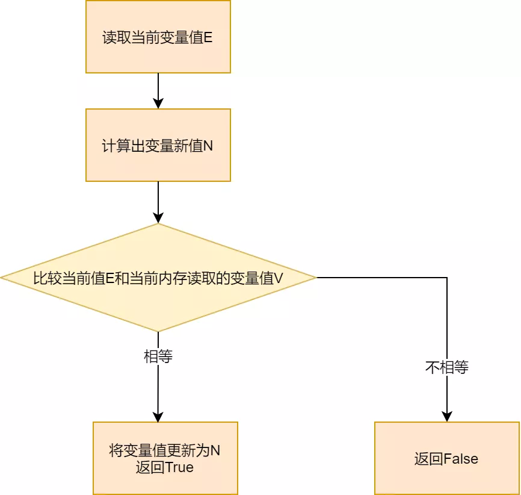

# Table of Contents

* [带着面试问题看知识](#带着面试问题看知识)
* [CAS是什么？](#cas是什么)
* [CAS原理](#cas原理)
  * [AtomicInteger](#atomicinteger)
  * [方法调用](#方法调用)
* [缺点](#缺点)
* [ABA问题](#aba问题)
* [解决ABA](#解决aba)
  * [原子引用](#原子引用)
  * [AtomicMarkableReference](#atomicmarkablereference)


# 带着面试问题看知识


**了解CAS吗，谈谈你对CAS的理解。**

使用多个线程操作同一个资源对象，怎么保证线程安全，一般第一反应就是`互斥锁`，互斥锁是可以解决线程安全

问题，但是也会带来上下文切换的消耗。是悲观锁，不能过度使用。

<font color=red>能不能不锁定资源，也能对线程进行同步？</font>


# CAS是什么？

+ Compare Ana Swap.顾名思义，该算法涉及到了两个操作，**比较**（Compare）和**交换**（Swap）。
+ 一条CPU的原子指令，不会造成数据不一致问题
+ 是乐观锁的一种实现
+ 是无锁的同步机制



```java
    public static void main(String[] args) {

        AtomicInteger atomicInteger = new AtomicInteger(5);
        // System.out.println(atomicInteger.compareAndSet(5,7));//true
        //ABA问题
        System.out.println(atomicInteger.compareAndSet(7,5));//true
        System.out.println(atomicInteger.compareAndSet(5,8));//true
    }
```

# CAS原理

CAS 是实现自旋锁的基础，<font color=red>CAS 利用 CPU 指令保证了操作的原子性，以达到锁的效果</font>。

CAS算法涉及到三个操作数：

- 需要读写的内存值 V。
- 进行比较的值 A。
- 要写入的新值 B。

当且仅当 V 的值等于 A 时，CAS通过原子方式用新值B来更新V的值（“比较+更新”整体是一个原子操作），否则不会执行任何操作。一般情况下，“更新”是一个不断重试的操作。


至于自旋呢，看字面意思也很明白，自己旋转，翻译成人话就是循环，一般是用一个无限循环实现。这样一来，一个无限循环中，执行一个 CAS 操作，当操作成功，返回 true 时，循环结束；当返回 false 时，接着执行循环，继续尝试 CAS 操作，直到返回 true。<font color=red>通常会配置自旋次数来方式死循环，默认是10次</font>。


## AtomicInteger

1. Unsafe是CAs的核心类，存在于sun.misc包中。像C指针一样直接操作内存，直接调用操作系统底层执行对应任务。
2. valueOffset，表示变量在内存中的偏移地址。
3. 变量value用volatile修饰，保持多线程之间的可见性。

```java

public class AtomicInteger extends Number implements java.io.Serializable {
    private static final long serialVersionUID = 6214790243416807050L;

    // setup to use Unsafe.compareAndSwapInt for updates
    private static final Unsafe unsafe = Unsafe.getUnsafe();
    private static final long valueOffset;

    static {
        try {
            //
            valueOffset = unsafe.objectFieldOffset
                (AtomicInteger.class.getDeclaredField("value"));
        } catch (Exception ex) { throw new Error(ex); }
    }

    // volatile 修饰
    private volatile int value;
```


## 方法调用

```java
AtomicInteger atomicInteger = new AtomicInteger(5);

int andIncrement = atomicInteger.getAndIncrement();

public final int getAndIncrement() {
    return unsafe.getAndAddInt(this, valueOffset, 1);
}

public final int getAndAddInt(Object var1, long var2, int var4) {
    int var5;
    do {
        //找出内存中的值
        var5 = this.getIntVolatile(var1, var2);
    } while(!this.compareAndSwapInt(var1, var2, var5, var5 + var4));
        //如果相同 +1 
        //如果不同，继续取值比较，直到更新完成
    return var5;
}

```


# 缺点

循环开销大

只能对一个变量就行操作

ABA问题


# ABA问题

> * 初始值为100，线程t1将100改成101，然后又将101改回100
> * 线程t2先睡眠1秒，等待t1操作完成，然后t2线程将值改成2019
> * 可以看到，线程2修改成功


<font color=red>可以看到ABA缺失了中间状态</font>

+ 业务中的库存问题或者是银行转账问题
+ 修改人问题

Ribbon中负载均衡的轮询算法也是运用了CAS


# 解决ABA

## 原子引用

由单一变量变为了引用类型

```java

AtomicReference<User> atomicReference = new AtomicReference();


```

==## 原子时间戳引用==

带版本戳的原子引用类型，版本戳为int类型。

```
    AtomicStampedReference atomicStampedReference = new AtomicStampedReference(2,1);

    atomicStampedReference.compareAndSet(2,3,1,1+1);

    System.out.println(atomicStampedReference.getReference());
    System.out.println(atomicStampedReference.getStamp());

```


## AtomicMarkableReference

带版本戳的原子引用类型，版本戳为boolean类型。
