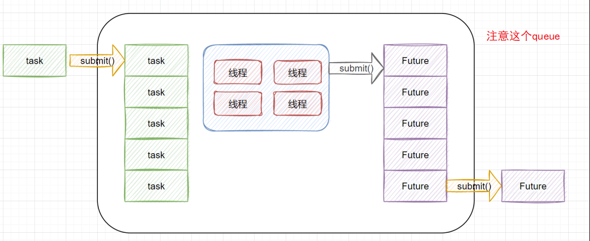

# Table of Contents

* [什么是CompletionService](#什么是completionservice)
* [注意的点](#注意的点)
* [参考资料](#参考资料)


# 什么是CompletionService

`CompletionService`是对定义`ExecutorService`进行了包装，可以一边生成任务,一边获取任务的返回值。让这两件事分开执行,任务之间不会互相阻塞，可以获取最先完成的任务结果。


> `CompletionService`的实现原理比较简单，底层通过FutureTask+**阻塞队列**，实现了任务先完成的话，可优先获取到。
>
> 也就是说任务执行结果按照完成的先后顺序来排序，先完成可以优先获取到。内部有一个先进先出的阻塞队列，用于保存已经执行完成的Future，你调用`CompletionService`的poll或take方法即可获取到一个已经执行完成的Future，进而通过调用Future接口实现类的`get`方法获取最终的结果。



```java
public class ExecutorCompletionService<V> implements CompletionService<V> {
    private final Executor executor;
    private final AbstractExecutorService aes;
    private final BlockingQueue<Future<V>> completionQueue;
}
```


# 注意的点

但是这里要说明的是另一个问题，直接使用completionService.submit的返回结果Future会造成内存泄漏，因为该方式只关心获取当前返回的结果，而忽略了BlockingQueue中保存的Future对象，BlockingQueue队列会不断变大（默认实现是LinkedBlockingQueue，无界队列），迟早将内存撑爆。正确的使用方式还是通过completionService.take()来获取Future对象。


# 参考资料

https://mp.weixin.qq.com/s/72u48SRqPHhYbZpuML0JAQ
