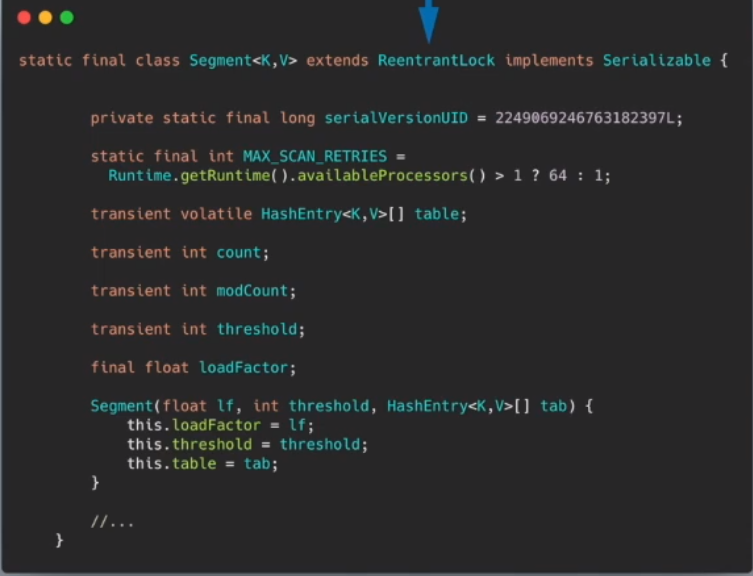
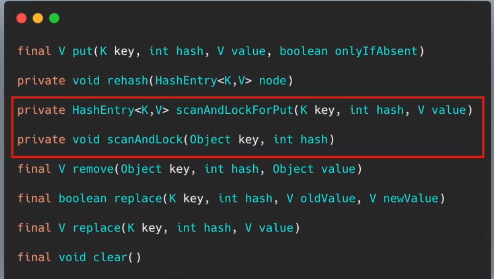
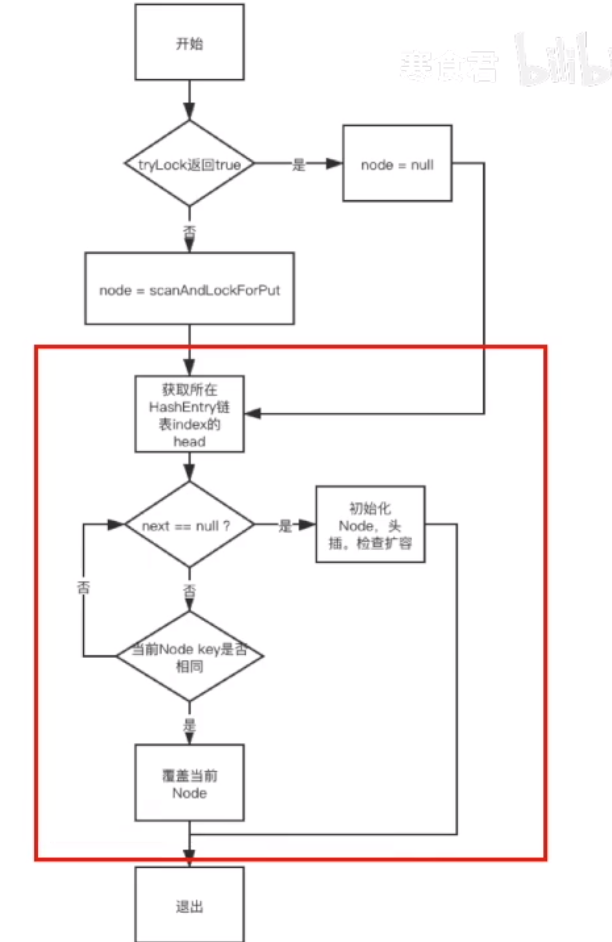

# Table of Contents

* [为什么要有ConCurrentHashMap](#为什么要有concurrenthashmap)
* [JDK 1.7](#jdk-17)
  * [HashEntry](#hashentry)
  * [Segment](#segment)
  * [初始化](#初始化)
  * [Put](#put)
    * [scanAndLockForPut](#scanandlockforput)
* [JDK 1.8](#jdk-18)
* [考点](#考点)


# 为什么要有ConCurrentHashMap

+ 基于HashMap并发不安全
+ HashTable过于笨重，对每个方法都加锁


#  JDK 1.7 

参考资料:https://www.cnblogs.com/rain4j/p/10972090.html


在JDK1.7版本中，ConcurrentHashMap的数据结构是由一个Segment数组和多个HashEntry组成，如下图所示：


采用了<font color=red>分段锁</font>的思想


```java
//默认的初始容量
static final int DEFAULT_INITIAL_CAPACITY = 16;

//默认加载因子
static final float DEFAULT_LOAD_FACTOR = 0.75f;

//默认的并发度，也就是默认的Segment数组长度 --------------------关注这个
static final int DEFAULT_CONCURRENCY_LEVEL = 16;

//最大容量，ConcurrentMap最大容量
static final int MAXIMUM_CAPACITY = 1 << 30;

//每个segment中table数组的长度,必须是2^n,最小为2
static final int MIN_SEGMENT_TABLE_CAPACITY = 2;

//允许最大segment数量,用于限定concurrencyLevel的边界,必须是2^n
static final int MAX_SEGMENTS = 1 << 16; // slightly conservative

//非锁定情况下调用size和contains方法的重试次数,避免由于table连续被修改导致无限重试 
static final int RETRIES_BEFORE_LOCK = 2;  --------------------关注这个

	//计算segment位置的掩码值
    final int segmentMask;

//用于计算算segment位置时,hash参与运算的位数
final int segmentShift;

//Segment数组
final Segment<K,V>[] segments;
```


这里主要关注

+ 并发等级：这个时候，最多可以同时支持 16 个线程并发写，只要它们的操作分别分布在不同的 Segment 上。这个值可以在初始化的时候设置为其他值，但是一旦初始化以后，它是不可以扩容的。
+ 重试次数
+ segmentMask：进行位与时，对某些位进行屏蔽
+ segmentShift：


## HashEntry


unfase执行的时不安全的，较为底层的操作，使用分享较高，场景比较少，


`objectFieldOffest`：成员属性在内存地址相对于此对象的内存地址的偏移量。


## Segment




为什么sgemen为什么性能提升n倍以上？不是n倍？因为本身concurrentHashMap也对锁进行了优化

+ 成员方法

  


## 初始化

```java
public ConcurrentHashMap(int initialCapacity,
                         float loadFactor, int concurrencyLevel) {
    if (!(loadFactor > 0) || initialCapacity < 0 || concurrencyLevel <= 0)
        throw new IllegalArgumentException();
    if (concurrencyLevel > MAX_SEGMENTS)
        concurrencyLevel = MAX_SEGMENTS;
    // Find power-of-two sizes best matching arguments
    int sshift = 0;
    int ssize = 1;
    // 计算并行级别 ssize，因为要保持并行级别是 2 的 n 次方
    while (ssize < concurrencyLevel) {
        ++sshift;
        ssize <<= 1;
    }
    // 我们这里先不要那么烧脑，用默认值，concurrencyLevel 为 16，sshift 为 4
    // 那么计算出 segmentShift 为 28，segmentMask 为 15=(n-1)，后面会用到这两个值
    this.segmentShift = 32 - sshift;
    this.segmentMask = ssize - 1;

    if (initialCapacity > MAXIMUM_CAPACITY)
        initialCapacity = MAXIMUM_CAPACITY;

    // initialCapacity 是设置整个 map 初始的大小，
    // 这里根据 initialCapacity 计算 Segment 数组中每个位置可以分到的大小
    // 如 initialCapacity 为 64，那么每个 Segment 或称之为"槽"可以分到 4 个
    int c = initialCapacity / ssize;
    if (c * ssize < initialCapacity)
        ++c;
    // 默认 MIN_SEGMENT_TABLE_CAPACITY 是 2，这个值也是有讲究的，因为这样的话，对于具体的槽上，
    // 插入一个元素不至于扩容，插入第二个的时候才会扩容
    int cap = MIN_SEGMENT_TABLE_CAPACITY; 
    while (cap < c)
        cap <<= 1;

    // 创建 Segment 数组，
    // 并创建数组的第一个元素 segment[0]
    Segment<K,V> s0 =
        new Segment<K,V>(loadFactor, (int)(cap * loadFactor),
                         (HashEntry<K,V>[])new HashEntry[cap]);
    Segment<K,V>[] ss = (Segment<K,V>[])new Segment[ssize];
    // 往数组写入 segment[0]
    UNSAFE.putOrderedObject(ss, SBASE, s0); // ordered write of segments[0]
    this.segments = ss;
}

```

+ 为什么要加入第一个元素？一般的初始化是不会加入元素的  <font color=red>待解答</font>
+ Segment 数组长度为 16，不可以扩容
+ Segment[i] 的默认大小为 2，负载因子是 0.75，得出初始阈值为 1.5，也就是以后插入第一个元素不会触发扩容，插入第二个会进行第一次扩容
+ 当前 segmentShift 的值为 32 - 4 = 28，segmentMask 为 16 - 1 = 15，姑且把它们简单翻译为移位数和掩码，这两个值马上就会用到

## Put


我们直接看核心put方法

```java
final V put(K key, int hash, V value, boolean onlyIfAbsent) {
    // 在往该 segment 写入前，需要先获取该 segment 的独占锁
    //    先看主流程，后面还会具体介绍这部分内容 这里就是对锁的优化部分
    HashEntry<K,V> node = tryLock() ? null :
        scanAndLockForPut(key, hash, value);
    V oldValue;
    try {
        // 这个是 segment 内部的数组
        HashEntry<K,V>[] tab = table;
        // 再利用 hash 值，求应该放置的数组下标
        int index = (tab.length - 1) & hash;
        // first 是数组该位置处的链表的表头
        HashEntry<K,V> first = entryAt(tab, index);

        // 下面这串 for 循环虽然很长，不过也很好理解，想想该位置没有任何元素和已经存在一个链表这两种情况
        for (HashEntry<K,V> e = first;;) {
            if (e != null) {
                K k;
                if ((k = e.key) == key ||
                    (e.hash == hash && key.equals(k))) {
                    oldValue = e.value;
                    if (!onlyIfAbsent) {
                        // 覆盖旧值
                        e.value = value;
                        ++modCount;
                    }
                    break;
                }
                // 继续顺着链表走
                e = e.next;
            }
            else {
                // node 到底是不是 null，这个要看获取锁的过程，不过和这里都没有关系。
                // 如果不为 null，那就直接将它设置为链表表头；如果是null，初始化并设置为链表表头。
                if (node != null)
                    node.setNext(first);
                else
                    node = new HashEntry<K,V>(hash, key, value, first);

                int c = count + 1;
                // 如果超过了该 segment 的阈值，这个 segment 需要扩容
                if (c > threshold && tab.length < MAXIMUM_CAPACITY)
                    rehash(node); // 扩容后面也会具体分析
                else
                    // 没有达到阈值，将 node 放到数组 tab 的 index 位置，
                    // 其实就是将新的节点设置成原链表的表头
                    setEntryAt(tab, index, node);
                ++modCount;
                count = c;
                oldValue = null;
                break;
            }
        }
    } finally {
        // 解锁
        unlock();
    }
    return oldValue;
}

```



### scanAndLockForPut

前面我们看到，在往某个 segment 中 put 的时候，首先会调用 node = tryLock() ? null : scanAndLockForPut(key, hash, value)，

也就是说先进行一次 tryLock() 快速获取该 segment 的独占锁，如果失败，那么进入到 scanAndLockForPut 这个方法来获取锁。

```java
private HashEntry<K,V> scanAndLockForPut(K key, int hash, V value) {
    HashEntry<K,V> first = entryForHash(this, hash);
    HashEntry<K,V> e = first;
    HashEntry<K,V> node = null;
    int retries = -1; // negative while locating node

    // 循环获取锁
    while (!tryLock()) {
        HashEntry<K,V> f; // to recheck first below
        if (retries < 0) {
            if (e == null) {
                if (node == null) // speculatively create node
                    // 进到这里说明数组该位置的链表是空的，没有任何元素
                    // 当然，进到这里的另一个原因是 tryLock() 失败，所以该槽存在并发，不一定是该位置
                    node = new HashEntry<K,V>(hash, key, value, null);
                retries = 0;
            }
            else if (key.equals(e.key))
                retries = 0;
            else
                // 顺着链表往下走
                e = e.next;
        }
        // 重试次数如果超过 MAX_SCAN_RETRIES(单核1多核64)，那么不抢了，进入到阻塞队列等待锁
        //    lock() 是阻塞方法，直到获取锁后返回
        else if (++retries > MAX_SCAN_RETRIES) {
            lock();
            break;
        }
        else if ((retries & 1) == 0 &&
                 // 这个时候是有大问题了，那就是有新的元素进到了链表，成为了新的表头
                 //     所以这边的策略是，相当于重新走一遍这个 scanAndLockForPut 方法
                 (f = entryForHash(this, hash)) != first) {
            e = first = f; // re-traverse if entry changed
            retries = -1;
        }
    }
    return node;
}

```


这个方法有两个出口，

+ 一个是 tryLock() 成功了，循环终止，
+ 另一个就是重试次数超过了 MAX_SCAN_RETRIES，进到 lock() 方法，此方法会阻塞等待，直到成功拿到独占锁。

这个方法就是看似复杂，但是其实就是做了一件事，那就是获取该 segment 的独占锁，如果需要的话顺便实例化了一下 node。

#  JDK 1.8

数据结构还是Node数组+链表+红黑树
并发控制：Synchronized和CAS


**JDK8中ConcurrentHashMap的实现使用的是锁分离思想，只是锁住的是一个node，而锁住Node之前的操作是基于在volatile和CAS之上无锁并且线程安全的。**


**那么在扩容的时候，可以不可以对数组进行读写操作呢？**

事实上是可以的。当在进行数组扩容的时候，如果当前节点还没有被处理（也就是说还没有设置为fwd节点），那就可以进行设置操作。

如果该节点已经被处理了，则当前线程也会加入到扩容的操作中去。

　　

**那么，多个线程又是如何同步处理的呢？**

在ConcurrentHashMap中，同步处理主要是通过Synchronized和unsafe两种方式来完成的。

·在取得sizeCtl、某个位置的Node的时候，使用的都是unsafe的方法，来达到并发安全的目的

·当需要在某个位置设置节点的时候，则会通过Synchronized的同步机制来锁定该位置的节点。

·在数组扩容的时候，则通过处理的步长和fwd节点来达到并发安全的目的，通过设置hash值为MOVED

·当把某个位置的节点复制到扩张后的table的时候，也通过Synchronized的同步机制来保证现程安全


# 考点

1. ConcurrentHashMap中的扩容仅针对HashEntry数组，Segment数组在初始化后无法再扩容。

2.为什么 ConcurrentHashMap 的读操作不需要加锁？ 1.8

get操作可以无锁是由于Node的元素val和指针next是用volatile修饰的，在多线程环境下线程A修改结点的val或者新增节点的时候是对线程B可见的。
```java
volatile V val;	
volatile Node<K,V> next;

```


