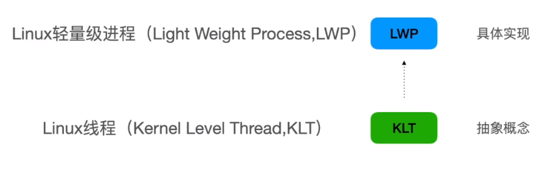
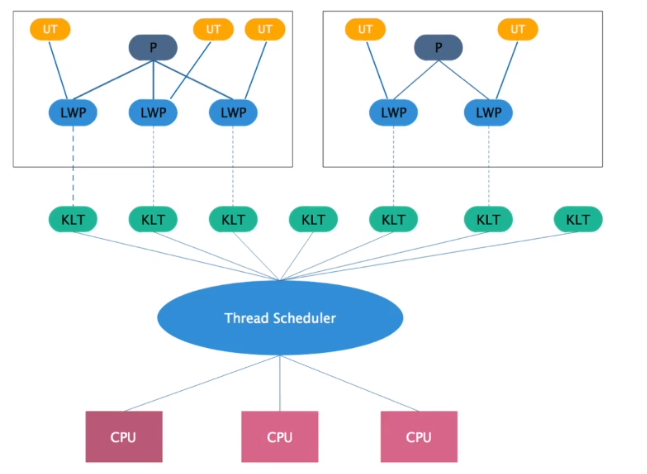
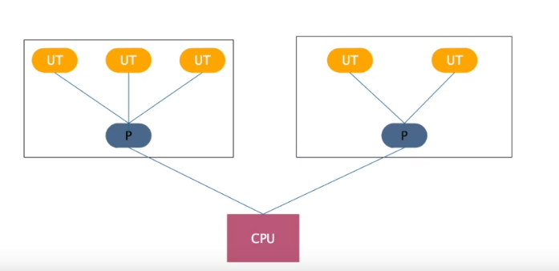
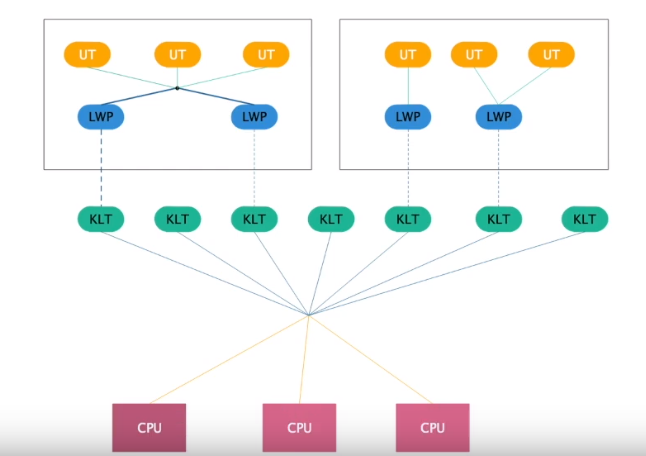

# Table of Contents

* [java线程模型](#java线程模型)
* [Linux内核](#linux内核)
* [有哪些线程模型](#有哪些线程模型)
  * [一对一](#一对一)
  * [多对一](#多对一)
  * [多对多](#多对多)

# java线程模型

+  什么是线程模型
   java字节码运行在Jvm中,Jvm运行在各个操作系统上，Jvm在进行线程创建和回收的过程中，必须要调用操作=系统的相关接口。也就是说Jvm线程与操作系统线程存在某种映射关系，这2中不同维度的线程之间规范和协议，就是线程模型。

+ 为什么需要线程模型
  不使用，难道你要自己去调用操作系统的线程api吗？那你还写什么java，直接写汇编吧。
  Jvm线程对不同操作系统上的原生线程进行高级抽象，专注上层开发就行了。

  

# Linux内核

 面试经常会问到:进程和线程的区别
 A:线程属于进程。

这句话对不对呢？

Linux线程又被称为轻量级进程

Linux进程有自己的独立空间。轻量级进程没有，只能共享同一个轻量级进程组下的地址空间，都会调用clone函数，只是传递的参数不同

# 有哪些线程模型

用户线程:内核线程

## 一对一

  

用户线程和内核线程建立一对一的关系，目前jvm用的是这个
​缺点：
​  1.  用户线程的阻塞和唤醒会直接映射到内核线程 采用cas aqs等

2. Linux创建的内核线程数比较有限

##  多对一

一个用户线程进行调用，其他用户线程无法调用内核线程，java早期版本就是用这种 

##  多对多

解决了1和2的缺点，但是实现难度比较高
